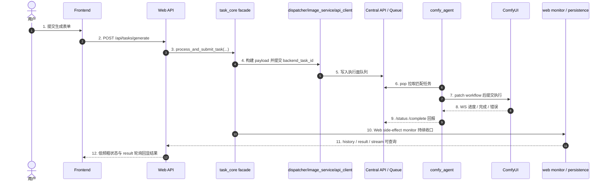

# 子模块: 生成任务全链路 (Task Full Chain)

> 当前 `i2i_pro` 与专属 `face_swap` Worker profile 都可承接 Central 的 `face_swap` 与 `face_swap_v2`，并通过显式 workflow override 将两者运行到 `face_swap_v2.json`。上游 API、计费、退款和业务类型不变；旧远程 V1 执行池已退役。

## 1. 目标与适用场景

本文档用于说明当前系统中“生成任务”从前端发起，到 Web API 提交，到 `task_core` 派发，再到底层 Central API / Queue / Worker / ComfyUI 执行，以及状态回流、结果持久化、历史查询的完整链路。

适用场景：

- 新增一种新的生成任务类型
- 运维排查任务卡住、堆积、结果丢失、状态异常
- 排查 Web 端提交成功但 SSE / 结果 / 历史表现不一致
- 理解 `registry_task_id` 与 `backend_task_id` 的分工

本文档是对以下文档的补充而不是替代：

- `docs/子模块_任务调度_task_scheduler.md`
- `docs/子模块_中控API与节点通信_central_api.md`
- `docs/system_architecture_report.md`

## 2. 一句话主链

当前系统中更准确的生成任务主链是：

`Frontend Page/Form -> /api/tasks/generate -> task_submission_service -> task_core.process_and_submit_task(...) -> task_core_submission / task_dispatcher / image_service / api_client -> Central API / QueueManager -> comfy_agent（可经本地 relay/sidecar）-> ComfyUI -> status/complete 回流 -> Web monitor / history / coarse status / result`

要点：

- Web 主入口是 `POST /api/tasks/generate`，不是旧的 generation params 风格接口
- `task_core` 是统一门面，负责业务编排，不是 Central API
- Central API 是执行面，不负责上游计费、并发锁和历史持久化
- Worker 通过主动 `pop` 拉取任务，不是上游直接把 workflow 推到 Worker
- 新版 worker 的 `pop` 会带 `agent_id`；GPU Pool Controller 可把单个 worker 标记为 `draining/disabled`，用于模型同步、任务能力切换和 canary 前停止接新单
- `agent_id`、`draining/disabled`、GPU pool heartbeat 元数据只作用于 Worker Agent 层；它不会自动重启或替换目标 ComfyUI。`cloud_prod_worker_01` 的 agent 容器已支持新协议，但它调用的 `gpu-226:8188` 仍是宿主机 ComfyUI。
- 本地 relay/sidecar 只优化 worker 到云 Central/R2 的固定开销，不拥有队列事实；任务仍只有在 R2 上传成功且 Central `/complete` 成功后才算成功收口
- 本地 relay `/health` 是轻量存活检查，`/ready` 会检查云 Central 与上传 client；worker 到 relay/Central 的控制面半断持续超过默认阈值时，agent 会退出并交给 Docker restart。这个自愈只恢复 worker 进程，不改变任务成功必须 `/complete` 的语义
- RunPod 镜像内的 `workers/runpod_runtime/` 通过 `runpod_relay` 访问专用 Central 域名，并复用同一 `pop/status/complete/heartbeat` 语义
- LAN-only `all` worker 在一次 `pop` 中携带 19 个支持类型，Central 仍按这些
  类型的全局 queue score 选择最早任务。它不会改变 execution type、根任务
  ID、计费、History、Gallery 或退款；流水线只让一个 Comfy 执行与一个预取、
  一个交付阶段安全重叠。

## 3. 分层职责图

## 4. 前端入口链路

### 4.1 表单与 payload 构造

前端生成页面负责收集用户输入，然后把输入转成统一提交 payload。

常见入口包括：

- `frontend/src/views/CustomFeatures.vue`
- 旧图生图、图生视频、换脸等 URL 的兼容重定向
- 统一 payload 构造器，例如 `frontend/src/features/generation/buildGenerationTaskPayload.ts`

前端提交到后端时，核心字段通常包括：

- `task_type`
- `inputs`
- `prompt`
- `negative_prompt`
- `priority`
- `is_template`
- `source_post_id`

约束：

- 若是 Web 一等任务类型，前端必须提供稳定的 `task_type`
- 输入图片、LoRA、分辨率、时长等应统一收口到 `inputs`
- 新任务类型若要在主站展示为独立能力，前端页面、卡片入口、i18n 和历史/投稿/收藏相关展示也要一并补齐

### 4.2 任务提交与前端运行态

前端通常通过以下链路提交：

- `frontend/src/composables/useTaskStream.ts`
- `frontend/src/stores/tasks.ts`
- `frontend/src/stores/taskSessionState.ts`
- `frontend/src/stores/taskStreamTransport.ts`
- `frontend/src/stores/tasksRuntime.ts`

提交后会发生：

1. `useTaskStream.submitTask(...)` 调用 `POST /tasks/generate`
2. 后端返回 `task_id` 后，前端把该任务写入 `tasksStore`
3. `tasksStore.startStatusPolling(...)` 默认每 15 秒查询 `/tasks/{task_id}/status` 粗状态；pending 可显示队列位置，running 不显示生成百分比
4. 收到粗状态 `success` 后，前端转入 `/tasks/{task_id}/result` 轮询；结果 URL 未就绪时保持 `awaitingResult=true` 并展示“保存结果中”，当前轮询窗口约 120 次 * 1.5 秒，需覆盖视频 R2 warmup 可能超过 60 秒的情况。页面从后台/BFCache 恢复、重新联网或重新打开后必须按持久化任务状态主动续接 result/status polling，并以任务 ID 去重，不能让浏览器冻结的旧 timer 导致“保存中”永远不进入完成态。
5. 若历史已落库，也可能通过最近历史或详情弹层展示结果
6. pending 悬浮任务的关闭按钮按用户撤销处理，调用 `/tasks/cancel/{registry_task_id}`；非 pending 关闭按钮仅收起本地悬浮任务，不代表后端取消

`record_history=false` 的内部交付任务不能只依赖通用 status/result 轮询收口：
人物子图任务以 `CharacterReferenceView.task_id/status/preview_url` 为持久化事实源，
人物 store 每次刷新都要把对应悬浮任务同步为 success 或 failed。运行态清理后
通用 status 可能返回 404，但不得因此覆盖已经持久化为 ready 的人物子图终态。

前端当前的状态语义重点：

- `pending`: 已提交但还在排队
- `running`: Worker 已开始执行，用户侧只展示“生成中”，不展示百分比
- `success`: 粗状态终态成功，前端随后去拿结果 URL
- `failed`: 执行失败或回流失败
- `cancelled`: 用户取消或执行面确认取消

## 5. Web API 提交链路

### 5.1 主入口

Web 统一入口在：

- `src/web_api/routers/tasks.py`
- `POST /api/tasks/generate`

这个入口本身应保持薄壳，主要负责：

- 接收 `TaskGenerateRequest`
- 注入当前用户
- 转发到 service
- 把领域异常映射为 HTTP 状态码

### 5.2 提交 service

真正的 Web 提交 service 在：

- `src/web_api/services/task_submission_service.py`

当前职责：

- 先执行 Web 入口级禁用任务检查；`i2i_draw` 局部重绘当前在 Web 端关闭，会在生成 `task_id`、扣费和入队前返回领域错误
- 把 `prompt` 补入 `req.inputs`
- 生成 Web 侧 `task_id`
- 设定 correlation id
- 调用 `process_and_submit_task(...)`
- 开启 `TaskSubmissionSideEffectPlan(attach_web_monitor=True)`
- 返回给前端 `pending` 初态和余额变化

当低阶外门用户因目标 Worker 执行池的 projected pending 达到容量上限而被拒绝时，`billing_core` 会经 task core 抛出 `QueueCapacityError`。`POST /api/tasks/generate` 将其映射为 HTTP 429，并返回结构化 `detail.code=GENERATION_QUEUE_FULL`；Vue 根据该 code 展示“当前任务队列已满”、可改用其他任务，以及仅适用于外门练气期及以下用户的充值升级身份提示。其它并发限制仍使用普通 429，避免将用户自身并发已满或其它接口限流误称为执行池满载。

这意味着 Web 成功返回给前端时，任务通常已经：

- 完成了计费检查
- 完成了并发锁检查
- 完成了 registry 注册
- 完成了 backend 提交
- 挂好了 Web monitor side effect

## 6. task_core 业务编排链路

### 6.1 统一门面

统一主门面是：

- `src/core/task_core.py`
- `process_and_submit_task(...)`

它不是简单转发，而是负责编排整个业务提交过程：

- 取策略 `StrategyFactory.get_strategy(task_type)`
- 计算任务成本
- 检查并发锁
- 扣减灵石
- 组装提交上下文
- 执行提交 Saga
- 挂载 side effect
- 在失败时退款并释放锁

当前 `process_and_submit_task(...)` 内部已继续拆成稳定步骤：

- `task_core_process_flow.build_prepared_task_submission_request(...)`
- `task_core_process_flow.prepare_task_submission_context(...)`
- `task_core_process_flow.maybe_deduct_submission_credits(...)`
- `task_core_process_flow.execute_task_submission_attempt(...)`
- `task_core_process_flow.release_submission_lock_if_needed(...)`

### 6.2 provider / dependency 边界

当前 `task_core` 采用 facade + provider/dependencies 结构：

- `src/core/task_core.py`
- `src/core/task_lifecycle_contract.py`
- `src/core/task_core_default_dependencies.py`
- `src/task_core_process_defaults.py`
- `src/core/task_core_service_providers.py`
- `src/core/task_core_submission.py`
- `src/core/task_core_process_flow.py`
- `src/services/task_lifecycle_runner.py`
- `src/services/task_web_side_effects.py`
- `src/services/task_web_lifecycle_monitor.py`
- `src/services/task_web_terminal_finalization.py`
- `src/core/task_core_runtime.py`

关键规则：

- `core` 内不应重新直连基础设施实现
- `task_core_default_dependencies.py` 只保留纯 builder；runtime-specific billing / strategy / Web side effect 装配已下沉到 `src/task_core_process_defaults.py`
- Bot / Web / stream 对 backend `done/error/cancelled` 终态判断应共享 `task_lifecycle_contract.py`
- Web 侧已按 `side effects -> lifecycle monitor -> terminal finalization` 三段拆开，入口分别位于 `task_web_side_effects.py`、`task_web_lifecycle_monitor.py`、`task_web_terminal_finalization.py`
- Bot `task_service_flow.py` 与 Web lifecycle monitor 现共享 `task_lifecycle_runner.py` 的 monitor->route 骨架；Web runtime monitor 与 `task_web_finalizer.py` 共享 terminal router
- 默认 provider 注册由应用入口承担，不由 `core` 模块导入时自动注册
- 单测优先走显式 `dependencies` 或 `*_func` seam
- 当前 `TaskCoreServiceProviders` 与主要 capability 已补强 `Protocol` / 精确 `Callable` 类型；新增 provider/capability 时继续沿用显式契约，不要扩大弱类型字段
- provider 运行时注册仍依赖模块级全局状态，测试和离线路径应优先显式传入 dependencies，避免把模块级 patch 当成主测试策略

### 6.3 双 ID 语义

当前链路中始终同时存在两个 ID：

- `registry_task_id`
  - Web/Bot 对外主任务 ID
  - 用于前端 SSE、结果查询、历史、清理、恢复
  - 也是 `/api/tasks/generate` 返回给前端的 `task_id`

- `backend_task_id`
  - 真正派发到底层执行面的运行态 ID
  - 用于 Central API / Queue / Worker / backend cancel

排障红线：

- 任何运行态查询、取消、强制终止、僵尸清理都必须先确认当前用的是哪个 ID
- 前端和 Web API 对外接口大多围绕 `registry_task_id`
- 执行面、队列和 Worker 更多围绕 `backend_task_id`

### 6.4 Bot 取消与优先级控制

Bot task flow 允许入口层在不改变数据库结构和 worker workflow 的前提下，向 `process_and_submit_task(...)` 透传两个任务控制语义：

- `base_priority`: 默认 `0`，透传到现有 Central 队列优先级计算；QQCC 链式 continuation 子任务使用 `100` 表达“排在第一”。
- `user_cancel_allowed`: 默认 `true`，写入 active task registry；`false` 时用户取消入口直接返回 `not_cancellable`，不调用 Central cancel，也不触发退款。

Telegram 展示层还有对应的 `allow_cancel`，用于控制 pending/submitted 状态是否展示 `cancel_task_*` 按钮。隐藏按钮只是用户体验层，权威边界仍在 `cancel_user_task(...)` 读取 active registry 的 `user_cancel_allowed`。

QQCC 懒人 Bot 的链式 AI绘图/AI动图复用这一通用语义：第一个真实子任务普通排队且 pending 可取消；后续后处理绘图、内部原图换脸、尾帧链后续步骤和最终首尾帧视频作为同一链路 continuation，高优先级入队且不可用户取消。主 Bot、Web、普通单任务 QQCC 功能和 worker 执行协议不因此改变。

Bot presentation context 另有 `show_queue_status`，默认 `true`。QQCC AI绘图、AI动图与 AI视频的第 2 个及以后真实子任务设为 `false`：初始提交直接使用现有图片/视频“生成中”，monitor 收到 pending 或队列位置变化仍保持生成中且无取消按钮，成功/失败/退款终态不受影响。图片、旧视频、Wan22 与 LTX actor 入口都只透传该展示标志，Central 优先级、计费、任务顺序和 Worker 协议完全不读取它。

QQCC `AI视频` 也复用 quick video plan：无尾帧引用时直接由 actor 参数入口提交 LTX I2V；有引用时把最终阶段记录为 durable continuation 的 `ltx_video` executor，以原始输入和当前尾帧提交 FLF2V。提交前按尾帧链加 LTX 时长统一核费，任一中间阶段失败不创建最终视频任务；私有 Bot checkpoint 继续保存原始输入、当前输出和 delivery 状态。

QQCC `AI动图` / `AI视频` 的 `next_scene_id` 在 quick video plan 中解析为完整有序 `qqcc_chain_segments` 快照，主 Bot 计划始终为空。根场景 `credit_cost=null` 时，全链费用是各视频段与各自尾帧绘图链费用之和；根场景配置固定总价时只在首个真实任务用 `cost_override` 一次扣除，后续段、尾帧绘图和内部换脸全部 `deduct_quota=false`，被引用场景自己的价格不参与计算。自动拼接不产生 task type 或费用。第一段沿用普通队列，后续段 `base_priority=100`、`show_queue_status=false`、`user_cancel_allowed=false`。官方 runner 用每段返回视频提取下一首帧，并在后续失败时拼接成功前缀；固定价链同时按根价全额幂等退款。私有 continuation 把 Worker `last_frame` CAS 写为下一输入、保留视频引用，并持久化根计费锚点，最终 `delivery_pending` 执行同一拼接。最终 History 的 `_qqcc_video_scene_chain` 保存根场景、场景/任务顺序、计划/完成段数和 partial 标志；中间 History 只用于审计。

尾帧提取与最终拼接依赖控制面运行镜像内的 `ffmpeg`、`ffprobe`，不依赖
Worker workflow。`qqcc-bot`、`private-bot-worker`、`qqcc-config-backend`、
`dashboard-backend` 四个真实消费者继承 `python-media-runtime-base`，镜像
focused smoke 对各最终 digest 执行双工具验证。runner 还必须区分
`generation` 与 `tail_frame` 失败阶段：已成功扣费并产出视频、但尾帧提取
失败时，不得把该段误报为“生成失败”。

### 6.5 QQCC 私有 Bot 的租户归属

私有 Bot 复用同一 `process_and_submit_task(...)`、用户表、余额、会员和 Central/worker 执行链。发起任务的 Telegram 访客先解析为自己的 `internal_user_id`，扣费和权限不归 owner；租户身份只通过 `client_type=bot:qqcc-private:<private_bot_id>` 区分配置、active task recovery 与 Telegram 结果投递。

Webhook update 先由 Web API 校验后写 `${REDIS_PREFIX}private_qqcc_bot:webhook:updates`。private worker 对同一 Bot 顺序处理、不同 Bot 并行处理；启动恢复只解析 exact private client type 并把任务交回相应 Application。官方 `bot:qqcc` 与不同 private ID 不能相互恢复。暂停/禁用只停止新任务，已扣费任务继续沿原实例 client type 完成，账本与退款规则不变。

私有 active registry 额外保存 `_bot_task_recovery` presentation contract，恢复时还原 `send_result`、用户可见 task type/prompt、输入索引、结果 metadata、完成文案和语言。私有旧记录缺 contract 时 fail closed，隐藏中间输出也不得被恢复器当最终结果发送。QQCC 私有多阶段 continuation 使用 Redis checkpoint 持久化原始输入、stage plan、确定性 submission sequence/registry ID、当前输出与状态；active registry 内 `_private_qqcc_continuation` 关联 chain/stage/executor fence。中间阶段结果必须先 CAS 推进 checkpoint 再 cleanup；最终阶段先记录 `delivery_pending`，delivery owner 发送 Telegram 成功后再 CAS delivered。checkpoint 不可用时保留 paid registry/用户锁，不先发送；worker 启动及周期扫描在 TaskRegistry 为空时仍续跑 ready/delivery checkpoint，租约丢失取消旧 owner，running orphan 在旧锁失效后 rewind。私有多步绘图、内部原图换脸和尾帧视频链因此与官方 `bot:qqcc` 保持同等功能，但仍使用 exact tenant `client_type`。

`_bot_task_recovery` 同时保存非默认的 `show_queue_status=false`；官方 QQCC continuation 也生成这一恢复 contract。私有 durable stage plan 在每个 `task_kwargs` 中保留首步 `true`、后续 `false`，序列化/反序列化和重启续跑后展示策略不变。

## 7. dispatcher 到 backend 执行面的下发

### 7.1 按任务类型选择策略

下发前的任务类型分流主要在：

- `src/core/task_dispatcher.py`
- `src/domain_config/task_type_registry.py`（只读事实表、查询 helper 与一致性门禁；当前驱动 Gallery/apply、Central simple task 映射与 workflow filename facts，dispatcher 策略仍由 core 显式装配）

这里决定：

- 用哪种策略计算价格
- 哪些输入文件需要先上传到存储
- 如何构造 metadata / payload
- 调用 `image_service` 的哪个提交方法

`task_type_registry.py` 记录 public type、legacy alias、执行面 task type、Central type、workflow filename、RunPod profile、视频/Gallery/apply 能力与成本。它提供稳定 query helper，当前已驱动 Gallery 可投稿类型、Gallery 展示配置、apply 输入复用白名单、Central simple task 映射与 workflow filename facts；dispatcher 策略与 worker `SUPPORTED_TASK_TYPES` 仍沿用显式事实源。`tests/config/test_task_type_registry.py` 会对照 `src/constants.py`、`backend/app/main_simple_task_routes.py`、`src/workflow_mapping_validation.py`、RunPod profile、Gallery/apply 输出做一致性门禁；新增或调整任务类型时先让 registry 与现有事实一致，再考虑分批迁移调用点。

用户展示层另行把 registry 的 public type、legacy alias、执行/内部阶段类型归一为稳定 `task_type.*` 展示 key。Web 历史、队列、详情、用户主页、Gallery 卡片和 Bot 结果只渲染共享中英文 locale；未知类型统一回退“生成任务/其他任务”，不得回显原始 task type。Dashboard、日志与 Central/Worker 协议仍保留原始诊断值。

新任务完成时，`History.prompt` 只保存提示词正文；模型公共 ID、强度、分辨率和时长合并写入 `extra_outputs._generation_context`，执行 payload 的 `lora_name/lora_strength`、费用和 workflow 均不变。History、Gallery、解锁/复制、一键应用、Telegram 私聊、主 Bot 与 QQCC/私有 Bot 恢复投递统一通过 presenter 输出干净 prompt 与可选 `prompt_model`。历史数据不批量迁移：读取时优先结构化上下文，缺失时兼容剥离并解析旧系统前缀。

例如：

- `txt2img` 走 `submit_txt2img_task(...)`
- `i2i_pro` 和 `i2i_draw` 有独立提交方法；注意这是 dispatcher/Bot/执行面能力说明，Web API 当前会在 `task_submission_service` 入口拒绝 `i2i_draw`
- `img2img_lora` 会带 `lora_name` 和 `lora_strength`
- Web 与主 Bot 的自由P图 v2.5 公开逻辑类型为 `free_edit_v2_5`，接受 1 或 2 张原图且不传 LoRA：单图扣 3 灵石并映射到 `pornmaster_flux2_edit_bf16`，双图扣 7 灵石并映射到仅内部使用的 `pornmaster_flux2_multi_edit_bf16`；其它数量在扣费前拒绝。内部双图类型复用既有 multiple-images workflow、BF16 模型与同一 GPU profile。任务完成后直接返回并统一以 `free_edit_v2_5` 写 History，不创建 `face_swap` continuation。
- Web 自由P图 v3 入口使用 `edit_v3`，只接受 1 张原图并提交逻辑类型 `pornmaster_flux2_edit_bf16`，固定扣 5 灵石且不传 LoRA。Web finalizer 在同一业务 `task_id` 下先等待 BF16 编辑，再用确定性的第二阶段 backend ID 提交 `face_swap_v2`（原图做人脸、BF16 结果做 body）；第二阶段不重复扣费且不可取消，只将最终换脸结果写入一条 `pornmaster_flux2_edit_bf16` History，输入只保留用户原图。主 Bot 的 v3 同样维持 BF16→V2 原脸恢复两阶段语义。
- `all` worker 同时支持这些内部阶段不代表把它们合并为一个 Comfy workflow：
  视频换脸仍是 `face_swap_v2 → scail2_face_swap_v2`，自由 P 图 v3 仍是
  `pornmaster_flux2_edit_bf16 → face_swap_v2`。continuation、隐藏中间结果、
  根计费锚点、确定性 stage ID 和幂等退款继续由现有控制面持有。
- Web finalizer 的 Redis pending 记录用 `continuation={version,kind,stage,stage2_task_type,stage2_backend_task_id,original_image,stage1_result_path}` 持久化两阶段进度，`stage2_task_type` 固定为 `face_swap_v2`；升级前缺少该字段或残留旧 `face_swap` 标签的 v3 记录也强制按 V2 恢复。先落盘 dispatch intent、再切换 active registry backend ID、最后提交确定性第二阶段 ID；因此重启或重复扫描不会重复扣费、重复提交或重复退款。任一执行阶段终止失败均以根业务 `task_id` 的既有幂等退款键退还 5 灵石。
- Web API 拒绝新的 `pornmaster_flux2_single_edit` / `pornmaster_flux2_multi_edit` 直接提交并提示刷新使用 v3；Bot 与 QQCC 的历史 v2 执行兼容仍保留，不得用 Web 下线规则删除 core/dispatcher/worker 能力。
- v2.5 与 v3 共用 `pornmaster_flux2_edit_bf16` 执行队列和 autoscaler profile；队列/运维展示必须明确标记“v2.5 + v3 共用执行池”，但不得把逻辑 History 类型合并或迁移。
- QQCC 自由P图 v3 使用配置 engine `free_edit_v3`，单图提交独立执行类型 `pornmaster_flux2_edit_bf16`，固定费用 6；Central 正式入口 `/api/v1/pornmaster_flux2_edit_bf16` 已于 2026-07-12 通过单服务 force-recreate 生效，任务可进入同名队列并由 gpu-226 BF16 worker 承接。
- 视频类会根据分辨率、时长转成底层所需尺寸和帧长

### 7.2 image_service / api_client

dispatcher 下游通常会继续经过：

- `src/services/image_service.py`
- `src/api_client.py`

职责划分：

- `task_dispatcher.py` 负责选择策略和高层任务语义
- `image_service.py` 负责按任务类型封装后端提交调用
- `api_client.py` 负责实际 HTTP 请求到底层执行面

注意：

- 当前 simple route 仍可能映射到 legacy `TaskType`，但 `txt2img` 已和其他任务一样通过标准 simple route 提交，并显式携带上游 `task_id`
- `image_service.py` / `api_client.py` 只负责把统一语义下沉到 Central API，不再由 `txt2img` 单独生成 backend task id
- `api_client.py` 的 HTTP circuit breaker 按请求类别隔离：任务提交走 `submit`，状态轮询走 `status`，媒体下载走 `media`，系统状态检查继续跳过 breaker。HTTP 4xx 不计入 breaker 失败，网络错误、超时和 5xx 才计入；Central Redis transient 503 会被上游忙碌识别处理，不应让状态轮询拖垮提交链路。
- Web 粗状态接口只在 active registry 已确认任务归属后调用 Central。Central 状态查询出现传输错误、超时或 `status` breaker 打开时，接口按 registry 中的 `backend_task_id`、`status` 与公开 `task_type` 返回保守的 `pending/running` 粗状态，不向用户放大为 HTTP 500；已有 History 时仍以 History 终态为准。Central 404 继续表示本次查询无状态，并且和其它 HTTP 4xx 一样不计入 breaker。相关错误日志必须保留 `error_type`，避免 `ReadTimeout` 等空字符串异常无法辨认。
- Wan22 AIO 视频的稳定配置入口是 `src.domain_config.wan22_aio_video`。旧 `src.services.wan22_video_v2_config` / `src.services.wan22_video_v2_context` 兼容 re-export 已删除，不应作为新增逻辑的事实源。
- `custom_video` / `video_lora`、Telegram 懒人动图 mode 与 `wan22_video_v2` 是不同用户功能入口，但底层由 `Wan22AioVideoStrategy` 与共享 submit helper 收口：公开类型继续写历史和展示，执行面类型用于 Central API / Worker 路由。

## 8. Central API / QueueManager 执行面

### 8.1 角色定位

Central API 是执行面，不是业务主入口。
云正式当前运行在 `cloud-central-api-prod`，本地 `cloud-prod-comfy-agent-*` 通过 Tailscale 从云 Central 拉取任务。

核心文件包括：

- `backend/app/main.py`
- `backend/app/main_simple_task_routes.py`
- `backend/app/queue_manager.py`
- `backend/app/queue_manager_flow_helpers.py`
- `backend/app/routers/agent.py`

执行面负责：

- 接收 backend 任务
- 在 `comfy:task_events:{backend_task_id}` 发布运行态与终态事件；其中 `done/error` 终态事件应附带 `task_type`，并优先带上 `worker_id`、`created_at` 等最小详情，供 Dashboard / stream 消费端在上游 runtime cleanup 已发生时仍能完成观测落库
- 写入 pending 队列
- 维护 worker 心跳视图
- 处理 agent `pop`；V2 worker 可使用 `/api/agent/task/pop?cancel_lock=true` 在真实接单时写入 `cancel_locked=1`、`execution_phase=preparing`，表示任务已进入输入准备/执行流水线，后续用户取消应返回不可取消而不是写 `cancel_requested`
- 提供只读 agent `peek` 供 worker 预取输入；`peek` 不能改变 pending/running/status/heartbeat，真实接单仍必须走 `pop`
- 接收运行态状态更新
- 接收完成上报；终态回报采用 compare-and-clear 清理 agent `current_task_id`，避免旧任务后台 complete 清掉新任务展示
- best-effort cancel
- 提供 `/status/{backend_task_id}`、`/system/status` 与 `/system/workers` 短缓存快照；这些接口使用短 TTL/stale 缓存与同 key 单飞刷新来承压高频轮询，不参与真实调度、Worker `pop`、状态上报、完成回流或终态收口。`/system/status.queue_pressure_by_worker_profile` 例外地作为低阶外门用户的快照式扣费前准入信号，但不提供强一致容量预约；`queue_by_type_details` 仍只按 Central pending 队列的 `created_at` / `priority` 计算每类任务免费与付费最长等待，供 Bot/监控轻量展示使用，不查询订单或低信任身份
- 使用统一 Redis 连接工厂创建共享 Redis 客户端，默认开启短超时、健康检查、TCP keepalive 和 timeout retry；Redis transient retry 耗尽时返回 503 + `Retry-After: 2`，上游按“当前服务器繁忙”路径补偿或重试

### 8.2 simple task route 与特例

常规 simple task route 在：

- `backend/app/main_simple_task_routes.py`

这里把上游任务 key 映射到 Central API 的 `TaskType`。

当前稳定业务/执行类型至少包括：

- `img2img`
- `img2img_lora`
- `face_swap`
- `face_swap_v2`
- `image_to_video`
- `face_video`
- `i2i_pro`
- `i2i_draw`
- `txt2img`
- `ltx_video`
- `ltx_video_flf2v`
- `ltx_video_v2v_audio`
- `wan22_video_v2`
- `pornmaster_flux2_single_edit`
- `pornmaster_flux2_multi_edit`

`video_insert` / `video_edit` 不再作为新增业务类型或独立 workflow 方向，只作为 legacy route / Central / Worker alias 保留，最终必须归一到 `TaskType.IMAGE_TO_VIDEO` / execution `image_to_video`。

PornMaster Flux2 图片编辑是测试期新增执行类型，simple route 为 `/api/v1/pornmaster_flux2_single_edit` 与 `/api/v1/pornmaster_flux2_multi_edit`，请求体复用 `Img2ImgRequest`。worker 必须声明同名 `SUPPORTED_TASK_TYPES`，避免落回旧 `img2img` / `img2img_lora` 队列。

其中 `txt2img` 当前通过 `/txt2img` simple route 进入执行面，Central API 内部仍映射到 legacy `TaskType.T2I_PORNMASTER_TURBO`。旧图生视频的 `/image_to_video` 与 `/perfect_video_lora` 会入队到执行面 `TaskType.IMAGE_TO_VIDEO`，但上游历史类型仍保留 `custom_video` / `video_lora`；旧 `/perfect_video_insert` 与 `/perfect_video_edit` 只作为兼容 endpoint 保留，会把旧 width/height/frame length 归一为 Wan22 `resolution_preset` 与秒数后入队 `TaskType.IMAGE_TO_VIDEO`。Telegram 懒人动图的差异应停留在 FSM 内置 prompt 与历史 mode，不再对应独立 worker workflow。Wan22 AIO 当前明确分两档 profile：旧图生视频 `custom_video` / `video_lora` / Web 字面量 `image_to_video` / 懒人动图 mode / legacy `video_insert`、`video_edit` -> execution `image_to_video` -> `legacy_image_to_video` profile；图生视频 v2 `wan22_video_v2` -> execution `wan22_video_v2` -> `wan22_video_v2` profile。LTX 高级图生视频用户侧历史与画廊仍归为 `ltx_video`；当前 Bot/Web 用户入口只开放单首帧和首尾帧，dispatcher 分别走 `ltx_video` 与 `ltx_video_flf2v`。底层 `ltx_video_v2v_audio` 仍作为输入视频+文本配音的历史/队列兼容执行类型保留，但 Web 练功房不再提供 `ltx_video_audio` 前端内部模式，Bot 层也不再注册旧 `ltx_mode_v2v_audio` 回调、`WAIT_VIDEO` 状态或视频上传 handler。LoRA/附加模型仍沿用 LTX 最多 3 个 `lora_items` 的既有注入规则。LTX 当前结果若带 `extra_outputs.last_frame`，练功房结果区可直接把尾帧载入下一段起始帧做扩展生成，Bot 结果消息也会进入同一续段语义。LTX 扩展提交会携带 `ltx_prev_task_id` / `ltx_chain_task_ids`，Web finalizer 或 Bot completion 持久化为 `extra_outputs._ltx_context`，结果响应暴露为 `result_meta.ltx_*`；续段结果可通过 `/users/history/{task_id}/ltx-chain/stitch` 拼接整条链，Bot 第二段起通过结果按钮 `ltx_stitch_chain:<task_id>` 触发同一整链拼接，拼接记录用 `extra_outputs.ltx_chain_stitch` 标记且不再展示扩展按钮。图片换脸执行面现分为两种 Central 类型：`POST /face_swap` 提交 V1，使用 `face_swap.json`、默认成本 2，快速/随机/历史重生成与旧 Gallery 应用保持该类型；`POST /face_swap_v2` 提交 V2，复用相同双图 request 契约，使用 `face_swap_v2.json`、默认成本 2，并由 `i2i_pro` profile 承接。自由P图 v3 与 QQCC 原脸恢复只在内部阶段调用 V2，History 仍保留上层业务类型。幻想换脸是单图+提示词的 `i2i_pro` 复合业务，继续按 6 灵石提交，不能替换为双图 V2。`scail2_action_transfer_long` 现在只作为 SCAIL-2 动作迁移 10/15/20s 的隐藏执行类型，使用 simple route `/api/v1/scail2_action_transfer_long` 和 `SCAIL-2_Animation_WAN-Context-Windows.api.json`；用户侧 task type、History、Gallery 和模板应用仍归并为 `scail2_action_transfer`。新增任务类型时，不要默认假设只改 `SIMPLE_TASK_TYPE_MAP` 就够，还要确认 request model、dispatcher、worker workflow 映射与只读 task type registry 是否齐全。

LTX I2V、FLF2V 和 V2V Audio 请求链都接受可选 `negative_prompt`。Web/QQCC/actor 入口先 trim，非空才进入 task inputs；API client 同样只在非空时发送。worker 的本地与远端 mapping 将它写入节点 `29.text`，字段缺省时不得修改 workflow 原值。现有 Telegram 高级 LTX FSM 不收集该字段。

SCAIL-2 长动作迁移的 Context Windows workflow 保持 81/29 窗口与 `standard_static`
调度，`freenoise=true`。这会恢复较快生成路径，但长动作迁移仍可能出现后续窗口复用前段噪声导致的动作循环。

### 8.3 QueueManager 的职责

QueueManager 负责执行面排队与 Worker 选择，关键职责包括：

- `enqueue_task`
- 维护 pending / running 任务
- 按可用类型给 Worker 分配任务
- 维护 worker heartbeat 与 task heartbeat
- 支持取消、dequeue、zombie 扫描和状态迁移；locked running 任务不可取消，legacy 未锁 running 任务仍保留 `cancel_requested` 兼容语义
- 通用/手工 `clean_zombies()` 必须无条件跳过 `bot:qqcc-private:<id>`；私有任务只能由 submission ledger、monitor lease 与租户 Application 感知的 `clean_private_qqcc_zombies()` 收口，避免重复退款或串租户投递
- 支持 `peek_pending_tasks(...)` 只读扫描 pending 队列，供预取流水线观察“下一单候选”，但不做 reservation

从系统语义上看：

- Web/Bot 提交成功不代表 Worker 已接单
- Worker 接单前，任务仍可能只停留在 pending 队列
- 没有匹配 `SUPPORTED_TASK_TYPES` 的 Worker 时，任务会持续排队
- `enqueue_task` 使用 Redis transaction pipeline 写入 task hash、TTL 和 pending zset，并对连接瞬断做有限 retry；`zpopmin` 真实出队不做盲 retry，避免连接未知态下重复弹单

## 9. Worker / ComfyUI 执行链路

### 9.1 Worker 主循环

当前底层 Worker 主循环主要在：

- `workers/comfy_agent/agent_main.py`
- `workers/runpod_runtime/comfy_agent/agent_main.py` 是 LAN/RunPod GPU profile 烘焙的正式执行 runtime

启动后主要做三件事：

- `poll_loop()`: 向 Central API 拉取可执行任务
- `heartbeat_loop()`: 上报节点和任务心跳
- `ws_listener_loop()`: 监听 ComfyUI WebSocket 获取进度和终态

关键环境变量：

- `AGENT_ID`
- `SUPPORTED_TASK_TYPES`
- `PREFERRED_TASK_TYPES`
- `MASTER_API_URL`
- `COMFY_API_URL`
- `COMFY_WS_URL`
- `UPLOAD_SIDECAR_URL`
- `PREFETCH_ENABLED`
- `PREFETCH_DEPTH`
- `PREFETCH_TASK_TYPES`
- `PREFETCH_CACHE_DIR`
- `PREFETCH_CONSUME_WAIT_SECONDS`
- `PREFETCH_RESERVE_TASK`
- `PIPELINE_ENABLED`
- `PIPELINE_MAX_RUNNING_TASKS`
- `PIPELINE_MAX_CLAIMED_TASKS`
- `PIPELINE_DELIVERY_CONCURRENCY`
- `PIPELINE_TASK_TYPES`
- `CANCEL_LOCK_ON_POP`
- `RESULT_SPOOL_DIR`

运维含义：

- 某任务长时间 pending 时，要先看是否有 Worker 声明支持该任务类型
- Worker 存活但 `SUPPORTED_TASK_TYPES` 不匹配，任务依然不会被接单
- `PREFERRED_TASK_TYPES` 默认空且不发送新 query；非空时 Worker 启动即校验它是 `SUPPORTED_TASK_TYPES` 的子集，并在每次领取时只发送当前 pipeline 类型交集内的 preferred。Central 会先取 preferred 组内 score 最早任务，没有 preferred 才取 fallback 组内 score 最早任务；旧 Worker 和空配置 Worker 的领取行为不变。
- RunPod `i2i_pro` worker 必须声明 `SUPPORTED_TASK_TYPES=i2i_pro,t2i-pornmaster-turbo,face_swap_v2,face_swap` 与 `POOL_RUNTIME_PROFILE=i2i_pro`，并设置 `TASK_TYPE_WORKFLOW_OVERRIDES={"t2i-pornmaster-turbo":"txt2img_from_i2i_pro.json","face_swap_v2":"face_swap_v2.json","face_swap":"face_swap_v2.json"}`。legacy `face_swap` 的公开类型和 Central 队列不变，独立调用计费为 2 灵石；实际执行 V1/V2 由接单 worker 决定。i2i-pro canary 必须依次提交 `i2i_pro`、`t2i-pornmaster-turbo`、`face_swap_v2` 和 legacy `face_swap`，不能只凭 supported-types 环境变量声明兼容；每项 canary 都必须观察到目标 agent 的 pop evidence，被其它 worker 接取或未观察到接单者时必须失败。cloud-test canary 会临时禁用同环境中支持这些执行类型的非 RunPod worker，结束后必须恢复。
- RunPod `scail2` worker 必须声明 `SUPPORTED_TASK_TYPES=scail2_action_transfer,scail2_video_replacement` 与 `POOL_RUNTIME_PROFILE=scail2`；cloud-test canary 会临时禁用同环境中支持这两个执行类型的非 RunPod worker（通常是 `cloud_worker_test_08`），结束后必须恢复。云测试 LAN worker8 可额外声明 `scail2_action_transfer_long` 并指向 context-window API workflow，但该类型不进入正式 RunPod profile。云正式可使用 gpu-002 slot0 LAN AIO agent `lan_aio_prod_gpu002_gpu0_scail2_01`，也可使用手动正式 RunPod `runpod_prod_scail2_manual_NN` 并行接单；正式 RunPod 必须写 `user-data-prod` 且模型只从 `allbot-model-cache` 同步。
- RunPod `ltx_video` worker 必须声明 `SUPPORTED_TASK_TYPES=ltx_video,ltx_video_flf2v,ltx_video_v2v_audio` 与 `POOL_RUNTIME_PROFILE=ltx_video`；正式 RunPod 使用 `runpod_prod_ltx_video_manual_NN`、`user-data-prod`、`allbot-model-cache/ltx_video/2026-06-10/manifest.json` 和 10Eros v1.2 workflow override，canary 完成后仍保持 disabled，手动 enable 后才接高级图生视频订单。
- `image_to_video` 是旧图生视频 `custom_video` / `video_lora` 与 Telegram 懒人动图的执行面类型；生产 worker 接入新链路时必须支持 `image_to_video`。worker 继续声明 `video_insert` / `video_edit` 只用于兼容旧队列残留，不应被当作新任务能力扩展方向。
- LTX 高级图生视频 worker 仍建议同时声明 `SUPPORTED_TASK_TYPES=ltx_video,ltx_video_flf2v,ltx_video_v2v_audio`，其中 `ltx_video_v2v_audio` 仅作历史/队列兼容；当前 Web/Bot 用户入口只会提交单首帧或首尾帧。

### 9.2 输入准备

Worker 拉到任务后会先处理输入：

- 从 MinIO 下载输入图片或视频
- 把输入通过 ComfyUI API 上传到 ComfyUI input 区
- 补全 `image` / `image2` / `image3` / `face_image` / `body_image` / `video` 等参数
- 输入下载优先使用 boto3 S3 client 读取当前 R2/MinIO 兼容对象存储，`MINIO_BOTO3_DOWNLOAD_ENABLED=false` 时可回退旧 MinIO SDK 路径；`MINIO_REGION` 未显式配置时，R2 endpoint 默认 `auto`，其它 MinIO endpoint 默认 `us-east-1`。
- 输入下载有两层超时保护：S3/MinIO HTTP 连接与读超时由 `MINIO_CONNECT_TIMEOUT_SECONDS`、`MINIO_READ_TIMEOUT_SECONDS`、`MINIO_HTTP_RETRY_TOTAL` 控制，连接池由 `MINIO_HTTP_POOL_MAXSIZE` 控制；整次输入文件下载由 `MINIO_DOWNLOAD_TIMEOUT_SECONDS`、`MINIO_DOWNLOAD_RETRY_ATTEMPTS`、`MINIO_DOWNLOAD_RETRY_DELAY_SECONDS` 控制。下载失败或超时会清理本地目标文件和 `.part.minio` 临时文件，并让任务进入失败补偿路径，避免 worker 长时间停在 `preparing` 而 ComfyUI 队列始终为空。
- 开启 `PREFETCH_ENABLED` 时，worker 会在当前 ComfyUI 执行期间提前下载、规范化和上传下一单输入。候选类型取该 Worker 的 `SUPPORTED_TASK_TYPES`、`PREFETCH_TASK_TYPES` 与流水线允许类型的交集，不再黏附当前任务类型；Central 在整个交集中按既有队列 score 选择，因此同一执行池内不同类型仍遵守用户优先级。默认仍通过 relay/Central `/api/agent/task/peek` 只读观察候选，真实 `/pop` 后只有 `task_id` 命中缓存才复用。
- `PREFETCH_RESERVE_TASK=true` 是单 Worker 一槽本地预接模式：预取协程改用现有原子 `/api/agent/task/pop?cancel_lock=true` 先接走一单并保存在 Worker 内存中，当前单结束后优先执行该预接单，不再访问 Central 抢第二次。多个 Worker 因此不会预拉同一任务；代价是预接单会提前进入 Central running，且短暂不可取消。该模式不要求修改 Central 服务。
- flex Worker 启用 preferred 后，预取集合必须只包含 preferred 类型。gpu-002
  的 `scail2_flex` supported 为四类 SCAIL-2 加
  `img2img,img2img_lora`，但 `PREFETCH_TASK_TYPES` 只能放四类 SCAIL-2，
  不得 reserve fallback，否则 fallback 会在后续 preferred 到达前已经进入
  running，无法被新协议抢占。本规则不授权自动切换任何存量 GPU Worker。
- `PREFETCH_CONSUME_WAIT_SECONDS` 只限制下一单开始时等待尚未完成的预取下载多久；缓存已完成时不等待。超时后会取消未完成的预取下载并对已经原子预接的任务走正常输入准备，不会再从 Central 接新任务。所有正式 LAN AIO Worker，以及统一 RunPod create request 后续新建的 cloud-test/cloud-prod Pod，默认使用深度 1、预接模式和 10 秒上限，`PREFETCH_TASK_TYPES` 自动跟随该 Worker 的 `SUPPORTED_TASK_TYPES`；预接任务等待前一单期间每 15 秒续一次 task heartbeat，但使用 `set_current=false`，不会覆盖当前执行任务。已经原子预接的普通任务仍可能先于随后才到达的付费任务执行，但不会再因当前类型黏性持续跳过其它类型。RunPod 该契约不反向更新已运行 Pod，且新 Pod 的 `deploy` Worker bundle 必须包含预接实现。
- 开启 `PIPELINE_ENABLED` 时，worker 不只依赖 peek：在本地 Comfy inflight 未满时会真实 `/pop?cancel_lock=true` 下一单，并在上一单 GPU 执行期间完成输入准备与 ComfyUI `queue_prompt`。`PIPELINE_MAX_RUNNING_TASKS` 控制 Comfy preparing/queued/running 数，`PIPELINE_MAX_CLAIMED_TASKS` 是包含 execution、delivery 和 reserved prefetch 的硬上限，promote reserved task 只能做等量阶段转换，不能多占一单。`PIPELINE_DELIVERY_CONCURRENCY` 单独限制结果解析、物化、spool、上传和 complete 的并发；GPU 发出 `gpu_done` 后可立即让下一单进入计算，但当前任务仍保持 running，直到拿到交付槽、上传成功并收到 Central `/complete` 确认。
- 有界重叠按 profile 分成两档。快速图片类 `img2img/img2img_lora`、`i2i_pro`、`pornmaster_flux2_edit_bf16` 使用 `PIPELINE_PROFILE_POLICY=image_claim3_comfy2_delivery1_v1`，有效 claimed/Comfy/delivery 上限为 `3/2/1`；媒体类 `image_to_video`、`ltx_video`、`scail2`、`wan22_video_v2` 使用 `media_claim2_comfy1_delivery1_v1`，有效上限为 `2/1/1`。媒体档始终只有一个 Comfy/GPU 执行槽，前一单进入 `gpu_done`/交付后才允许下一单开始计算。LAN render 与后续新建 RunPod create request 注入相同策略；存量 RunPod 不原地修改。数字环境仍固定写入回滚默认 `1/2/1`，旧 worker 忽略未知版本策略时保持串行。历史 `bf16_lan_claim3_comfy2_delivery1` 只作为已发布 BF16 镜像的兼容别名。

无输入的任务类型也必须确认 workflow patcher 对纯文本场景兼容，例如 `txt2img`。

### 9.3 workflow 选择与 patch

底层 workflow 选择依赖：

- `src/workflow_mapping_validation.py`
- `workers/comfy_agent/workflows/mappings.json`
- `workers/comfy_agent/workflow_patcher.py`

关键点：

- `TASK_TYPE_WORKFLOW_FILENAMES` 决定任务类型默认绑定哪个 workflow JSON
- `TASK_TYPE_WORKFLOW_OVERRIDES` 可在单个 Worker 环境变量中覆盖某个 task type 的 workflow JSON，用于云测试/canary；未设置时仍走默认绑定，override 文件名必须留在 workflow 目录内
- RunPod profile 镜像必须把 `workers/runpod_runtime/` 烘焙到 `/opt/allbot/runtime/runpod_worker`，并以镜像 label/manifest 固定 agent 与 workflow revision；Pod 启动不访问 AllBot Git 分支。当 `i2i_pro` profile 同时接 `i2i_pro/t2i-pornmaster-turbo/face_swap_v2/face_swap` 时，baked bundle 的 `workflow_mapping_validation.py` 必须支持 `TASK_TYPE_WORKFLOW_OVERRIDES`，且 workflows 必须包含 `txt2img_from_i2i_pro.json` 与 `face_swap_v2.json`。SCAIL-2 同理内置 replacement/audio/context-window/v10 workflow；源码变化只有重建并发布对应 profile digest 后才会进入 LAN/RunPod。
- `face_swap_v2` 使用 `i2i_pro` 的 Flux2/edit 节点与模型，去掉旧换脸专用 LoRA / DifferentialDiffusion；`mappings.json` 对两个业务类型都只写入 `face_image -> 2`、`body_image -> 3`。当前 i2i_pro/专属 face-swap profile 对 `face_swap` 和 `face_swap_v2` 都执行 `face_swap_v2.json`。
- `mappings.json` 决定输入参数如何映射到 workflow 节点
- `workflow_patcher.py` 负责把运行时参数打进具体 workflow
- `image_to_video`、legacy `video_insert` / `video_edit` 与 `wan22_video_v2` 共用 `Wan22AioV82.json`。Wan22 请求优先读取最多 5 个 `{name,strength}`，无列表时兼容 `lora_name/lora_strength`；patcher 清空旧槽后按序写入节点 `26`/`18` 的高/低噪双文件。主 Bot 仍保持既有单模型入口，QQCC 官方/私有场景可配置 5 项；v2 使用相同注入规则。
- 对 `image_to_video` / `video_insert` / `video_edit` 这类共享 workflow 的 alias，`TASK_TYPE_WORKFLOW_FILENAMES`、`mappings.json` 和 `TASK_SPECIFIC_PATCHERS` 必须同轮更新，并同步 `workers/` 与 `workers/runpod_runtime/`。只让挂载目录里的 workflow/mapping 先生效、但容器镜像中的 `workflow_task_patchers.py` 仍是旧版，会出现“读到新 `Wan22AioV82.json` 但仍按旧 patcher 提交”的半更新状态，典型表现是 ComfyUI `/prompt` 400、`LoadImage` 还在读取模板占位文件。
- V82 在 `2603` 最终帧序列后接 `265` 插帧；默认使用 `FL_RIFE` (`multiplier=4`)。patcher 检测到 `265` 后会把 `28` 视频输出、`2575` 帧数统计和 `2607` 尾帧提取都指向 `["265", 0]`，避免运行时覆盖导致插帧失效。历史生产 worker3 / `192.168.1.177:8189` 的 `FL_RIFE` 修复已随 gpu-177 旧链路退役；gpu-177 GPU0 AIO `8190` 当前按 `image_to_video` profile 渲染，gpu-177 GPU1 Wan22 v2 在 2026-07-01 正确切换后首单 OOM（status 137）并标记 `blocked_oom_32gb`，`wan22_video_v2` 需要使用 RunPod 或 48GB+ LAN 容量。所有 Wan22 AIO 容量都必须由 AIO 镜像/manifest 提供 RIFE 缓存。
- Wan22 AIO 的 `5s/8s/10s` 时长最终由 worker patcher 写入 `2578.inputs.value`，再经 workflow 内部帧数公式得到 `81/129/161` 源帧；计费和 result meta 使用同一份 `src.domain_config.wan22_aio_video` duration 归一化。
- 旧图生视频 Web/Bot 历史类型仍是 `custom_video` / `video_lora`，懒人动图历史类型仍是其具体 mode；执行面 task type 才是 `image_to_video`。排障时需要同时确认上游历史类型、registry task type 和 backend task type。
- LTX API workflow 事实源在 `workers/comfy_agent/workflows`，现有 `LTX 2.3 I2V 6.1.json` 不变；新增 `LTX 2.3 FLF2V 6.1.json` 绑定 `ltx_video_flf2v`，新增 `LTX 2.3 V2V Audio 6.1.json` 绑定 `ltx_video_v2v_audio`，`workers/runpod_runtime/` 同步同名副本。FLF2V 使用额外 `LoadImage` 节点 `16` 与 end-frame resize 节点 `26:313`，并把第二张图注入 `26:297` / `26:312` 的 image slot；V2V Audio 使用 `VHS_LoadVideo` 节点 `900` 读输入视频并按所选时长采样，视频合成仍沿用 LTX workflow 的音频连接。两个新 workflow 都通过 `ImageFromBatch` / `SaveImage` 节点 `901` / `902` 保存输出尾帧，worker materialization 会写入 `extra_outputs.last_frame` 供扩展生成使用。V2V Audio 的真实口型/音轨效果必须以目标 ComfyUI 节点集 `/object_info`、实际生成结果与 `ffprobe` 音轨检查为准。
- SCAIL-2 用户侧任务类型包括 `scail2_action_transfer`（动作迁移）、`scail2_video_replacement`（视频换人）以及 `scail2_face_swap_v2`（视频换脸 v10 two-stage）；内部保留 `scail2_action_transfer_long` 作为动作迁移 10/15/20s 的隐藏 Central/Worker 执行类型。Web payload 使用 `inputs.images=[参考图, 驱动视频]`、可选 `prompt`、`negative_prompt`、`duration`；Bot 入口在“视频生视频”二级菜单下，SCAIL-2 任务都收集参考图、驱动视频和可选正向提示词，Bot 可跳过、Web 可留空，空值由 `normalize_scail2_positive_prompt(...)` 按 task type 补默认提示词。负面词使用默认值，驱动视频上限 40MB。公开动作迁移支持 `5s/8s/10s/15s/20s`，计费 `40/80/120/180/260` 灵石；视频换人和视频换脸 v2 仍只支持 `5s/8s`，计费 `40/80` 灵石。业务/History/Gallery 记录长动作迁移仍写 `scail2_action_transfer`；dispatcher 在提交 Central 前按 duration 选择执行类型：`5s/8s -> scail2_action_transfer -> SCAIL-2_Animation_multi-char_audio.api.json`，`10s/15s/20s -> scail2_action_transfer_long -> SCAIL-2_Animation_WAN-Context-Windows.api.json`。长时长只按 `16fps * 秒数 + 1` 写 `161/241/321` 帧，不开放无限长度输入。SCAIL-2 Web/Bot 成功结果可投稿；Web 一键应用只复用原 motion/driving video，复用者重新上传 reference image，衍生任务必须保持 `allow_contribute=false`；旧 `scail2_action_transfer_long` 历史/广场/模板数据展示和筛选归并为“动作迁移”。业务 workflow 必须是 API format；当前正式 LAN 四任务默认覆盖到 audio/context-window/v10 workflow，其中 `scail2_action_transfer_long -> SCAIL-2_Animation_WAN-Context-Windows.api.json`，`scail2_face_swap_v2 -> SCAIL-2_FaceSwap_v10_firstframe_faceswap_replacement_audio.api.json`。v10 workflow 只消费已经完成图片换脸的首帧，把它作为 SCAIL-2 reference image，并走视频换人式 `human` track / replacement workflow；首帧提取与标准 `face_swap_v2` 属于进入 SCAIL 队列前的控制面第一阶段。worker patcher 固定 512x896、`force_rate=16`、`skip_first_frames=0`；动作迁移执行类型强制 `replacement_mode=false`，视频换人与视频换脸 v2 强制 `replacement_mode=true`。云测试执行 runtime 可以是 gpu-002 LAN AIO SCAIL-2 容器 `http://192.168.1.2:8190` + `cloud_worker_test_08`；云正式 LAN slot0 `lan_aio_prod_gpu002_gpu0_scail2_01` 接四类 SCAIL-2 执行任务并只写 `user-data-prod`，正式 RunPod `scail2` profile 仍只接动作迁移与视频换人。
- SCAIL-2 长动作迁移的 Context Windows 节点当前保持 `freenoise=true`；`workflow_task_patchers.py` 会对 `scail2_action_transfer_long` 再次写入该值，避免 workflow 重导出后把 FreeNoise 关闭。该选择优先减少长时长生成耗时，代价是动作循环类伪影风险可能回归。
- 视频换脸使用标准 Central 两阶段 continuation：共享服务从 Bot 本地视频或 Web 对象键抽取首帧，第一阶段 `face_swap_v2` 固定优先级 100；成功后先持久化 intent 并切换 TaskRegistry，再以确定性 backend ID、根任务正常 `final_priority` 提交 `reference_preprocessed=true` 的 SCAIL-2 阶段。根业务 ID、原始 `[人脸参考图, 驱动视频]`、40/80 灵石扣费与最终 History/Gallery 类型保持不变；第一阶段可取消，第二阶段不可取消，中间图不投递/不落历史。恢复逻辑先查询确定性阶段 ID，存在时禁止重复提交。Central 请求模型与 Worker workflow execution 都会拒绝缺少严格 `reference_preprocessed=true` 的视频换脸第二阶段；SCAIL-2 Worker 只执行 replacement workflow，不加载 `face_swap_v2.json`、不创建辅助 ComfyClient、不访问外部 8188。

如果出现以下错误，优先看这三层：

- Worker 报 `Workflow for xxx not found`
- patch 后 ComfyUI 报节点输入缺失
- 某参数前端传了但底层 workflow 实际没吃到

### 9.4 执行与结果上传

Worker 执行流程：

1. 真实 `/pop` 后进入输入准备；若使用 `cancel_lock=true`，该阶段起用户取消不再受理
2. 向 ComfyUI 提交 patched workflow，拿到 `prompt_id`
3. 通过 WebSocket 监听 `execution_start` / `progress` / `execution_success` / `execution_error`
4. `wait_for_task_completion(...)` 以 WebSocket 终态为快路径，同时在提交后约 45 秒开始周期性探测 ComfyUI `/history/{prompt_id}`，约每 12 秒探测一次；若 history 已有结果，会立即设置完成态，避免半活 WebSocket 让 Worker 等满旧的固定窗口
5. Worker 普通任务保留约 30 分钟硬超时，超时后先做最终 history 探测；若仍无结果则抛出 `TaskExecutionTimeoutError` 并按失败上报，避免超时后误进入成功收口。RunPod `wan22_video_v2` profile 默认使用约 10 分钟专属完成超时，timeout 时会 best-effort 调用 ComfyUI `/interrupt`，上报失败并退出 agent/container，让外层重启获得干净 ComfyUI 队列，避免继续接下一单叠在卡住的 prompt 后面
   - RunPod `wan22_video_v2` ComfyUI 启动 env 还默认带 `COMFY_EXTRA_ARGS=--disable-dynamic-vram`；若日志停在 `WanTEModel prepared for dynamic VRAM loading` 后无采样进展，先核验该 env 是否在新 Pod 中生效，再继续排查 workflow、模型或 GPU 规格。
6. 开启有界 pipeline 时，当前任务收到 `gpu_done` 后释放 Comfy inflight 并等待独立交付槽；worker 可同时让下一单继续占用 ComfyUI/GPU 队列。WebSocket 事件按 `prompt_id -> TaskExecutionContext` 路由，heartbeat 覆盖本地 preparing/queued/running/gpu_done/delivering context。
7. 拿到交付槽后，finalizer 从 ComfyUI history 或 view API 取回结果文件
8. `i2i_pro` 在上传前会对主结果做轻量质量闸门：若 ComfyUI success 但输出为纯黑/极暗图，或与参考输入过度相似，worker 会换 seed 重新提交一次；重试后仍退化则按失败上报，避免把黑图或近原图结果 `/complete` 给用户。
9. 上传结果到当前 output bucket。云正式/云测试 worker 可先把结果写入本地 `RESULT_SPOOL_DIR`，再交给本地 relay sidecar 上传 R2；未配置 `UPLOAD_SIDECAR_URL` 时继续由 worker 进程直接上传。
   - Worker 到本机 sidecar 的 loopback 请求只限制 connect/write/pool 等本地传输阶段，不设置独立 read deadline；R2 put 的超时与有界重试由 sidecar/MinIO adapter 统一拥有。禁止让 agent 的较短 read timeout 抢先于仍在执行的 sidecar 上传，否则会形成“Central 已报失败、R2 稍后成功”的冲突终态。
10. 向 Central API 调 `/api/agent/task/complete`。完成回报是任务收口的硬依赖：Worker 会对断连或 4xx/5xx 进行短退避重试，全部失败后必须抛错进入失败路径，不能吞掉异常后继续记录 `completed successfully`，否则会出现“结果已上传但 Central 仍按 heartbeat lost 判失败”的假完成。无论是否使用 sidecar，都必须先拿到 R2/S3 put 成功确认，再 `/complete`。
11. 向 Central API 调 `/api/agent/task/status` 的运行态上报也会做轻量重试；status 上报重试耗尽只记录错误，不应直接让当前生成任务失败。Dashboard 上看到的短暂状态缺口要和真正的任务终态失败区分开。

执行失败则走：

- `/api/agent/task/status` 上报 `failed`

维护口径：

- `workers/comfy_agent/agent_main.py` 继续作为启动、shutdown、loop orchestration 和依赖组装 shell；健康/隔离与控制面恢复已下沉到 `agent_health.py`，Central 上报和 retry 下沉到 `agent_reporting_client.py`，预取生命周期下沉到 `agent_prefetch_manager.py`，双槽 pop/prepare/submit 与后台 finalizer 调度下沉到 `agent_pipeline_coordinator.py`，等待完成、quality retry、结果物化、sidecar/R2 上传、complete/fail/cancel 回报和 timeout interrupt 下沉到 `agent_finalizer.py`。旧 `_record_*`、`report_*`、`_prefetch_*`、`_launch_pipeline_task(...)`、`_prepare_and_submit_task(...)`、`_finalize_execution(...)` 方法名保留为薄委托。
- 输入准备、workflow 执行、结果物化、结果上报等底层 helper 已拆出；旧 `process_task(...)` 仍保留串行兼容路径，串行路径通过 coordinator prepare/submit 后同步调用 finalizer，双槽主链通过 coordinator 启动后台 finalizer。
- `workers/local_relay/relay_main.py` 是本地 worker relay 与上传 sidecar；非终态 status 可本地 ACK 后合并转发，`pop/check/complete/failed/cancelled` 必须同步转发。`/health` 只表示进程存活，`/ready` 检查 Central 与上传 client，供宿主机 watchdog 判定是否精确恢复 relay；`/ready` 404 是旧运行版本信号，watchdog 只记录不重启。sidecar 上传失败时当前任务应走 failed/status 路径，不得提前 complete。
- 新增输出类型、失败补偿、取消检查、重试策略或上报语义时，优先把阶段逻辑下沉到对应 helper，并补 `tests/workers/test_comfy_agent.py` / `tests/workers/test_agent_result_materialization.py` focused tests。
- `_route_ws_event(...)` 仍承担多种 ComfyUI WebSocket 事件分发；新增事件类型时优先拆 handler map 或独立 handler，避免继续扩大单函数条件分支。

## 10. 状态回流与结果落地

### 10.1 Worker 到执行面

Worker 上报的关键回调包括：

- `/api/agent/task/status`
- `/api/agent/task/complete`
- `/api/agent/task/heartbeat`
- `/api/agent/task/task_heartbeat`
- `/api/agent/task/peek`（只读预取 hint，不是接单）
- `/api/agent/task/pop?cancel_lock=true`（真实接单并进入取消锁）

执行面据此更新：

- 任务状态
- 运行中进度
- 节点当前负载
- 完成结果路径

### 10.2 Web side-effect finalizer

Web 任务提交成功后，真正负责“收尾”的是：

- `src/services/task_web_side_effects.py`
- `src/services/task_web_lifecycle_monitor.py`
- `src/services/task_web_terminal_finalization.py`
- `src/services/task_web_finalizer.py`

当前口径是“持久化 finalizer + 恢复循环”：

- 提交成功时先由 `task_web_side_effects.py` 把收尾上下文写入 Redis `pending_web_finalizers`
- Web API 启动后持续运行 finalizer loop，按 `backend_task_id` 轮询终态
- 即使 Web 进程重启，只要任务已成功提交，后续仍可恢复成功持久化 / 退款 / cleanup
- 多 worker Web API 会同时运行 finalizer loop；处理单条 pending record 时必须先拿 Redis lock，并在锁后重新读取该 record。`hgetall` 的批量快照只能用于枚举候选 key，不能作为最终收口数据源。
- Web 成功历史持久化必须以 `user_id + task_id + source` 幂等；重复终态收口时更新/跳过已有 `History`，并跳过重复 R2 warmup，避免同一任务写出多条历史。
- Web 成功 finalizer 不能吞掉历史落库异常；`persist_successful_web_history` 失败必须抛出，让 Redis `pending_web_finalizers` 保持可重试，runtime cleanup 只能在历史持久化成功后执行。排查“ComfyUI 已生成但 Web 没结果”时，要同时查 pending finalizer、history 落库错误和 R2 对象。
- 人物参考子图等私有资产通过 `TaskPersistencePostprocessPlan(record_history=false)` 继续完成结果物化，但跳过 History、生成次数和 Web history warmup；`persist_successful_web_history_default(...)` 必须接收并透传该 plan，不能在默认门面丢失这一终态契约。
- `History.type` 当前为 `String(64)`，用于保存真实业务 task type；新增长 task type（例如 SCAIL-2 的 `scail2_face_swap_v2`）时不得沿用旧的 20 字符假设，否则会出现结果对象已保存但历史插入失败。
- SCAIL-2 若出现“backend 已 done 且有 `result_path`，但 Web result/闪回瓶缺记录”，先确认 Alembic 已把库中 `history.type` 迁到 64，再使用 `scripts/recover_scail2_history_delivery.py` 分步恢复；脚本覆盖 `scail2_action_transfer`、`scail2_action_transfer_long`、`scail2_video_replacement` 与 `scail2_face_swap_v2` 的 `done + result_path` 任务。backend `error/cancelled`、无 `result_path`、无 History output 或无 Telegram 绑定只记审计/跳过，不退款、不手工插入 History、不重启 GPU/RunPod。
- 历史主动发送必须用统一媒体类型判断（`get_media_type_from_history` / `VIDEO_TASK_TYPES`），不能只靠 `"video" in history.type`；`scail2_action_transfer` 和 `scail2_face_swap_v2` 都必须按 `sendVideo` 发送。

它负责把 backend 终态转为 Web 可消费的最终语义：

- `task_web_lifecycle_monitor.py` 负责构造 terminal snapshot
- `task_web_terminal_finalization.py` 成功时持久化历史
- 必要时进行 R2 warmup
- 失败时退款
- 取消时退款
- 最后释放并发锁并清理 registry 运行态

这也是为什么：

- router 不应该自己做历史落库
- 前端不应该自己做终态补偿
- 结果是否最终可见，不只取决于 Worker 是否执行成功，还取决于 finalizer/persistence 是否收口完成

### 10.3 粗状态、SSE 与结果查询

Web 端当前用户侧运行态与结果查询链路分成三层：

- 用户侧粗状态：
  - `GET /api/tasks/{task_id}/status`
  - service 入口：`src/web_api/services/task_runtime_api_service.py`
  - 默认由前端每 15 秒低频轮询；pending 对外仍返回 `queue_pos` 字段，但该字段是用户展示用的同任务类型队列位置（0-based），running 不返回/不展示生成百分比，success 后转入 result 轮询

- 兼容实时流：
  - `GET /api/tasks/{task_id}/stream`
  - service 入口：`src/web_api/services/task_stream_api_service.py`
  - 后端 SSE 与 Redis Pub/Sub 能力保留，但不再作为 Web 前端默认用户侧进度展示路径

- 结果态：
  - `GET /api/tasks/{task_id}/result`
  - service 入口：`src/web_api/services/task_result_service.py`

重要语义：

- `status` / `stream` / `result` 对外接收的都是 `registry_task_id`
- service 内部会尽量解析出真正的 `runtime_task_id` / `backend_task_id`
- 用户侧取消入口对外接收 `registry_task_id`；core 会解析 active registry 中的 `backend_task_id` 发给 Central。active registry 同时记录 `credits_deducted`，confirmed cancel 退款必须按该字段判断，不能只看 `cost`。Central 返回 `state=cancelled` 时表示 pending 已确认取消，Web/Bot 侧必须立即走 `finalize_task_cancellation`，完成退款、并发锁释放和 active registry 清理；若仅返回 `cancellation_requested`，说明运行中任务只进入等待执行端确认阶段，不得提前退款或清理 active registry
- `refund_user_cancel` 是账本级幂等副作用。取消 finalizer 会基于 `registry_task_id` 生成 `task_refund:refund_user_cancel:<registry_task_id>`，并写入 `user_logs.extra_info.credit_idempotency_key`；账本层在同一用户行锁事务内先查该 key，命中时跳过加余额和重复日志。用户取消接口、Web monitor、Web finalizer 恢复或 Bot 侧重复收口同一 `cancelled` 任务时，只允许第一次真正退款。
- 用户侧不展示生成百分比；Central 和 Worker 内部仍可写入完整 progress/status/heartbeat，供 monitor、排障和终态收口使用
- 若运行态已消失但历史已存在，SSE 应返回可终止的 fallback 语义，而不是无限轮询
- SSE 不能只依赖 Redis Pub/Sub 事件。Pub/Sub 是进度快路径；Web API 订阅、读取或关闭 Pub/Sub 失败时不得让 SSE 冒 ASGI Exception，同一连接应继续通过 Central `/status/{backend_task_id}` 补偿轮询到终态。任务进入 `running` 后仍需周期性查询 Central `/status/{backend_task_id}`，用于补偿终态事件丢失、Web 连接断开重连或 worker 回报路径异常时的前端收口。Web API 会对同一 `api_base + backend_task_id` 的 status 拉取做约 2 秒共享缓存，避免多个浏览器连接重复打 Central；同一任务状态/队列位置/进度连续不变时，Web SSE 补偿轮询会从 pending 约 5 秒、running 约 10 秒逐步退避到默认最多约 20 秒，状态变化后恢复初始间隔。
- Central `/status/{backend_task_id}` 是单任务观测接口，默认约 2 秒 TTL、4 秒 stale 窗口，并有最大条目数上限；过期刷新期间可短暂返回旧快照，真实任务分发、Worker 上报、完成回流和 cancel 仍走实时路径。Central 原始 pending 响应里的 `queue_pos` 是全局队列位置；调用方传 `include_type_position=true` 时会额外返回同任务类型内的 `queue_type_pos`。当前 Bot 任务进度、Web 粗状态和 Web SSE fallback 都请求 `include_type_position=true`，用户态展示优先使用 `queue_type_pos`，缺失时回退全局 `queue_pos`；Web 对外字段名仍保持 `queue_pos` 以兼容前端。排查时若看到前端状态晚几秒进入终态，应结合 Redis 事件、Central `complete` 日志和 Web monitor 落库判断。可用 `TASK_STATUS_CACHE_TTL_SECONDS`、`TASK_STATUS_CACHE_STALE_SECONDS`、`TASK_STATUS_CACHE_MAX_ENTRIES` 调整。
- Central `/system/status` 与 `/system/workers` 是 Dashboard/Bot 的观测接口，使用短 TTL/stale 快照缓存；它们不参与真实任务分发和终态收口。Dashboard 对 active task 的 backend status 聚合默认再做约 5 秒缓存；Bot 用户侧任务进度默认不再订阅 Pub/Sub，而是每 15 秒 HTTP polling 粗状态，pending 同任务类型队列位置变化可编辑消息，running 不按 progress 百分比反复编辑。
- `result` 对 Web 历史优先取 R2 公网结果地址；延迟敏感路径必须用 R2 公网 HEAD 快探测并在查对象存储前释放 DB 只读事务，不能用慢 S3 API HEAD 阻塞请求。R2 warmup 未就绪时，图片可对任务本人返回短有效期 MinIO presigned fallback；视频不走 MinIO 代理 fallback，应返回 `pending_result` 等下一轮轮询拿 R2。前端结果轮询窗口必须覆盖分钟级 R2 warmup，避免 `awaitingResult` / “保存结果中” 阶段被视频拉流、R2 HEAD 阻塞或短轮询窗口拖成网络失败/不返回结果。

## 11. 历史、收藏、投稿与结果可见性

对于 Web 一等任务类型，只打通底层执行链路通常还不够，还要看是否要进入这些链：

- `History` 落库
- 最近历史列表
- 收藏
- 投稿
- 详情弹层
- Gallery / My Favorites / My Submissions
- i18n 任务类型文案

如果一个任务“能生成但前端看不见”，常见不是 worker 问题，而是这些展示链没补齐。

## 12. 新任务类型添加清单

新增生成任务类型时，按下面顺序检查最稳妥。

### 12.1 前端层

- 是否需要新的页面、卡片入口、路由
- 是否补了 `task_type` 常量与文案
- 是否补了表单到 `inputs` 的 payload 构造
- 是否需要进入历史、收藏、投稿、详情、筛选 tabs

### 12.2 业务编排层

- `src/constants.py` 是否补了 mode、成本、名称映射
- `src/core/task_dispatcher.py` 是否为该类型接入正确策略
- `image_service.py` / `api_client.py` 是否新增对应提交方法
- 是否要走现有兼容链，还是应成为标准 simple route

### 12.3 Central API 层

- 若走 simple route，`src/domain_config/task_type_registry.py` 是否补了 `central_type`，且 `backend/app/main_simple_task_routes.py` 是否补了 task key 和路由
- 相关 Pydantic request / enum / handler 是否齐全
- QueueManager 是否能识别并分发该类型

### 12.4 Worker / workflow 层

- `src/domain_config/task_type_registry.py` 是否补了 `workflow_filename`，且 `src/workflow_mapping_validation.py` 是否能从 registry 派生到该 workflow 文件映射
- `workers/comfy_agent/workflows/` 是否新增 workflow JSON
- `workers/comfy_agent/workflows/mappings.json` 是否补了参数映射
- `workflow_patcher.py` 是否需要支持新参数
- 对应环境中的 Worker `SUPPORTED_TASK_TYPES` 是否包含该类型

### 12.5 Registry 门禁

- `src/domain_config/task_type_registry.py` 是否补了 public type、alias、execution type、Central type、workflow filename、RunPod profile、Gallery/apply 与成本字段
- `tests/config/test_task_type_registry.py` 是否覆盖该任务类型与相关 alias
- registry 与 `src/constants.py`、`SIMPLE_TASK_TYPE_MAP`、`TASK_TYPE_WORKFLOW_FILENAMES`、RunPod profile 支持类型是否一致

### 12.6 收尾与展示层

- `task_result_service.py` 是否能正确返回公网可访问结果
- 历史、收藏、投稿、Gallery 筛选是否要纳入该类型
- 中英文 locale 是否补齐
- focused tests 和黄金路径回归是否补齐

## 13. 运维排障清单

### 13.1 前端提交直接失败

优先检查：

- `/api/tasks/generate` 返回码
- 是否触发 402 灵石不足
- 是否触发 429 并发锁限制
- `task_submission_service.py` 是否把必要字段写入了 `inputs`

### 13.2 一直 pending，不进入 running

优先检查：

- Central API 是否收到 backend 任务
- `/system/status` 是否只是观测缓存滞后；真实判断应结合 worker 日志、Central `pop/status/complete` 访问日志与队列指标
- Queue 是否持续堆积
- 是否存在支持该 `task_type` 的 Worker
- Worker `SUPPORTED_TASK_TYPES` 是否匹配
- Worker heartbeat 是否正常
- 若 Queue 已归零、目标 worker 显示 `running` 且 `execution_phase=preparing`，但 ComfyUI `/queue` 为空，这不是“没有接单”，而是卡在输入准备阶段。优先查 worker 对象存储下载日志、`/tmp/input/*.part.minio` 临时文件增长情况、R2/MinIO 读延迟和 `MINIO_DOWNLOAD_*` 超时配置。

### 13.3 running 后卡死或长时间 1%

优先检查：

- Worker 日志
- ComfyUI WebSocket 是否正常
- ComfyUI workflow 是否真的开始执行
- `task_heartbeat` 是否仍持续更新
- 是否有取消请求未被 Worker 轮询到

### 13.4 SSE 提示“任务不存在或无权限”

优先检查：

- 当前查询的是 `registry_task_id` 还是 `backend_task_id`
- active task 中是否还保留该任务
- 历史是否已落库
- `task_stream_api_service.py` 是否正确把 `backend_task_id` 作为 runtime 查询 ID

### 13.5 历史有记录，但结果预览空白

优先检查：

- `History.output_file` 是否已写入
- Web 结果地址是否能通过 R2 或 owner-only MinIO 短签解析
- R2 公网地址是否已准备完成；R2 未 ready 时 `/result` 图片可返回 MinIO fallback，视频应继续 `pending_result`，同时检查 R2 公网 HEAD 快探测是否被短超时保护
- `/api/tasks/{task_id}/result` 当前返回的是 `success` 还是 `pending_result`

### 13.6 新任务类型在某环境不接单

优先检查：

- 该环境的 compose / env 里是否声明了该类型
- workflow JSON 是否已部署到对应 Worker
- `mappings.json` 是否同步到该环境
- 该类型是不是仍走 legacy 别名，而 Worker 只声明了新名字或反过来

## 14. 当前稳定结论

- Web 主入口是 `POST /api/tasks/generate`
- `task_core.process_and_submit_task(...)` 是统一业务提交门面
- `registry_task_id` 与 `backend_task_id` 必须显式区分
- `task_dispatcher.py` 决定任务类型如何下发到底层
- Central API 是执行面，不是业务编排面
- Worker 通过 `pop` 主动拉取任务并按 `SUPPORTED_TASK_TYPES` 过滤
- workflow 默认绑定关系由 `TASK_TYPE_WORKFLOW_FILENAMES + mappings.json + workflow_patcher.py` 共同决定；单 Worker 可用 `TASK_TYPE_WORKFLOW_OVERRIDES` 做测试/canary 覆盖
- Web 最终可见性不仅取决于 Worker 执行成功，还取决于 monitor、history、result 公网地址和前端展示链是否完整

## 15. 推荐联读文件

新增 LTX 文生视频与人物一致性任务的固定模型栈、人物所有权、计费、workflow
和仅限 LAN 的发布边界，见
`docs/子模块_LTX文生视频与人物一致性_ltx_t2v_characters.md`。

- `frontend/src/composables/useTaskStream.ts`
- `frontend/src/stores/tasks.ts`
- `src/web_api/routers/tasks.py`
- `src/web_api/services/task_submission_service.py`
- `src/web_api/services/task_stream_api_service.py`
- `src/web_api/services/task_result_service.py`
- `src/core/task_core.py`
- `src/core/task_core_submission.py`
- `src/services/task_web_lifecycle_monitor.py`
- `src/core/task_core_runtime.py`
- `src/core/task_dispatcher.py`
- `backend/app/main_simple_task_routes.py`
- `backend/app/queue_manager.py`
- `backend/app/routers/agent.py`
- `workers/comfy_agent/agent_main.py`
- `workers/comfy_agent/workflow_patcher.py`
- `src/workflow_mapping_validation.py`
