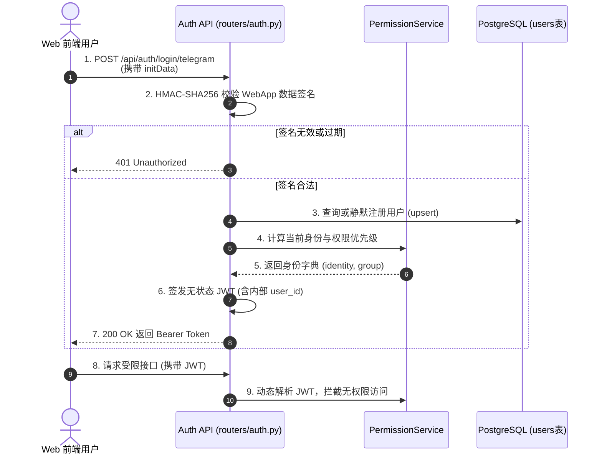
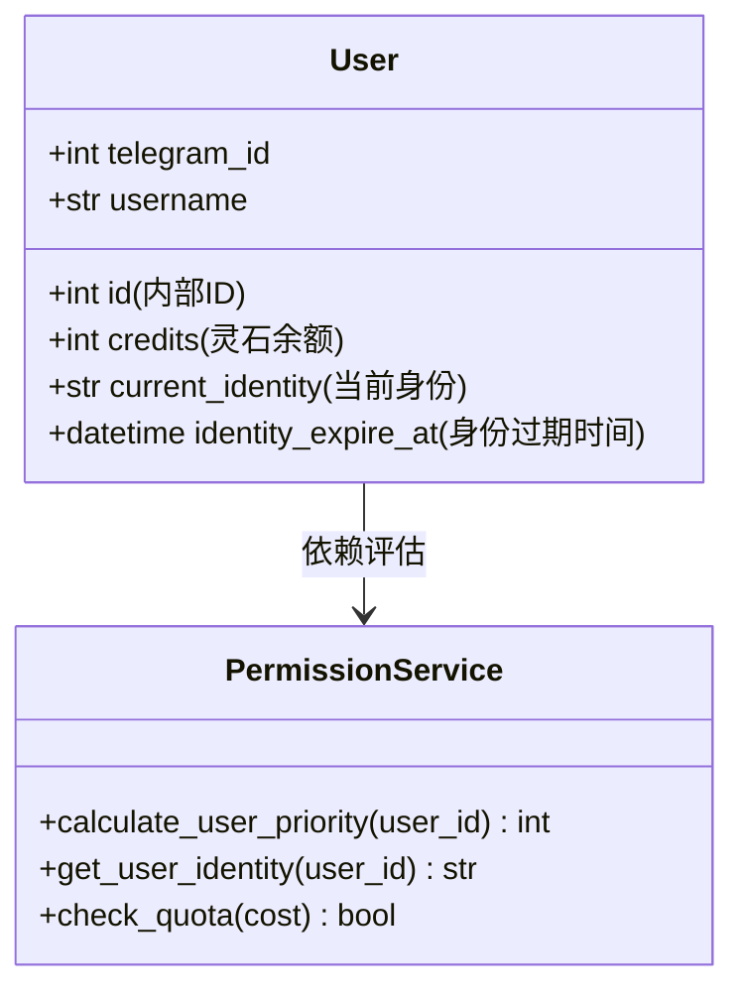

# 子模块: 用户认证与权限管理 (User Auth & Permission)

## 1. 目标与范围
本模块负责全系统的身份验证与权限控制。提供两套鉴权机制：针对 Telegram 客户端的原生消息上下文鉴权，以及针对 Web 前端的 `Telegram Web App InitData` 校验与无状态 JWT 签发。同时，通过统一的领域服务（`PermissionService`），计算用户的修仙等级（凡人、练气期、筑基期等）和会员身份（内门、核心、真传），从而进行动态的并发限流和高阶功能（如一键换脸）的准入拦截。

## 2. 架构图与调用链





## 3. 核心代码片段

### Telegram Web App 签名校验 (src/core/auth_core.py)
[`auth_core.py:L55-L75`](file:///home/hfy/APP/All_bot/src/core/auth_core.py#L55)
```python
def verify_telegram_webapp_initdata(init_data: str) -> Optional[dict]:
    """验证从 Telegram Web App 传入的 initData 签名，防止伪造登录"""
    import urllib.parse
    import hmac
    import hashlib
    
    parsed_data = dict(urllib.parse.parse_qsl(init_data))
    if 'hash' not in parsed_data:
        return None
        
    hash_value = parsed_data.pop('hash')
    # 按照 Key 的字母顺序排序并拼接
    data_check_string = '\n'.join(f"{k}={v}" for k, v in sorted(parsed_data.items()))
    
    # 核心安全红线：使用 BOT_TOKEN 派生 Secret Key 进行 HMAC-SHA256 校验
    secret_key = hmac.new(b"WebAppData", BOT_TOKEN.encode(), hashlib.sha256).digest()
    calculated_hash = hmac.new(secret_key, data_check_string.encode(), hashlib.sha256).hexdigest()
    
    if calculated_hash != hash_value:
        return None
    return parsed_data
```

### 权限与等级优先级计算 (src/services/permission_service.py)
[`permission_service.py:L13-L42`](file:///home/hfy/APP/All_bot/src/services/permission_service.py#L13-L42)
```python
async def calculate_user_priority(self, user_id: int) -> int:
    """
    Calculate dynamic priority based on user group (修为), identity (身份), and daily usage.
    Priority from group and identity are calculated independently and then added together.
    Rules defined in DYNAMIC_PRIORITY_RULES.
    """
    # 新手特权：前2次生成固定极高优先级 30
    stats = await self.quota_manager.get_user_stats(user_id)
    if stats.get("generation_count", 0) < 2:
        return 30

    group = await self.get_user_group(user_id)
    identity = await self.get_user_identity(user_id)
    usage = await self.quota_manager.get_daily_usage(user_id)
    
    group_priority = 0
    group_rules = DYNAMIC_PRIORITY_RULES.get(group, [])
    for limit, priority in group_rules:
        if usage < limit:
            group_priority = priority
            break
            
    identity_priority = 0
    identity_rules = DYNAMIC_PRIORITY_RULES.get(identity, [])
    for limit, priority in identity_rules:
        if usage < limit:
            identity_priority = priority
            break
    
    return group_priority + identity_priority
```

### 核心层隔离 (Core Isolation) 规范
为了支持多端复用（Web API, Bot, Dashboard），`PermissionService` 中的所有核心业务方法（如 `check_access`, `ensure_user`, `perform_checkin`）已彻底剥离对 Telegram 特定对象（如 `Update`, `ContextTypes`）的依赖，全部改为接收基础类型参数（`tg_id`, `username`, `full_name` 等）。
调用方（如 Handler 层）在调用前，必须自行完成对象的解析与前置防御（例如判断 `update.effective_user` 是否为空）。


## 4. 接口定义 (OpenAPI 3.0)

```yaml
openapi: 3.0.3
info:
  title: User Authentication API
  version: 1.0.0
paths:
  /api/auth/login/telegram:
    post:
      summary: Telegram Web App 静默登录
      requestBody:
        required: true
        content:
          application/json:
            schema:
              type: object
              properties:
                initData:
                  type: string
                  description: 从 window.Telegram.WebApp.initData 提取的完整字符串
      responses:
        '200':
          description: 登录成功，返回 JWT Token 与用户信息
          content:
            application/json:
              schema:
                type: object
                properties:
                  access_token:
                    type: string
                  token_type:
                    type: string
                    example: bearer
        '401':
          description: 签名校验失败或已过期
```

## 5. 单元与集成测试要求
- **覆盖率基准**：核心验签和优先级逻辑要求 **≥90%** 覆盖率。
- **核心用例**：
  1. `test_verify_webapp_signature_valid`：使用测试 `BOT_TOKEN` 和伪造的有效签名进行验证，断言返回正确的 User 字典。
  2. `test_verify_webapp_signature_invalid`：修改任意参数内容或哈希，断言返回 `None` 并抛出 HTTP 401 异常。
  3. `test_priority_calculation`：模拟不同 `identity` 的用户，断言 `calculate_user_priority` 返回期望的阶梯权重（如：真传弟子返回 10）。

## 6. 部署与回滚步骤
- **部署**：随 Web API 一同发布：`docker-compose up -d --build web-api`。
- **环境要求**：必须在 `.env` 中正确配置前端绑定的 `BOT_TOKEN`。
- **回滚**：无特殊的数据库迁移强依赖。可通过拉取上一稳定版本镜像重启 `web-api` 容器完成。

## 7. 监控告警规则 (SLI/SLO)
- **SLI**：`/api/auth/login/telegram` 接口的 401 错误率及接口平均响应时间。
- **SLO**：合法登录成功率 > 99.9%，平均响应时间 < 150ms。
- **告警策略**：
  - **Critical**：连续 3 分钟内出现大量 (如 > 50次) 的 401 Unauthorized 报错，极可能是 `.env` 中的 `BOT_TOKEN` 被误改导致全网掉线，需触发 P0 级告警。
