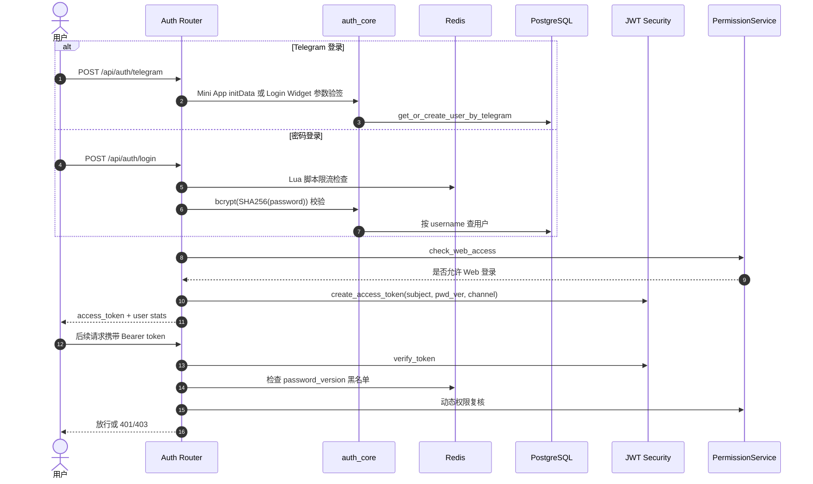

# 子模块: 用户认证与权限管理 (User Auth & Permission)

## 1. 目标与范围
本模块负责 Web 端身份认证、会话校验、动态权限拦截与用户身份映射。当前实现已经不是“仅 Telegram Mini App 静默登录”，而是一个双入口认证体系：
- Telegram Mini App / Login Widget 验签登录
- 用户名密码登录与绑定密码

同时，Web 会话不是“签完 JWT 就结束”，每次请求还会重新验证：
- 用户是否存在
- Token 是否被 `password_version` 黑名单失效
- 用户当前境界/身份是否仍满足 Web 准入要求

## 2. 当前认证链路

## 3. 已落地实现事实

### 3.1 Telegram 登录
- 路由是 `POST /api/auth/telegram`，不再使用旧文档中的 `/api/auth/login/telegram`。
- 同一个接口同时支持：
  - `initData` 登录（Mini App）
  - Login Widget 字段登录（`id/hash/auth_date/...`）
- 验签时会同时尝试 `BOT_TOKEN` 与 `BOT_TOKEN_TEST`，兼容正式/测试 Bot。
- 验签包含 `auth_date` 过期检查，阻断重放攻击。

### 3.2 密码登录与改密
- 路由已提供：
  - `POST /api/auth/login`
  - `POST /api/auth/bind-password`
- 密码不是明文 bcrypt，而是先 `SHA256` 再 `bcrypt`。
- 登录与绑定密码都接入 Redis Lua 限流脚本，按 IP 和用户双维度限制爆破。
- 改密成功后会：
  - `password_version += 1`
  - 把旧版本加入 Redis 黑名单 7 天
  - 向 Telegram 发安全提醒消息

### 3.3 JWT 与会话校验
- JWT 由 `src/web_api/core/security.py` 基于 `SECRET_KEY` 与 `ALGORITHM` 签发。
- Token payload 包含：
  - `sub`
  - `pwd_ver`
  - `channel`
  - `exp`
- `get_current_user` 不是只解 token；它还会做：
  - 用户存在性检查
  - 黑名单校验
  - 当前身份/境界复核
- 因此“已登录用户”如果后续被降权，访问 Web 时仍会被 403 拦截。

### 3.4 权限与用户态
- Web 登录资格依赖 `PermissionService.check_web_access()`。
- 返回给前端的用户对象已经包含：
  - `credits`
  - `user_group`
  - `current_identity`
  - `priority`
  - `identity_expire_at`
  - `invitation_recharge`
  - 签到/生成/邀请等统计
- 这意味着认证接口已经是“登录 + 用户首页基础态聚合接口”，不是单纯 token 交换。

## 4. 需要坚持的安全红线
- 不要绕过 `auth_core` 直接在路由层手写 Telegram 验签或密码校验。
- 不要把 JWT 说成由 `BOT_TOKEN` 直接签发。当前 `BOT_TOKEN` 只用于 Telegram 验签。
- 不要在改密后仅更新数据库而不处理旧会话失效；`password_version` 黑名单是现有安全基线的一部分。
- 不要把 Web 准入写成“只看身份”或“只看境界”，当前是动态权限联合判断。

## 5. 测试关注面
- Telegram Mini App / Login Widget 验签成功与失败
- `auth_date` 过期重放拦截
- 密码登录限流与错误口令返回
- 改密后旧 token 失效
- 已登录用户降权后再次访问 Web 被拒绝

## 6. 文档维护口径
- 认证模块文档必须同时覆盖 Telegram 登录与密码登录。
- 权限模块文档必须反映“持久权限检查”，不能再写成一次性授权模型。
