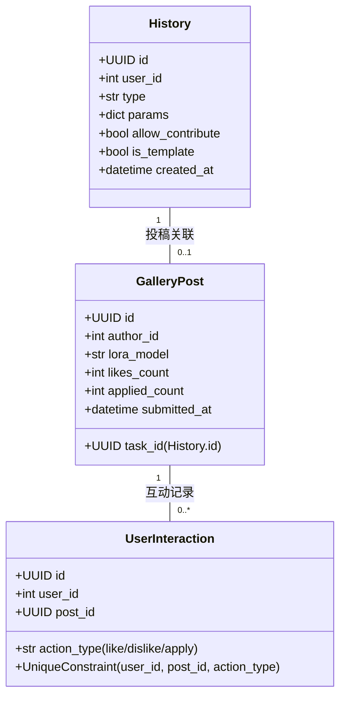
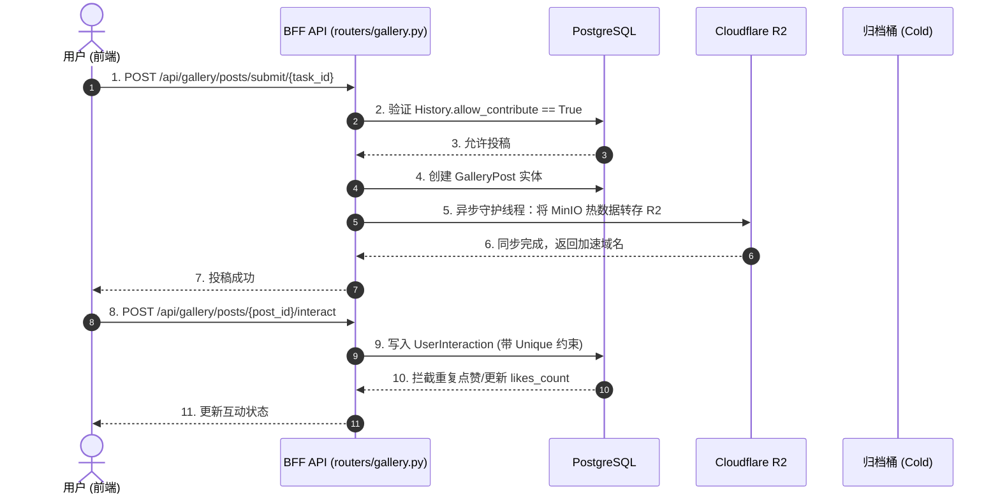

# 子模块: 社区广场与分级存储 (Gallery & Storage)

## 1. 目标与范围
本模块包含两大核心：一是系统级的冷热分级存储与大文件传输加速；二是依托历史生成记录衍生出的社区广场。它通过 MinIO 对象存储引用传递机制、CDN 边缘加速（R2）、以及 `GalleryPost` / `UserInteraction` 的防并发覆盖和原创保护机制，大幅降低内网带宽与主库压力。

## 2. 架构图与调用链





## 3. 核心代码片段

### 社区原创保护与投稿下沉 (src/core/gallery_core.py)
[`gallery_core.py`](file:///home/hfy/APP/All_bot/src/core/gallery_core.py)
```python
async def process_submit_to_gallery(user_id: int, task_id: str, background_tasks, width: int = None, height: int = None, duration: int = None) -> dict:
    """Core logic for submitting a task to the gallery. (防抄袭与原创保护)"""
    # Check limit
    can_submit = await redis_client.check_gallery_submit_limit(user_id, limit=10)
    if not can_submit:
        raise GalleryCoreError("您今日的投稿次数已达 10 次上限，请明日再来~")

    async with AsyncSessionLocal() as session:
        # Check existing
        existing = await session.execute(select(GalleryPost).where(GalleryPost.task_id == task_id))
        if existing.scalars().first():
            raise GalleryCoreError("您已经投稿过此内容啦！")

        # Get History
        hist_res = await session.execute(select(History).where(History.task_id == task_id).where(History.user_id == user_id))
        history = hist_res.scalars().first()
        
        if getattr(history, 'allow_contribute', True) is False:
            raise GalleryCoreError("这是一键应用他人的模板生成的作品，为了保护原创，暂不支持再次投稿。")
        
        # ...执行投稿与 R2 异步转存
```

### 动态分页与并发互动保护 (src/core/gallery_core.py)
[`gallery_core.py`](file:///home/hfy/APP/All_bot/src/core/gallery_core.py)
```python
async def get_gallery_feed(page: int = 1, size: int = 20, ...) -> tuple[list, int]:
    """
    解决 N+1 查询性能问题与分页计算 Bug：
    1. 使用 selectinload/joinedload 预加载关联数据（如 Author/History），避免列表遍历时的 N+1 查询。
    2. 使用 subquery().count() 动态计算分页总数，彻底解决条件筛选（如 outerjoin）导致的前端页码错位。
    """
    async with AsyncSessionLocal() as session:
        query = select(GalleryPost).where(...)
        # ... 各种复杂的 where 和 join 条件
        
        # Get total count dynamically
        total_query = select(func.count()).select_from(query.subquery())
        total = (await session.execute(total_query)).scalar()
        
        # Paginate
        offset = (page - 1) * size if page > 0 else 0
        query = query.offset(offset).limit(size)
        
        result = await session.execute(query)
        return result.scalars().all(), total

async def toggle_like(user_id: int, post_id: int, action: str) -> dict:
    """利用 UniqueConstraint 捕获 IntegrityError，并通过原子更新防并发连点"""
    # 核心红线：捕获 IntegrityError 前，必须手动 flush，防止 autoflush 提前抛错
    await session.flush()
    # 使用数据库层面的原子更新，防覆盖
    stmt = update(GalleryPost).where(GalleryPost.id == post_id)\
                              .values(likes_count=GalleryPost.likes_count + 1)\
                              .returning(GalleryPost.likes_count, GalleryPost.dislikes_count)
    # ...

async def record_apply_interaction(user_id: int, post_id: int):
    """一键应用防刷与延迟计数"""
    # 核心红线：应用次数 (applied_count) 不能在 FSM/Router 层用户点击时立即增加，
    # 必须通过 TaskService 在成功排队并扣费后，调用本函数进行累加，避免因余额不足或任务取消导致的虚假统计。
    # 并在捕获 IntegrityError 前进行 session.flush()。
    interaction = UserInteraction(user_id=user_id, post_id=post_id, action_type="apply")
    session.add(interaction)
    await session.flush()
    # 原子增加...
```

## 4. 接口定义 (OpenAPI 3.0)

```yaml
openapi: 3.0.3
info:
  title: Gallery & Storage API
  version: 1.0.0
paths:
  /api/gallery/posts/submit/{task_id}:
    post:
      summary: 将个人历史记录推送到社区广场
      parameters:
        - in: path
          name: task_id
          required: true
          schema:
            type: string
            format: uuid
      responses:
        '200':
          description: 发布成功
        '400':
          description: 非原创作品（allow_contribute=False），拒绝发布
        '403':
          description: 无权操作他人记录
```

## 5. 单元与集成测试要求
- **覆盖率基准**：此模块覆盖率要求 **≥85%**。
- **核心用例**：
  1. `test_duplicate_submission`：对同一个 `task_id` 连续调用两次投稿接口，断言数据库只存在一条 `GalleryPost`，第二次抛出 400 错误。
  2. `test_prevent_template_resubmission`：构建一个 `allow_contribute=False` 的 History，调用投稿，断言被严格拦截。
  3. `test_concurrent_likes`：使用多线程/协程对同一帖子进行 50 次并发点赞，断言最终 `likes_count` 精确为 50。

## 6. 部署与回滚步骤
- **部署**：
  广场与存储服务与 BFF 网关集成。部署执行：
  `docker-compose -f deploy/docker-compose.yml up -d --build web-api`
- **回滚**：
  如果异步转存逻辑导致 MinIO 崩溃，可回滚旧镜像或手动重启存储容器：`docker restart minio-server`。

## 7. 监控告警规则 (SLI/SLO)
- **SLI**：排行榜查询 `/api/gallery/posts` 的响应时间；MinIO `_region_map` 离线签名命中率。
- **SLO**：广场首页 API 平均响应延迟 < 200ms；直传文件预签名失败率 < 0.1%。
- **告警策略**：
  - **Critical**：前端频发 503 超时错误，表示 MinIO 已进入假死离线状态（taking drive offline），触发最高级别警报，人工介入重启存储节点。
  - **Warning**：热门数据转存 R2 失败次数 > 5 次/分钟，通过群组通报 CDN 同步异常。
