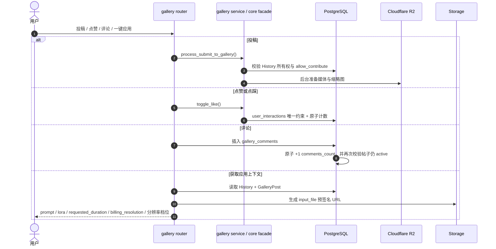

# 子模块: 社区广场与分级存储 (Gallery & Storage)

## 1. 目标与范围
本模块负责 Gallery 社区、对象存储访问、R2 边缘分发以及模板一键应用上下文。当前实现已经不是“投稿 + 点赞 + R2 转存”三件套，而是完整的社区工作台：
- 社区投稿与原创保护
- 点赞/点踩/应用记录
- 评论系统与评论计数
- 我的投稿 / 我的收藏
- Web workbench 一键应用上下文
- R2 媒体与缩略图优先返回
- Dashboard 投稿用户展示、用户名/提示词筛选、投稿封禁与用户级批量下架

## 2. 当前数据模型
- `gallery_posts`
  - 核心帖子实体，保存媒体类型、宽高、时长、互动计数、`comments_count`、上下架状态。
- `user_interactions`
  - 记录 `like / dislike / apply`，通过唯一约束拦截重复互动。
- `gallery_comments`
  - 评论表，按 `post_id + created_at` 建索引，支持活跃评论分页。
- `history`
  - 仍是帖子内容来源与 apply-context 的事实源，包含 `prompt / input_file / requested_duration / billing_resolution / allow_contribute` 等字段。
- `users`
  - `is_submission_banned / submission_banned_at / submission_ban_reason` 控制用户是否仍可投稿，不能用身份或修为字段模拟。

## 3. 当前主流程

## 4. 已落地实现事实

### 4.1 投稿与原创保护
- 投稿仍要求内容源自自己的 `History`。
- `allow_contribute=False` 的模板衍生作品不能再次投稿，防止套娃搬运。
- 用户级 `is_submission_banned=True` 时，Bot 端广场投稿、公开分享、模板共建，以及 Web 端一键投稿/重新上架都会被统一拦截，并提示“违禁被封，请联系管理员解封”。
- Dashboard 广场内容列表 `GET /api/gallery/all` 支持 `username`、`prompt_contains`、`prompt_max_length` 筛选；提示词条件以关联 `History.prompt` 为准，`prompt_max_length` 按去除首尾空白后的字符数过滤。
- Dashboard 广场内容管理可通过 `POST /api/gallery/users/{user_id}/ban-submissions-and-takedown` 对投稿用户一键封禁并下架其所有广场投稿；接口返回 `affected_posts` 与 `affected_histories` 用于后台反馈。
- 删除帖子采用软删除/下架思路，不是简单硬删所有内容暴力清空。

### 4.2 互动系统
- `POST /api/gallery/posts/{post_id}/interact` 当前只接受 `like|dislike`。
- `apply` 统计不是在点击时立即加一，而是要等真正进入任务链路后再记 `UserInteraction(action_type='apply')`。
- 这一点是广场统计真实性的核心红线，不能为了前端方便在 UI 点击时预增计数。

### 4.3 评论系统
- 已提供创建评论与分页查询接口。
- 评论前会校验帖子仍处于 `is_active=True`。
- 评论提交有 Redis 频率锁，防止短时间刷评。
- `comments_count` 通过数据库原子更新维护，并在提交阶段再次校验帖子没有被并发下架。

### 4.4 收藏与个人视图
- 已提供：
  - 广场列表 `posts`
  - 我的投稿 `my-posts`
  - 我的收藏/应用历史 `my-favorites`
- `my-favorites` 不是单独表，而是从 `user_interactions` 反查点赞和应用记录。
- Gallery feed 查询拼装已从 `src/core` 迁到 `src/services/gallery_feed_queries.py`，`src/core/gallery_feed_queries.py` 仅作为兼容 re-export；新增列表查询条件应继续放在 service 层，避免 core 重新直连 SQL 细节。

### 4.5 Apply Context 已成为 Web 主路径
- `GET /api/gallery/posts/{post_id}/apply-context` 会返回：
  - `source_post_id`
  - `prompt`
  - `lora_name`
  - `task_type`
  - `input_file` 与预签名 `input_file_url`
  - `requested_duration`
  - `billing_resolution`
  - 宽高与媒体元数据
- 旧图生视频 `custom_video` / `video_lora` 投稿应用时会把旧 `512p/720p/1024p` 归一为 Wan22 v2 档位 `preview/standard/hd`，并把历史 duration 固定恢复为 5 秒；`video_lora` 还会从历史 prompt 中的 `[模型: xxx]` 兼容解析 `lora_name`。
- 这已经是 Web workbench 模板应用的主入口，Telegram 内的老 `gallery_apply_fsm` 只应视为兼容路径。

### 4.6 媒体 URL 策略
- 列表返回媒体时优先尝试 R2 公网 URL。
- 若 R2 对象不存在，则回退到原始存储路径。
- 缩略图也有独立的 R2 key 选择逻辑，不再是“简单拼接后缀”即可概括的模型。

## 5. 核心红线
- 捕获互动类 `IntegrityError` 前，必须先 `flush()`，避免 `autoflush` 提前把异常抛出到错误层级。
- 点赞、点踩、评论计数都必须用数据库原子更新，不能先读后写覆盖。
- 投稿封禁属于用户能力控制，不得通过篡改 `allow_contribute`、`current_identity` 或 `user_group` 去模拟。
- 用户级批量下架必须同时更新 `GalleryPost.is_active=False` 与投稿关联的 `History.is_public=False`，避免只隐藏列表但保留旧公开资源入口。
- `apply-context` 必须从 `History` 取请求语义字段，不能只依赖帖子展示用的输出元数据。
- 对象存储异常只能降级，不能阻断广场浏览主链路。

## 6. 测试关注面
- 重复投稿与 `allow_contribute=False` 拦截
- 并发点赞/点踩的一致性
- 评论并发下架时的回滚与 404
- `my-favorites` 过滤 like/apply 的正确性
- apply-context 对 `requested_duration` / `billing_resolution` / `input_file_url` 的返回准确性
- Dashboard 封禁投稿并批量下架时，用户封禁状态、帖子上下架状态和多条 `History.is_public` 同步

## 7. 文档维护口径
- 广场文档必须把“评论、收藏、apply-context、R2 优先 URL”视作现有能力，而不是扩展项。
- 不要再把 Telegram 端一键应用写成主流程，当前主入口是 Web workbench。
