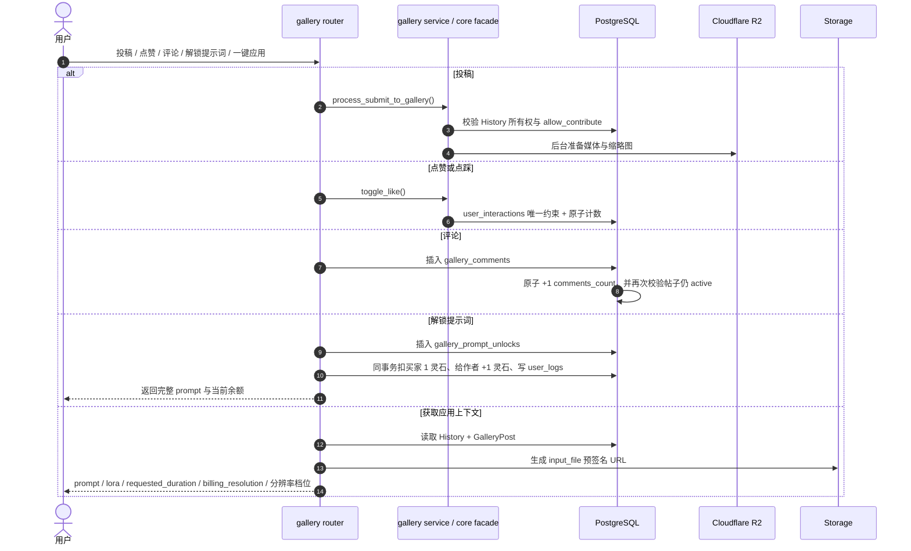

# 子模块: 社区广场与分级存储 (Gallery & Storage)

## 1. 目标与范围
本模块负责 Gallery 社区、对象存储访问、R2 边缘分发以及模板一键应用上下文。当前实现已经不是“投稿 + 点赞 + R2 转存”三件套，而是完整的社区工作台：
- 社区投稿与原创保护
- 点赞/点踩/应用记录
- 评论系统与评论计数
- 我的投稿 / 我的收藏
- 提示词付费解锁与我的提示词模版
- Web workbench 一键应用上下文
- R2 媒体与缩略图优先返回
- Dashboard 投稿用户展示、用户名/提示词筛选、投稿封禁与用户级批量下架

## 2. 当前数据模型
- `gallery_posts`
  - 核心帖子实体，保存媒体类型、宽高、时长、互动计数、`comments_count`、上下架状态。
- `user_interactions`
  - 记录 `like / dislike / apply`，通过唯一约束拦截重复互动。
- `gallery_comments`
  - 评论表，按 `post_id + created_at` 建索引，支持活跃评论分页。
- `gallery_prompt_unlocks`
  - 提示词解锁表，`user_id + post_id` 唯一，记录买家、帖子、作者与解锁灵石成本，是提示词解锁的幂等锚点。
- `history`
  - 仍是帖子内容来源与 apply-context 的事实源，包含 `prompt / input_file / requested_duration / billing_resolution / allow_contribute` 等字段。
- `users`
  - `is_submission_banned / submission_banned_at / submission_ban_reason` 控制用户是否仍可投稿，不能用身份或修为字段模拟。

## 3. 当前主流程

## 4. 已落地实现事实

### 4.1 投稿与原创保护
- 投稿仍要求内容源自自己的 `History`。
- `allow_contribute=False` 的模板衍生作品不能再次投稿，防止套娃搬运。
- 用户级 `is_submission_banned=True` 时，Bot 端广场投稿、公开分享、模板共建，以及 Web 端一键投稿/重新上架都会被统一拦截，并提示“违禁被封，请联系管理员解封”。
- Dashboard 广场内容列表 `GET /api/gallery/all` 支持 `username`、`prompt_contains`、`prompt_max_length` 筛选；提示词条件以关联 `History.prompt` 为准，`prompt_max_length` 按去除首尾空白后的字符数过滤。
- Dashboard 广场内容管理可通过 `POST /api/gallery/users/{user_id}/ban-submissions-and-takedown` 对投稿用户一键封禁并下架其所有广场投稿；接口返回 `affected_posts` 与 `affected_histories` 用于后台反馈。
- 删除帖子采用软删除/下架思路，不是简单硬删所有内容暴力清空。

### 4.2 互动系统
- `POST /api/gallery/posts/{post_id}/interact` 当前只接受 `like|dislike`。
- `apply` 统计不是在点击时立即加一，而是要等真正进入任务链路后再记 `UserInteraction(action_type='apply')`。
- 这一点是广场统计真实性的核心红线，不能为了前端方便在 UI 点击时预增计数。

### 4.3 评论系统
- 已提供创建评论与分页查询接口。
- 评论前会校验帖子仍处于 `is_active=True`。
- 评论提交有 Redis 频率锁，防止短时间刷评。
- `comments_count` 通过数据库原子更新维护，并在提交阶段再次校验帖子没有被并发下架。

### 4.4 收藏与个人视图
- 已提供：
  - 广场列表 `posts`
  - 我的投稿 `my-posts`
  - 我的收藏/应用历史 `my-favorites`
  - 我的提示词模版 `my-prompt-unlocks`
- `my-favorites` 不是单独表，而是从 `user_interactions` 反查点赞和应用记录。
- `my-prompt-unlocks` 从 `gallery_prompt_unlocks` 反查当前用户已解锁提示词的活跃帖子；服务端会根据是否作者/是否已解锁决定返回完整 prompt 或遮罩 prompt。
- Gallery feed 查询拼装已从 `src/core` 迁到 `src/services/gallery_feed_queries.py`，旧 `src/core/gallery_feed_queries.py` 兼容 re-export 已删除；新增列表查询条件应继续放在 service 层，避免 core 重新直连 SQL 细节。

### 4.5 提示词付费解锁
- Gallery 列表与详情响应新增 `prompt_unlocked`、`prompt_unlockable`、`prompt_is_masked`、`prompt_unlock_price` 字段。
- 未解锁且非作者访问时，服务端只返回半公开的遮罩 prompt；前端不能依赖客户端遮罩来保护完整提示词。
- 解锁入口为 `POST /api/gallery/posts/{post_id}/prompt-unlock`，固定消耗 1 灵石；扣减买家与奖励作者必须通过 `QuotaManager.transfer_credits(...)` 在同一事务内完成，并各自写入 `user_logs`。
- 重复解锁同一帖子必须命中 `gallery_prompt_unlocks.user_id + post_id` 唯一约束或既有记录，不得重复扣费。
- 作者查看自己的帖子视为已解锁，不创建解锁记录、不发生灵石转账。

### 4.6 Apply Context 已成为 Web 主路径
- `GET /api/gallery/posts/{post_id}/apply-context` 会返回：
  - `source_post_id`
  - `prompt`
  - `negative_prompt`
  - `lora_name`
  - `task_type`
  - `input_file` 与预签名 `input_file_url`
  - `requested_duration`
  - `billing_resolution`
  - 宽高与媒体元数据
- 旧图生视频 `custom_video` / `video_lora` 投稿应用时会把旧 `512p/720p/1024p` 归一为 Wan22 v2 档位 `preview/standard/hd`，把 `0.36 MP - Small` 归一为 `small`，并恢复 canonical `5s/8s/10s` 时长，缺失或非 canonical 时回退 5 秒；`video_lora` 还会从历史 prompt 中的 `[模型: xxx]` 兼容解析 `lora_name`。
- `wan22_video_v2` 单段投稿支持一键应用，回填正向提示词、`_wan22_context.wan22_negative_prompt`、`_wan22_context.wan22_resolution_preset` 和 `_wan22_context.wan22_duration_seconds`，不复刻首尾帧或链式上下文。
- 所有 Wan22 stitched 拼接记录（旧 `custom_video` / `video_lora` 与 `wan22_video_v2`）都不支持一键应用：列表/详情应返回 `template_apply_supported=false` 与 `template_apply_disabled_reason="wan22_stitched"`，apply-context 入口必须返回 400 防绕过。
- 这已经是 Web workbench 模板应用的主入口，Telegram 内的老 `gallery_apply_fsm` 只应视为兼容路径。

### 4.7 媒体 URL 策略
- 列表返回媒体时不在热路径对每个媒体做公网 `HEAD` 探测；R2 S3 key 命中时优先返回 R2 S3 短签 URL，避免自定义公网域名 miss 导致前端空白，预签不可用时才退回公网 URL。
- R2 key 候选顺序为标准历史 key、原始 object key、raw `output_file`、旧 basename。例如 `history/{task_id}/original.ext` 未命中时，会继续探测 `123/output_images/file.ext`；若历史值本身包含 `bot-data/...` 且 R2 曾按该 raw 前缀镜像，也会继续探测 raw 路径，兼容迁移期多种对象位置。
- 云正式迁移期可通过 `LEGACY_MINIO_*` 启用本地 MinIO 只读回源；R2 对象不存在且 legacy 对象存在时，Web API 返回 legacy 短签 URL。该 fallback 只用于读旧历史媒体，新生成数据仍写入 R2。
- 历史详情、Wan22 历史预览等非列表读路径会先对 R2 公网 URL 做短超时可读性探测；若公网自定义域名返回 404/不可读但 R2 S3 `HEAD` 命中，可返回 R2 S3 短签 URL 保证用户可读。Web owner `/result` 仍是延迟敏感路径，视频结果未就绪时继续返回 `pending_result`，不要把它和历史详情 fallback 混为一谈。
- `input_file_url` 也支持 legacy MinIO 只读回源，保障 Gallery apply-context 和历史模板应用能恢复旧输入图。
- 缩略图也有独立的 R2 key 选择逻辑，不再是“简单拼接后缀”即可概括的模型；legacy 回源会先验证旧缩略图对象存在。迁移脚本可先从 legacy 复制已有缩略图，再用 `--source-storage current --generate-missing-thumbnails` 从已预热到 R2 的原文件生成缺失缩略图；legacy 源批量生成受保护拦截。
- Web API 在历史、用户历史和 Gallery 响应构造中会尽量先释放只读数据库事务，再进行对象存储 URL 解析、R2/legacy fallback 或缩略图处理。新增读路径时不要在 DB 事务内等待慢对象存储。
- 云正式已为 Gallery/History 热路径补充并发索引：活跃帖子按创建时间翻页、`history.task_id`、用户历史倒序、用户可见收藏、`task_id + user_id` 与 `user_interactions(user_id, action_type, post_id)`。新增列表查询条件时，应优先确认是否命中现有索引。

## 5. 核心红线
- 捕获互动类 `IntegrityError` 前，必须先 `flush()`，避免 `autoflush` 提前把异常抛出到错误层级。
- 点赞、点踩、评论计数都必须用数据库原子更新，不能先读后写覆盖。
- 提示词解锁必须先有 `gallery_prompt_unlocks` 唯一记录作为幂等锚点，灵石扣减与作者入账必须同事务完成。
- 未解锁提示词的完整内容不得通过 gallery 列表/详情响应泄漏；只允许返回服务端生成的遮罩 prompt。
- 投稿封禁属于用户能力控制，不得通过篡改 `allow_contribute`、`current_identity` 或 `user_group` 去模拟。
- 用户级批量下架必须同时更新 `GalleryPost.is_active=False` 与投稿关联的 `History.is_public=False`，避免只隐藏列表但保留旧公开资源入口。
- `apply-context` 必须从 `History` 取请求语义字段，不能只依赖帖子展示用的输出元数据。
- `apply-context` 必须服务端拒绝 Wan22 stitched 拼接记录，不能只靠前端隐藏按钮。
- 对象存储异常只能降级，不能阻断广场浏览主链路。
- 广场列表热路径不得恢复为“每条媒体公网 HEAD 探测 + 持有 DB 只读事务等待对象存储”的模式。

## 6. 测试关注面
- 重复投稿与 `allow_contribute=False` 拦截
- 并发点赞/点踩的一致性
- 评论并发下架时的回滚与 404
- `my-favorites` 过滤 like/apply 的正确性
- 提示词解锁首次扣费、重复请求不重复扣费、唯一约束并发冲突回滚、`my-prompt-unlocks` 列表过滤
- apply-context 对 `requested_duration` / `billing_resolution` / `negative_prompt` / `input_file_url` 的返回准确性
- Wan22 v2 单段一键应用回填与 stitched 拼接记录禁用、400 拒绝
- Dashboard 封禁投稿并批量下架时，用户封禁状态、帖子上下架状态和多条 `History.is_public` 同步
- Gallery 列表、我的投稿、我的收藏和历史详情需要覆盖 R2 hit、R2 miss + legacy fallback、缩略图 fallback 与对象存储慢响应场景。

## 7. 文档维护口径
- 广场文档必须把“评论、收藏、apply-context、R2 优先 URL”视作现有能力，而不是扩展项。
- 不要再把 Telegram 端一键应用写成主流程，当前主入口是 Web workbench。
