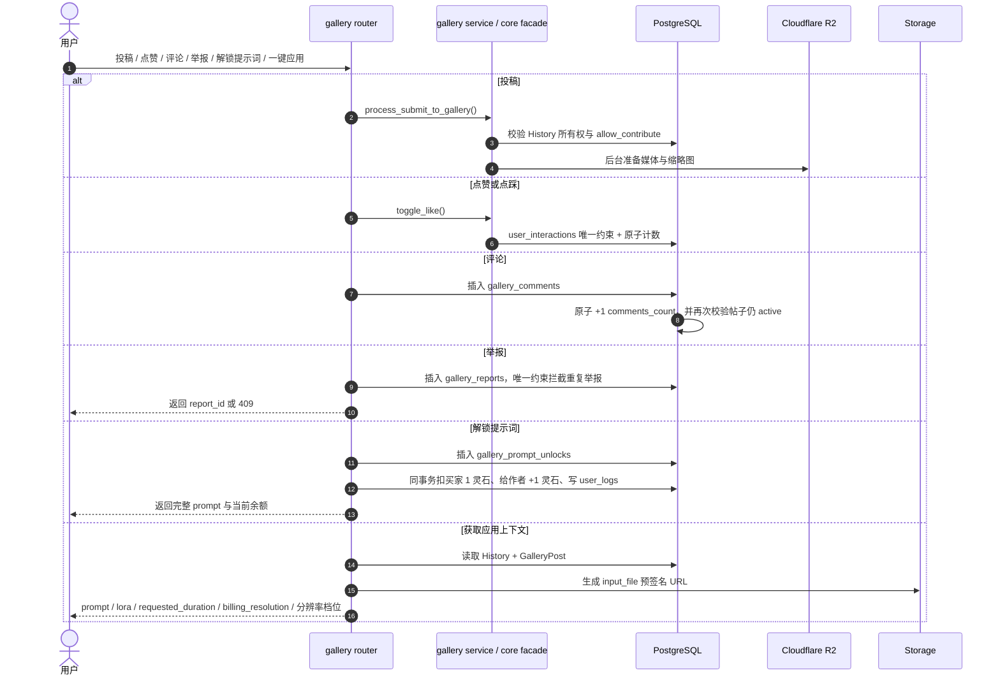

# 子模块: 社区广场与分级存储 (Gallery & Storage)

## 1. 目标与范围

本模块负责 Gallery 社区、对象存储访问、R2 边缘分发以及模板一键应用上下文。当前实现已经不是“投稿 + 点赞 + R2 转存”三件套，而是完整的社区工作台：

- 社区投稿与原创保护
- 点赞/点踩/应用记录
- 评论系统与评论计数
- 举报治理与后台处理
- 我的投稿 / 我的收藏
- 提示词付费解锁与我的提示词模版
- 用户公开主页、好友搜索、关注列表与粉丝列表
- Gallery / 修仙笔记 / 闪回瓶详情的原始输入素材预览
- Web workbench 一键应用上下文
- R2 媒体与缩略图优先返回
- Dashboard 投稿用户展示、用户名/提示词筛选、投稿封禁与用户级批量下架

## 2. 当前数据模型

- `gallery_posts`
  - 核心帖子实体，保存媒体类型、宽高、时长、互动计数、`comments_count`、上下架状态。
- `user_interactions`
  - 记录 `like / dislike / apply`，通过唯一约束拦截重复互动。
- `gallery_comments`
  - 评论表，按 `post_id + created_at` 建索引，支持活跃评论分页。
- `gallery_reports`
  - 举报表，保存举报人、作品作者、`post_task_id` 快照、原因与处理状态；`reporter_user_id + post_id` 唯一，作品删除后 `post_id` 可置空但举报记录保留。
- `gallery_prompt_unlocks`
  - 提示词解锁表，`user_id + post_id` 唯一，记录买家、帖子、作者与解锁灵石成本，是提示词解锁的幂等锚点。
- `history`
  - 仍是帖子内容来源与 apply-context 的事实源，包含 `prompt / input_file / requested_duration / billing_resolution / allow_contribute` 等字段。
- `users`
  - `is_submission_banned / submission_banned_at / submission_ban_reason` 控制用户是否仍可投稿，不能用身份或修为字段模拟。
- `user_follows`
  - 关注关系表，`follower_id + followee_id` 唯一；Web 用户中心用它展示“我的关注”“我的粉丝”和搜索结果里的关注状态，粉丝列表的 `is_following` 表示当前用户是否已经回关。

## 3. 当前主流程



## 4. 已落地实现事实

### 4.1 投稿与原创保护

- 投稿仍要求内容源自自己的 `History`。
- `allow_contribute=False` 的模板衍生作品不能再次投稿，防止套娃搬运。
- 用户级 `is_submission_banned=True` 时，Bot 端广场投稿、公开分享、模板共建，以及 Web 端一键投稿/重新上架都会被统一拦截，并提示“违禁被封，请联系管理员解封”。
- Dashboard 广场内容列表 `GET /api/gallery/all` 支持 `username`、`prompt_contains`、`prompt_max_length` 筛选；提示词条件以关联 `History.prompt` 为准，`prompt_max_length` 按去除首尾空白后的字符数过滤。
- Dashboard 广场内容管理可通过 `POST /api/gallery/users/{user_id}/ban-submissions-and-takedown` 对投稿用户一键封禁并下架其所有广场投稿；接口返回 `affected_posts` 与 `affected_histories` 用于后台反馈。
- 删除帖子采用软删除/下架思路，不是简单硬删所有内容暴力清空。

### 4.2 互动系统

- `POST /api/gallery/posts/{post_id}/interact` 当前只接受 `like|dislike`。
- `apply` 统计不是在点击时立即加一，而是要等真正进入任务链路后再记 `UserInteraction(action_type='apply')`。
- 这一点是广场统计真实性的核心红线，不能为了前端方便在 UI 点击时预增计数。

### 4.3 评论系统

- 已提供创建评论与分页查询接口。
- 评论前会校验帖子仍处于 `is_active=True`。
- 评论提交有 Redis 频率锁，防止短时间刷评。
- `comments_count` 通过数据库原子更新维护，并在提交阶段再次校验帖子没有被并发下架。

### 4.4 举报治理

- Web 修仙市集作品详情弹窗提供举报入口，提交 `POST /api/gallery/posts/{post_id}/reports`。
- 举报原因是单选枚举：`children` 儿童、`gore` 血腥、`gross` 恶心、`other` 其他；“其他”不要求补充说明。
- 只有登录用户可举报仍处于 `is_active=True` 的作品；同一用户对同一 `post_id` 只能举报一次，重复提交返回 `409`，不覆盖旧原因。
- Dashboard 新增举报管理入口，`GET /api/gallery/reports` 支持 `status`、`reason`、`post_id` 筛选，并按 `created_at desc, id desc` 稳定排序。
- Dashboard 标记处理只更新举报状态；联动下架会软下架 `GalleryPost.is_active=False`，同步同一 `task_id + user_id` 的所有 `History.is_public=False`，并把同作品其他 pending 举报一起置为 resolved。
- 举报展示文案由 Web/Dashboard 前端 locale 控制，后端只返回原因枚举、状态与快照字段。

### 4.5 收藏与个人视图

- 已提供：
  - 广场列表 `posts`
  - 我的投稿 `my-posts`
  - 我的收藏/应用历史 `my-favorites`
  - 我的提示词模版 `my-prompt-unlocks`
  - 用户公开主页 `GET /api/users/{user_id}/public-profile?page=&size=`
  - 好友搜索 `GET /api/users/search?q=&limit=`
  - 我的关注 `GET /api/users/me/follows`
  - 我的粉丝 `GET /api/users/me/followers`
- `my-favorites` 不是单独表，而是从 `user_interactions` 反查点赞和应用记录。
- `my-prompt-unlocks` 从 `gallery_prompt_unlocks` 反查当前用户已解锁提示词的活跃帖子；服务端会根据是否作者/是否已解锁决定返回完整 prompt 或遮罩 prompt。
- 好友搜索支持按 TG `username`（可带 `@`）或 `full_name` 昵称片段模糊匹配，返回公开用户摘要与 `is_following`，并排除当前用户自己。
- 用户公开主页响应以 `posts: { items,total,page,size,pages }` 作为公开投稿分页主字段，`recent_posts` 仅保留为当前页 items 的兼容字段；公开投稿统计和分页必须使用同一组可见性条件，避免统计数大于实际可翻页内容。
- 用户公开主页里的作品详情必须复用 Gallery 详情的提示词解锁逻辑，不能因为入口来自个人主页而隐藏 `prompt_unlockable` 的解锁入口。
- Gallery feed 查询拼装已从 `src/core` 迁到 `src/services/gallery_feed_queries.py`，旧 `src/core/gallery_feed_queries.py` 兼容 re-export 已删除；新增列表查询条件应继续放在 service 层，避免 core 重新直连 SQL 细节。
- Gallery 前端分组中，旧自由P图使用 `edit_group`，只包含 `edit` / `quick_image` / `img2img_lora`；规范自由P图分组为 `free_edit_v3_group`，包含新 `pornmaster_flux2_edit_bf16` 以及历史 `pornmaster_flux2_single_edit` / `pornmaster_flux2_multi_edit`。`free_edit_v2_group` 仅作为旧客户端查询别名解析到同一集合，Web 统一显示“自由P图 v3”。
- LTX 高级图生视频只保留 `ltx_video` 一个 Gallery 展示/筛选入口；历史或执行别名 `ltx_video_flf2v` 必须 canonical 到 `ltx_video`，投稿允许该别名但不新增展示 tab，筛选时同时查询两种 `History.type`。
- Gallery 列表/详情、我的投稿、我的收藏、我的提示词模版与用户主页 recent posts 基于 `GalleryPostResponse.input_file/input_file_url/input_files/input_file_urls` 展示 `History.input_file` 的原始输入素材预览；这是展示字段，不改变投稿、收藏或模板应用语义。

### 4.6 提示词付费解锁

- Gallery 列表与详情响应新增 `prompt_unlocked`、`prompt_unlockable`、`prompt_is_masked`、`prompt_unlock_price` 字段。
- 未解锁且非作者访问时，服务端只返回半公开的遮罩 prompt；前端不能依赖客户端遮罩来保护完整提示词。
- 解锁入口为 `POST /api/gallery/posts/{post_id}/prompt-unlock`，固定消耗 1 灵石；扣减买家与奖励作者必须通过 `QuotaManager.transfer_credits(...)` 在同一事务内完成，并各自写入 `user_logs`。
- 重复解锁同一帖子必须命中 `gallery_prompt_unlocks.user_id + post_id` 唯一约束或既有记录，不得重复扣费。
- 作者查看自己的帖子视为已解锁，不创建解锁记录、不发生灵石转账。

### 4.7 Apply Context 已成为 Web 主路径

- `GET /api/gallery/posts/{post_id}/apply-context` 会返回：
  - `source_post_id`
  - `prompt`
  - `negative_prompt`
  - `lora_name`
  - `task_type`
  - `input_file` / `input_file_url` 兼容字段，以及 `input_files` / `input_file_urls` 多输入数组
  - `requested_duration`
  - `billing_resolution`
  - 宽高与媒体元数据
- 旧图生视频 `custom_video` / `video_lora` 投稿应用时会把旧 `512p/720p/1024p` 归一为 Wan22 v2 档位 `preview/standard/hd`，把 `0.36 MP - Small` 归一为 `small`，并恢复 canonical `5s/8s/10s` 时长，缺失或非 canonical 时回退 5 秒；`video_lora` 还会从历史 prompt 中的 `[模型: xxx]` 兼容解析 `lora_name`。
- 新 v3 与历史 v2 自由P图投稿均支持 Web 一键应用：模板应用复用并锁定原 prompt、记录 `source_post_id`，要求用户重新上传恰好 1 张原图；面板不展示 LoRA/附加模型，统一提交 `pornmaster_flux2_edit_bf16` 并固定显示 5 灵石。普通 v3 结果可投稿，模板应用生成结果必须保存为 `allow_contribute=false`，避免模板递归投稿。
- `i2i_draw` 局部重绘当前已在 Web 一键应用关闭：作品仍可展示，但列表/详情必须返回 `template_apply_supported=false` 与 `template_apply_disabled_reason="i2i_draw_disabled"`，apply-context 入口必须返回 400 防绕过。
- `wan22_video_v2` 单段投稿支持一键应用，回填正向提示词、`_wan22_context.wan22_negative_prompt`、`_wan22_context.wan22_resolution_preset` 和 `_wan22_context.wan22_duration_seconds`，不复刻首尾帧或链式上下文。
- `ltx_video` 单首帧/首尾帧投稿支持一键应用，保留两张原始输入图顺序，并从 `_ltx_context` 回填 `lora_items`、`ltx_width`、`ltx_height`、`ltx_duration_seconds`；执行别名 `ltx_video_flf2v` 仍按 `ltx_video` 模板入口处理。
- `scail2_action_transfer` / `scail2_video_replacement` / `scail2_face_swap_v2` 投稿支持 Web 一键应用：模板只复用原历史第二个输入 motion/driving video，复用者重新上传 reference image；旧兼容字段 `input_file` 也指向该 motion video。缺失 motion video 时列表/详情返回 `template_apply_supported=false` 与 `template_apply_disabled_reason="missing_scail2_motion_video"`，apply-context 返回 400。
- 所有 Wan22 stitched 拼接记录（旧 `custom_video` / `video_lora` 与 `wan22_video_v2`）都不支持一键应用：列表/详情应返回 `template_apply_supported=false` 与 `template_apply_disabled_reason="wan22_stitched"`，apply-context 入口必须返回 400 防绕过。
- 这已经是 Web workbench 模板应用的主入口，Telegram 内的老 `gallery_apply_fsm` 只应视为兼容路径。
- QQCC 懒人 Bot 的 `修仙市集` 是轻量 Bot 入口，不取代 Web workbench 主路径。它按 Web 当前可见分组浏览 Gallery 投稿，支持点赞/点踩；普通可应用投稿同时展示 `一键应用` 与 `Web应用`，视频换脸类模板只展示 `Web应用`，Wan22/LTX 多段拼接结果不展示任何应用入口，并把类型和 `#task.mode_*` 标签翻译成当前语言展示。安全的单图模板可在 Bot 内重新收 1 张参考图并提交，必须带 `source_post_id` 与 `allow_contribute=False`。SCAIL-2、多图、多视频、LTX 首尾帧等复杂模板的一键应用只返回 Web 深链 `/gallery?apply_source=gallery&apply_id=<post_id>`，由 Web Gallery 打开对应 apply-context。QQCC 自己生成的快速换脸、AI绘图和 AI动图结果不提供投稿或公开入口，旧结果按钮也由 QQCC callback 入口拒绝。
- Apply-context presenter 的共享 seam 在 `src/services/gallery_apply_context_presenter.py`，Web API 的 `src/web_api/common/utils.py` 只是兼容薄壳；QQCC Bot 不再直接依赖 Web common utils。QQCC market Bot 层拆为 `gallery_market_view.py`、`gallery_market_interactions.py` 与 `gallery_market_apply.py`，原 `gallery_market.py` 只保留 callback facade 与数据加载。
- QQCC 原生 apply 下载的参考图必须走 FSM 临时目录；提交异常、unsupported task type、`/cancel` 或全局异常兜底都必须删除已下载路径。点击 `一键应用` 本身不得预增 `applied_count`，只有任务成功链路才能记 `UserInteraction(action_type='apply')`。

### 4.8 展示用原始输入预览

- `GalleryPostResponse` 现在额外暴露展示字段：`input_file`、`input_file_url`、`input_files`、`input_file_urls`。其中兼容字段指向展示列表第一个输入，数组字段保留 `History.input_file` 的原始顺序。
- `txt2img` 没有原始输入，前端不展示输入角标或详情区。
- 单输入任务在卡片左上角显示 1 张输入缩略图；详情中显示“原始输入”区域。
- 多输入任务在卡片左上角显示叠层与 `+N`，详情按数组顺序展示全部输入素材。
- Wan22 首尾帧按顺序显示为“起始帧 / 终止帧”。LTX 高级图生视频单首帧显示为“起始帧”，首尾帧显示为“起始帧 / 终止帧”；历史兼容的视频配音记录可显示为“输入视频”，但当前 Web/Bot 不再提供该入口。SCAIL-2 按顺序显示为“参考图 / 驱动视频”。
- Wan22 与 LTX 的链式视频标签由服务端从历史上下文补齐：单首帧、首尾帧、`segment:{n}` 和 `stitched_video:{n}` 只作为 Gallery/历史展示 tag，不新增单独筛选 tab。
- SCAIL-2 的展示输入与 apply-context 复用输入必须分开理解：展示层显示 reference image 与 motion/driving video 两份素材；模板应用仍只复用第二个 motion/driving video，复用者重新上传 reference image。
- 闪回瓶历史详情复用 `HistoryItem.input_file_urls` 展示原始输入。历史列表本身仍以任务输出缩略图为主，不把输入素材替代为结果图。
- 这些输入 URL 只做短签展示，不在列表热路径增加对象存储 HEAD 探测。

### 4.9 媒体 URL 策略

- 列表返回媒体时不在热路径对每个媒体做公网 `HEAD` 探测；R2 S3 key 命中时优先返回 R2 S3 短签 URL，避免自定义公网域名 miss 导致前端空白，预签不可用时才退回公网 URL。
- Telegram Gallery 浏览可使用 `GalleryPost.telegram_file_id` 秒发缓存。缓存缺失或 Telegram 返回 `wrong file identifier` 时，只对当前要展示的作品走 Gallery R2/S3 URL resolver 下载媒体并刷新 file_id；测试 Bot 不持久化新 file_id。不得把旧 `storage.get_file_bytes(...)` / legacy MinIO bytes 读取恢复成 Bot 浏览主路径。
- R2 key 候选顺序为标准历史 key、原始 object key、raw `output_file`、旧 basename。例如 `history/{task_id}/original.ext` 未命中时，会继续探测 `123/output_images/file.ext`；若历史值本身包含 `bot-data/...` 且 R2 曾按该 raw 前缀镜像，也会继续探测 raw 路径，兼容迁移期多种对象位置。
- 正式 Web/Dashboard 运行时已退出 legacy MinIO 回源：默认 `LEGACY_MINIO_READ_FALLBACK_ENABLED=false`，R2 miss 后只返回当前 R2/S3 短签、空值或 `pending_result`，不得生成 `assets.aivison.it.com` URL。legacy MinIO 只保留给迁移脚本、人工回滚和旧外链排障，新生成数据仍写入 R2。
- 历史详情、Wan22 历史预览等非列表读路径会先对 R2 公网 URL 做短超时可读性探测；若公网自定义域名返回 404/不可读但 R2 S3 `HEAD` 命中，可返回 R2 S3 短签 URL 保证用户可读。Web owner `/result` 仍是延迟敏感路径，视频结果未就绪时继续返回 `pending_result`，不要把它和历史详情 fallback 混为一谈。
- `input_file_url` 只生成当前 R2/S3 短签；旧输入图需要在禁用 legacy 前通过迁移脚本补齐到 R2，保障 Gallery apply-context 和历史模板应用可用。
- 缩略图也有独立的 R2 key 选择逻辑，不再是“简单拼接后缀”即可概括的模型。迁移脚本可先从 legacy 复制已有原文件、缩略图与 `input_file`，再用 `--source-storage current --generate-missing-thumbnails` 从已预热到 R2 的原文件生成缺失缩略图；legacy 源批量生成受保护拦截。
- Web API 在历史、用户历史和 Gallery 响应构造中会尽量先释放只读数据库事务，再进行对象存储 URL 解析、R2 探测、短签生成或缩略图处理。新增读路径时不要在 DB 事务内等待慢对象存储。
- legacy 退出前的可见热集补齐使用 `scripts/backfill_history_r2_objects.py --env-file .env.cloud.prod --hotset-profile web-visible-retire-legacy --source-storage legacy --include-input-files --batch-size 500`，默认 dry-run，真实复制必须显式 `--apply`；若本轮只迁移 Gallery 投稿、History 收藏、Gallery like/apply active posts 与 prompt unlock active posts，不迁移每用户最近 8 条历史，追加 `--skip-per-user-recent-history` 并使用独立 cursor；补齐后再用 `--source-storage current --generate-missing-thumbnails --apply` 生成缺失缩略图。
- R2 可见热集缺失核对使用只读脚本 `scripts/audit_visible_hotset_r2_objects.py`。默认审计范围为“Web 可见热集”：每用户最近 8 条可见历史、全部 Gallery 投稿、History 收藏、Gallery like/apply 关联 active posts、prompt unlock 关联 active posts；默认对象范围为历史原文件、标准缩略图和本地 `input_file`。脚本同时检查运行时 R2 候选 key（标准 `history/{task_id}/...`、原始 object key、raw `output_file`、旧 basename）和标准 key，因此报告能区分“用户运行时会 R2 miss”与“标准 key 未补齐但 fallback key 可命中”。
- 云正式只读审计示例：

```bash
python scripts/audit_visible_hotset_r2_objects.py \
  --env-file .env.cloud.prod \
  --recent-limit 8 \
  --concurrency 48 \
  --progress-interval 1000 \
  --db-batch-size 1000 \
  --report-dir logs
```

  运行后会在 `logs/` 生成三类文件：`r2_visible_hotset_audit_*.json`（机器可读全量报告，含 `missing_records`）、`r2_visible_hotset_audit_*.md`（概要报告）与 `r2_visible_hotset_audit_*_missing_appendix.csv`（缺失附录，记录 history、task、媒体类型、来源标签、缺失对象类型、R2 key 与候选 key）。如果只审计社区强可见集合、不含每用户最近 8 条，可追加 `--skip-per-user-recent-history`；如果不需要 apply-context 输入图，可追加 `--skip-input-files`。`--db-batch-size` 默认 1000，用于分批读取 History 详情，避免全量生产审计生成超大 SQL；`--concurrency` 同时控制 R2 HEAD semaphore 与线程池 worker，`--progress-interval` 默认每 1000 条输出进度。脚本只执行 DB 只读查询和 R2 `HEAD`，不上传、不删除、不改 cursor、不重建容器。

- 用 AI 生成排查报告时，优先喂入 Markdown 概要和 JSON 的 `summary`；需要列举具体缺失对象时再引用 CSV 附录。不要把 `.env.cloud.prod`、R2 presigned URL、访问密钥或完整生产 compose 渲染输出放入报告。
- 云正式已为 Gallery/History 热路径补充并发索引：活跃帖子按创建时间翻页、`history.task_id`、用户历史倒序、用户可见收藏、`task_id + user_id` 与 `user_interactions(user_id, action_type, post_id)`。新增列表查询条件时，应优先确认是否命中现有索引。

## 5. 核心红线

- 捕获互动类 `IntegrityError` 前，必须先 `flush()`，避免 `autoflush` 提前把异常抛出到错误层级。
- 点赞、点踩、评论计数都必须用数据库原子更新，不能先读后写覆盖。
- 提示词解锁必须先有 `gallery_prompt_unlocks` 唯一记录作为幂等锚点，灵石扣减与作者入账必须同事务完成。
- 未解锁提示词的完整内容不得通过 gallery 列表/详情响应泄漏；只允许返回服务端生成的遮罩 prompt。
- 投稿封禁属于用户能力控制，不得通过篡改 `allow_contribute`、`current_identity` 或 `user_group` 去模拟。
- 用户级批量下架必须同时更新 `GalleryPost.is_active=False` 与投稿关联的 `History.is_public=False`，避免只隐藏列表但保留旧公开资源入口。
- 举报联动下架必须同时更新 `GalleryPost.is_active=False` 与同 `task_id + user_id` 的 `History.is_public=False`，并批量处理同作品 pending 举报；不得只改举报状态。
- `apply-context` 必须从 `History` 取请求语义字段，不能只依赖帖子展示用的输出元数据。
- `apply-context` 必须服务端拒绝 Wan22 stitched 拼接记录、缺少 motion video 的 SCAIL-2 记录和 Web 已关闭的 `i2i_draw` 记录，不能只靠前端隐藏按钮。
- 对象存储异常只能降级，不能阻断广场浏览主链路。
- 广场列表热路径不得恢复为“每条媒体公网 HEAD 探测 + 持有 DB 只读事务等待对象存储”的模式。

## 6. 测试关注面

- 重复投稿与 `allow_contribute=False` 拦截
- 并发点赞/点踩的一致性
- 评论并发下架时的回滚与 404
- 举报成功、无效原因、作品不存在/已下架、重复举报 `409`；Dashboard 举报筛选、标记处理、联动下架、同作品 pending 举报批量 resolved
- `my-favorites` 过滤 like/apply 的正确性
- 用户公开主页公开投稿分页的总数、页数和可见性过滤；个人主页详情提示词解锁入口与解锁后状态同步
- 好友搜索 username/full_name 模糊匹配、排除自己和当前关注状态；我的关注/我的粉丝列表方向正确性，以及粉丝列表的回关状态
- 提示词解锁首次扣费、重复请求不重复扣费、唯一约束并发冲突回滚、`my-prompt-unlocks` 列表过滤
- apply-context 对 `requested_duration` / `billing_resolution` / `negative_prompt` / `input_file_url` / `input_files` 的返回准确性
- Gallery/修仙笔记/我的投稿卡片左上角原始输入缩略图、详情“原始输入”区域、多输入顺序、LTX 首尾帧标签与 SCAIL-2 展示/复用语义分离
- Wan22 v2 单段一键应用回填与 stitched 拼接记录禁用、400 拒绝；SCAIL-2 一键应用只复用 motion video，缺失 motion video 时禁用并 400 拒绝；`i2i_draw` Web 一键应用禁用字段与 apply-context 400 拒绝
- Dashboard 封禁投稿并批量下架时，用户封禁状态、帖子上下架状态和多条 `History.is_public` 同步
- Gallery 列表、我的投稿、我的收藏和历史详情需要覆盖 R2 hit、R2 miss 后当前 R2/S3 短签或空值/`pending_result`、不得返回 legacy URL、缩略图 fallback 与对象存储慢响应场景。
- Telegram file_id 缓存需要覆盖已缓存不下载、file_id 失效后从当前 Gallery R2/S3 URL 刷新、测试 Bot 不写回缓存。

## 7. 文档维护口径

- 广场文档必须把“评论、收藏、apply-context、R2 优先 URL”视作现有能力，而不是扩展项。
- 不要再把 Telegram 端一键应用写成主流程，当前主入口是 Web workbench。
