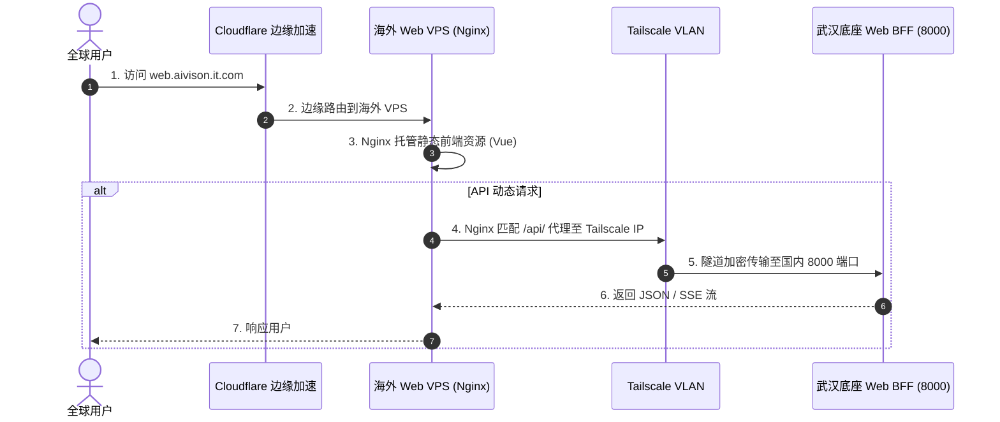

# 子模块: 网络暴露与代理穿透 (Network & Proxy)

## 1. 目标与范围
本模块负责系统在全球网络中的连通性、安全性与带宽加速。因为核心高算力底座部署在国内（无固定公网 IP，且受防火墙限制），所以必须通过海外 VPS 部署边缘节点，并结合 Tailscale 虚拟局域网（VLAN）、Cloudflare Tunnel 与 FRP，将内部的 API 和 Dashboard 面板安全地穿透暴露给公网用户和第三方回调网关。

## 2. 架构图与流向



## 3. 核心代码片段

### Nginx 反向代理配置 (海外 VPS)
[`/etc/nginx/sites-available/web_frontend.conf`](file:///etc/nginx/sites-available/web_frontend.conf#L12)
```nginx
server {
    listen 443 ssl;
    server_name web.aivison.it.com;

    # 静态资源由海外 VPS 极速响应
    location / {
        root /root/dist;
        index index.html;
        try_files $uri $uri/ /index.html;
    }

    # 核心红线：动态 API 必须通过 Tailscale 内网 IP 穿透到国内底座
    # 绝对禁止在 proxy_pass 末尾加斜杠，否则会导致路由截断
    location /api/ {
        proxy_pass http://100.x.x.x:8000;
        
        # 针对 SSE 长连接的特殊支持
        proxy_set_header Connection '';
        proxy_http_version 1.1;
        chunked_transfer_encoding off;
        proxy_buffering off;
        proxy_cache off;
    }
}
```

## 4. 接口定义 (网络契约)
本模块处理的是 4 层与 7 层的网络转发，其主要网络契约如下：
- `100.x.x.x:8000` (Tailscale) -> Web BFF API
- `100.x.x.x:8003` (Tailscale) -> Central API
- `Cloudflare Tunnel (Public URL)` -> 映射到本地 `8021` 供支付网关回调。

## 5. 单元与集成测试要求
- **核心用例**：
  1. `test_nginx_static_routing`：向海外 VPS 发起 `GET /`，断言返回的 HTML 文件状态码为 200，且延迟小于 100ms。
  2. `test_tailscale_api_proxy`：向海外 VPS 发起 `GET /api/health`，断言 Nginx 成功将请求通过 Tailscale 转发至国内并返回 200，而不是 502 Bad Gateway。
  3. `test_sse_connection_keepalive`：使用客户端建立长连接至 `/api/tasks/stream`，断言 Nginx 未缓存块数据且连接能保持 10 分钟以上不断开。

## 6. 部署与回滚步骤
- **部署前端**：
  在项目 `/frontend` 目录下运行自动化发布脚本：
  `npm run build && scp -i ssh_key/id_rsa.pem -r dist/* root@<VPS_IP>:/root/dist/`
- **故障回滚**：
  如果 Tailscale 节点掉线导致 502 错误，需 SSH 登录国内底座并运行 `tailscale up --authkey=...` 重新注册节点。

## 7. 监控告警规则 (SLI/SLO)
- **SLI**：Nginx 的 502 (Bad Gateway) 和 504 (Gateway Timeout) 错误率。
- **SLO**：穿透隧道的可用性需达到 99.9%。
- **告警策略**：
  - **Critical**：若 Nginx 日志中每分钟出现超过 50 个 502 错误，表示国内底座已宕机或 Tailscale 组网断开，触发最高级别 P0 告警，运维需立即介入检查网络连通性。
