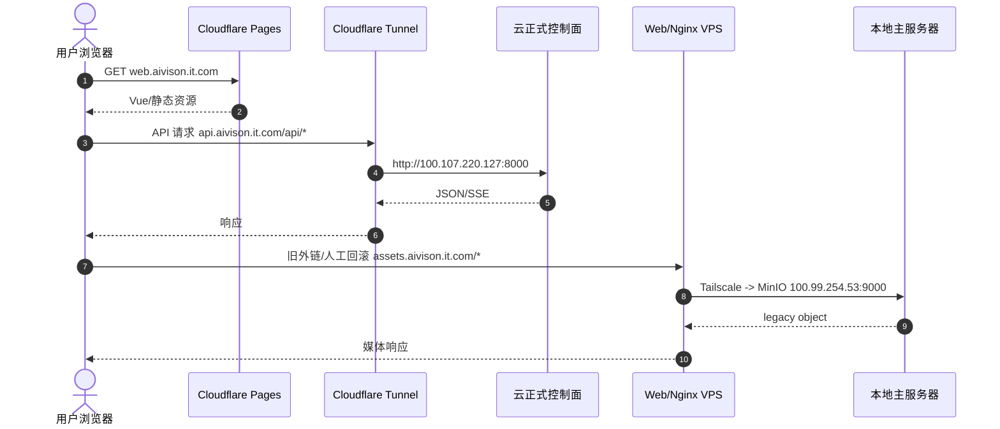
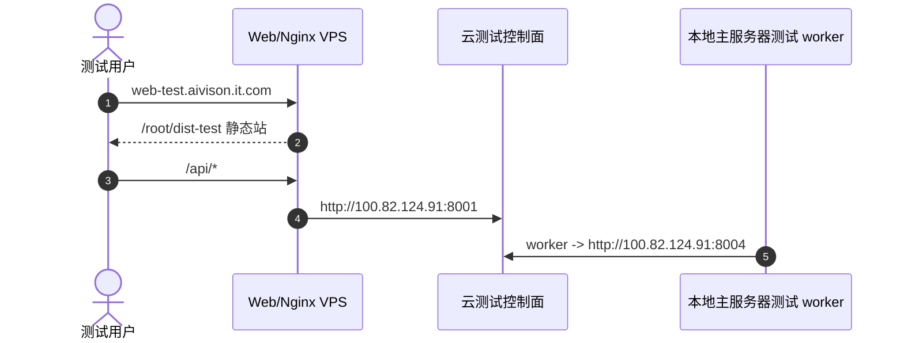

# 子模块: 网络暴露与代理穿透 (Network & Proxy)

## 1. 目标与范围

本文档记录 AllBot 当前公网入口、Cloudflare、Tailscale、Web/Nginx VPS 与本地主服务器之间的真实网络契约。当前正式生产已经迁到云控制面；本地主服务器主要承担 GPU worker、legacy MinIO 和本地灾备，不再是正式 Web/API 主入口。

## 2. 当前入口总览

| 域名/入口 | 当前承接方 | 回源/职责 |
| :--- | :--- | :--- |
| `web.aivison.it.com` | Cloudflare Pages `allbot-web-prod` | 正式 Web 静态站；生产包调用 `https://api.aivison.it.com/api` |
| `api.aivison.it.com` | Cloudflare Tunnel on `allbot-do-sgp1-control` | 回源云 Web API `http://100.107.220.127:8000` |
| `rmb.aivison.it.com` | Cloudflare Tunnel | 当前回源云 Payment API `http://100.107.220.127:8021`；可用脚本切回本地 Payment API |
| 管理后台云端前端 | Tailscale/受控入口 | `http://100.107.220.127:8086`，如需公网域名必须走 Cloudflare Tunnel + Access |
| `analytics.aivison.it.com` | 本地主服务器用户级 Cloudflare Tunnel `allbot-local-analytics` | 回源本地只读分析平台 `http://127.0.0.1:8095`；Cloudflare Access 邮箱 allowlist + 应用层登录双层保护 |
| `assets.aivison.it.com` | Web/Nginx VPS `100.88.57.122` | 回源本地 legacy MinIO `http://100.99.254.53:9000`；仅用于人工回滚、旧外链和迁移排障，正式应用不再生成该域名 URL |
| `web-test.aivison.it.com` | Web/Nginx VPS `100.88.57.122` | `/root/dist-test` 静态站，`/api/` 回源云测试 Web API `http://100.82.124.91:8001` |
| `qqcc-admin-test.aivison.it.com` | Cloudflare Tunnel `allbot-cloud-web-api-canary` + Access | 回源云测试 QQCC Config Frontend `http://100.82.124.91:8088`；管理员邮箱 allowlist + 应用层登录双层保护 |
| `private-bot.aivison.it.com` | Cloudflare Tunnel `allbot-admin-dashboard-prod` -> QQCC Config Frontend `100.107.220.127:8088` | 只允许 owner WebApp 与 owner API；公开且不套 Access，依赖 ticket/JWT 与双层 Host 隔离 |
| Telegram Local API | VPS `69.63.220.115` | `8081` Bot API，`8082` 文件服务 |

Web/Nginx VPS 的 `web.aivison.it.com` Nginx 配置只作为正式 Web 回滚副本，不是当前正式主路径。正式 Web 健康检查使用 `https://web.aivison.it.com`；正式 API 健康检查使用 `https://api.aivison.it.com/api/health`。

私有 Bot Telegram webhook 复用正式 API Tunnel：`api.aivison.it.com/api/private-bots/webhook/{public_id}` 回源 `cloud-web-api-prod`。该机器入口不能启用浏览器型 Cloudflare Access；Web API 还会校验 Telegram secret header、Bot 状态和 update 结构。Owner WebApp 是另一 Host，回源 QQCC Config Frontend，并由 Nginx 按 Host 拒绝管理员路径。两者不能混成同一个“全部 API 可访问”的公开网关。

## 3. 网络流向



云测试流向：



## 4. 关键网络契约

| 地址 | 用途 | 约束 |
| :--- | :--- | :--- |
| `100.107.220.127:8000` | 云正式 Web API | 只通过 Tailscale/Tunnel/受控来源访问 |
| `100.107.220.127:8003` | 云正式 Central API | 本地正式 worker relay 使用 |
| `100.107.220.127:8021` | 云正式 Payment API | RMB Tunnel 当前回源 |
| `100.107.220.127:8043` | 云正式 Dashboard Backend | 本地 Dashboard 网关使用 |
| `100.107.220.127:8086` | 云正式 Dashboard Frontend | 仅 Tailscale/Cloudflare Access 受控入口；同源反代 Dashboard Backend |
| `100.107.220.127:8045` | 云正式 QQCC Config Backend | QQCC 懒人 Bot 独立配置 API |
| `100.107.220.127:8088` | 云正式 QQCC Config Frontend origin | 按 `QQCC_CONFIG_ADMIN_HOST` / `PRIVATE_QQCC_BOT_OWNER_HOST` 分流；未知 Host 404，公网管理员 Host 仍需 Cloudflare Access |
| `100.82.124.91:8001` | 云测试 Web API | Web/Nginx VPS `web-test` upstream |
| `100.82.124.91:8004` | 云测试 Central API | 本地云测试 worker 使用 |
| `100.82.124.91:8044` | 云测试 Dashboard Backend | 测试管理入口 |
| `100.82.124.91:8087` | 云测试 Dashboard Frontend | 测试管理前端，仅 Tailscale/受控来源访问 |
| `100.82.124.91:8045` | 云测试 QQCC Config Backend | 测试 QQCC 配置 API |
| `100.82.124.91:8088` | 云测试 QQCC Config Frontend origin | 只接受显式 test admin/owner Host；未知 IP/localhost Host 404 |
| `100.99.254.53:9000` | 本地 legacy MinIO | 只做 `assets.aivison.it.com` 人工回滚、旧外链和迁移排障入口 |
| `127.0.0.1:8095` | 本地数据分析平台 | 只读 cloud-prod shadow 数据；公网入口为 `analytics.aivison.it.com`，必须 Cloudflare Access + 应用登录双层保护，不得裸露端口 |
| `69.63.220.115:8081/8082` | Telegram Local API / 文件服务 | Bot 大文件能力依赖 |

云测试端口绑定云测试 Tailscale IP `100.82.124.91`，公网 eth0 上的 `8001/8004/8044/8045/8084/8087/8088` 由 `allbot-cloud-test-firewall.service` drop。不要把云测试 DB/Redis 暴露到公网。

## 5. RMB Tunnel 切换

RMB 入口由本地主服务器上的管理脚本维护。脚本默认 dry-run，真实变更必须显式 `--execute`。

切到云正式：

```bash
scripts/switch_rmb_tunnel_to_cloud_prod.sh --dry-run
scripts/switch_rmb_tunnel_to_cloud_prod.sh --execute
```

切回本地灾备：

```bash
scripts/rollback_rmb_tunnel_to_local_prod.sh --dry-run
scripts/rollback_rmb_tunnel_to_local_prod.sh --execute
```

切换前后必须验证：

```bash
curl -fsS https://rmb.aivison.it.com/pay/result
```

## 6. Cloudflare 管理与本地分析公网入口

Cloudflare 账号、token、DNS、Tunnel、Access、Pages/R2 与公网管理入口的详细 SOP 已拆到 `docs/子模块_Cloudflare公网入口与账号管理_cloudflare_ops.md`，后续配置或排障应先加载 `allbot-cloudflare-ops`。

当前网络层只保留入口摘要：

| 入口 | 摘要 | 详细事实源 |
| :--- | :--- | :--- |
| `analytics.aivison.it.com` | 独立 Tunnel `allbot-local-analytics` 回源 `http://127.0.0.1:8095`；Cloudflare Access allow `cv1347968277@gmail.com` + 本地应用登录 | Cloudflare Ops 文档、本地数据分析平台文档 |
| `qqcc-admin-test.aivison.it.com` | 测试 Tunnel `allbot-cloud-web-api-canary` 回源 `http://100.82.124.91:8088`；Cloudflare Access allow `cv1347968277@gmail.com` + QQCC Config 登录 | Cloudflare Ops 文档、云测试与 QQCC 文档 |
| `qqcc-admin.aivison.it.com` | 受 Cloudflare Access 保护的 QQCC 管理后台参考基线；allow `cv1347968277@gmail.com` | Cloudflare Ops 文档、QQCC 文档 |
| Cloudflare 自动化 token | 主文件 `/home/hfy/.cloudflare/allbot-cloudflare-admin.token`；兼容链接 `/home/hfy/.cloudflare/allbot-local-analytics.token`；只记录路径和权限，不记录明文 | Cloudflare Ops 文档 |

验证本地分析公网入口：

```bash
systemctl --user is-active cloudflared-local-analytics.service
curl -I https://analytics.aivison.it.com
curl -sS http://127.0.0.1:8095/api/auth/session
```

公网未登录时应先由 Cloudflare Access 返回 302 到 `chuzeyu.cloudflareaccess.com`；通过邮箱一次性验证码后，再进入本地分析平台 `/login` 应用登录页。

## 7. 本地正式灾备网络切换

云正式整体不可用时，按 `docs/子模块_本地正式灾备切换_local_prod_fallback.md` 操作。网络层只允许选择一条切换路径：

- 修改 `api.aivison.it.com` Cloudflare Tunnel 回源到本地 Web API。
- 或回滚 `web.aivison.it.com` 到 Web/Nginx VPS `/root/dist` 并让 `/api/` 回源本地主服务器。

不要同时修改 Pages、Tunnel、Nginx 和 DNS 多处入口，否则回滚和对账会变复杂。

## 8. 验证命令

```bash
curl -fsS https://web.aivison.it.com
curl -fsS https://api.aivison.it.com/api/health
curl -fsS https://rmb.aivison.it.com/pay/result
curl -I https://analytics.aivison.it.com
curl -fsS https://web-test.aivison.it.com/api/health
curl -fsS http://100.107.220.127:8086/api/health
curl -fsS http://100.107.220.127:8088/api/health

ssh -i frontend/ssh_key/id_rsa.pem root@100.88.57.122 'nginx -t && systemctl is-active nginx tailscaled'
ssh allbot-do-sgp1-control 'curl -fsS http://100.107.220.127:8000/api/health'
ssh allbot-do-sgp1-test-control 'curl -fsS http://100.82.124.91:8001/api/health'
```

## 9. 红线

- 不要把 `web.aivison.it.com/api/health` 当作正式 API 健康检查；它会返回 Pages SPA HTML 或前端路由结果。
- 不要让 Web/Nginx VPS 的 `web-test.aivison.it.com` upstream 指向正式 Web API。
- 不要复用本地主服务器 RMB Tunnel 来承接正式 `api.aivison.it.com`。
- 不要把管理后台 `8086`、Dashboard Backend `8043`、本地分析 `8095` 或 shadow 数据库端口裸露到公网；公网管理/分析入口必须有 Cloudflare Access 或等价身份层、管理员 allowlist 和 MFA。
- 不要把 Tailscale 配成武汉家庭内网 subnet router。
- 不要在文档、日志或聊天中输出 Cloudflare API Token、Tunnel token、Bot token、R2 密钥或 `.env.cloud.*`；Cloudflare token 与公网入口 SOP 统一维护在 `docs/子模块_Cloudflare公网入口与账号管理_cloudflare_ops.md`。
- 不要在 `assets.aivison.it.com` 的 MinIO proxy_pass 后追加 URI 或尾部斜杠。

## 10. 文档维护

以下变化发生时必须同步更新本文档、边缘节点文档、资源画像和运维 skill：

- Cloudflare Pages 项目、Tunnel connector、Access app/policy、API token 或 public hostname 变化；此类变更必须同步 Cloudflare Ops 专项文档。
- `api.aivison.it.com`、`rmb.aivison.it.com`、管理后台公网域名、`web-test.aivison.it.com`、`assets.aivison.it.com` 回源变化。
- 云正式或云测试 Tailscale IP 变化。
- Web/Nginx VPS、Telegram Local API VPS、Tailscale ACL 或防火墙策略变化。
