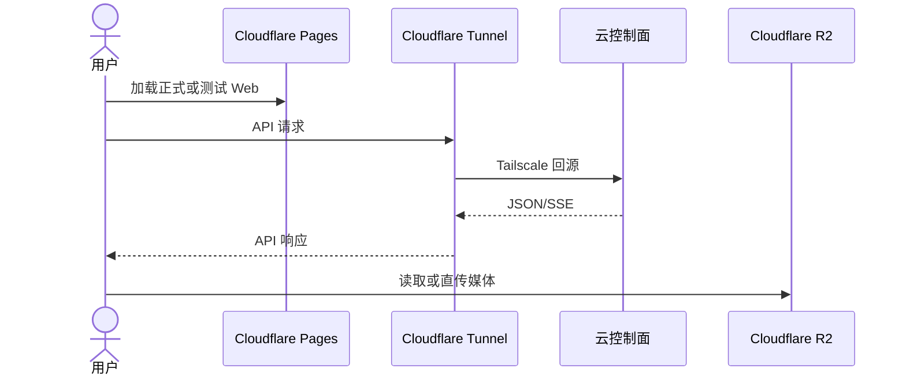

# 子模块：网络暴露与代理穿透

## 1. 当前公网入口

AllBot 的 Web 静态站统一由 Cloudflare Pages 承载，API、支付、Worker 和受控管理入口统一通过 Cloudflare Tunnel 回源云控制面。本地主服务器只承担 GPU Worker、本地分析和灾备副本，不承接公共 Web 静态站或媒体代理。

| 域名/入口 | 承接方 | 回源/职责 |
| :--- | :--- | :--- |
| `web.aivison.it.com` | Pages `allbot-web-prod` | 正式 Web 静态站 |
| `web-cf-test.aivison.it.com` | Pages `allbot-web-cf-test` | 测试 Web 静态站 |
| `api.aivison.it.com` | Cloudflare Tunnel | 云正式 Web API `100.107.220.127:8000` |
| `api-cf-test.aivison.it.com` | Cloudflare Tunnel | 云测试 Web API `100.82.124.91:8001` |
| `rmb.aivison.it.com` | Cloudflare Tunnel | 不可变云正式 Payment API `100.107.220.127:8002` |
| `worker-central.aivison.it.com` | Cloudflare Tunnel | 正式 RunPod Central |
| `worker-central-test.aivison.it.com` | Cloudflare Tunnel | 测试 RunPod Central |
| `qqcc-admin.aivison.it.com` | Tunnel + Access | 正式 QQCC 管理后台 |
| `qqcc-admin-test.aivison.it.com` | Tunnel + Access | 测试 QQCC 管理后台 |
| `private-bot.aivison.it.com` | Cloudflare Tunnel | 私有 Bot owner WebApp |
| `analytics.aivison.it.com` | Tunnel + Access | 本地只读分析平台 |
| Telegram Local API | 独立 VPS `69.63.220.115` | Bot API `8081` 与文件服务 `8082` |

## 2. 核心流向



## 3. 网络契约

- 正式 Web 包固定使用 `https://api.aivison.it.com/api`。
- 测试 Web 包固定使用 `https://api-cf-test.aivison.it.com/api`。
- 媒体 URL 由后端返回当前 R2 公网 URL或 S3 短签；前端不拼接对象存储域名。
- 数据库、Redis、Dashboard Backend、本地分析端口不得裸露公网。
- 管理与分析入口必须保留 Cloudflare Access 或等价身份层；机器入口不得启用浏览器登录页。
- 云测试和云正式控制面端口只绑定 Tailscale/受控地址。

## 4. 灾备边界

云正式不可用时只允许按 `docs/子模块_本地正式灾备切换_local_prod_fallback.md` 将 API Tunnel 回源切到本地主灾备服务。Web 静态站继续使用 Pages，媒体继续使用 R2；不要同时修改 Pages、Tunnel、DNS 和应用运行配置。

## 5. 验证

```bash
curl -fsS https://web.aivison.it.com
curl -fsS https://api.aivison.it.com/api/health
curl -fsS https://web-cf-test.aivison.it.com
curl -fsS https://api-cf-test.aivison.it.com/api/health
curl -fsS https://rmb.aivison.it.com/healthz
curl -I https://analytics.aivison.it.com
```

拓扑、Tunnel、Pages、自定义域或 Access 策略变化时，同步更新 Cloudflare 专项文档、对应控制面文档与知识库核对矩阵。
