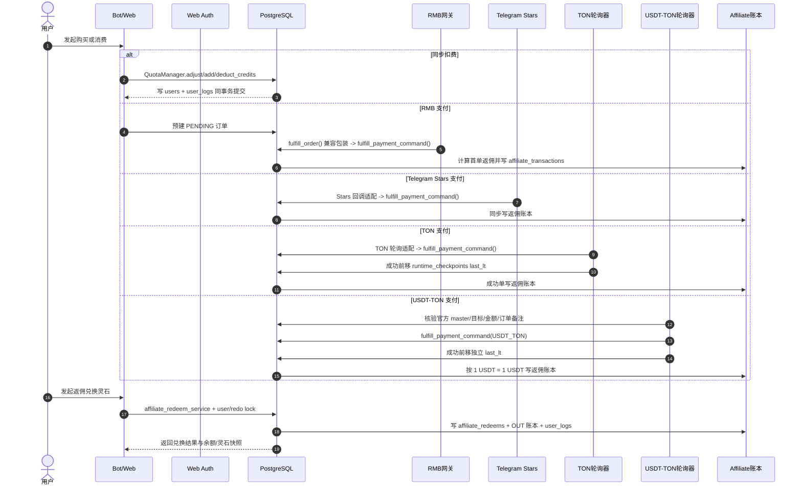

# 子模块: 计费与支付核心 (Billing & Payment)

## 1. 目标与范围

本模块负责 AllBot 的资产变动、支付履约、返佣账本与返佣兑换闭环。当前实现已经从“单一支付回调 + 充值发货”扩展为四条并行链路：

- 灵石同步扣减与退款
- 标准邀请奖励分层入账
- RMB 网关异步回调履约
- Telegram Stars 官方支付回调履约
- TON 链上轮询入账与发货
- USDT-TON Jetton 链上轮询入账与发货
- Affiliate 返佣入账、余额统计、兑换灵石/身份与人工兑换 USDT-TON

核心目标不是“把钱加上”，而是保证任意真实资产变化都具备以下性质：

- 有唯一业务单或唯一外部流水作为幂等锚点
- 有数据库锁或唯一约束阻断并发双花
- 有不可变快照或流水支持事后审计
- 有 user_logs / affiliate_transactions / affiliate_redeems 三类账本可追溯

## 2. 当前架构概览

## 3. 已落地的数据模型

- `orders`
  - 保存本地业务单、支付渠道、RMB `payment_provider`、`tx_hash`、支付状态、`commission_usdt`、支付时间。
  - RMB 新订单在创建时把提供方固定为 `HUANYUY` 或 `ALIPAY_DIRECT`；历史 RMB
    订单迁移回填为 `HUANYUY`，非 RMB 订单保持空值。
  - Web 与 Bot 的新 RMB 订单还在 `settlement_snapshot.rmb_pay_type` 固化用户选择的
    `alipay` 或 `wxpay`。管理统计以“提供方 + 支付方式”区分支付宝直连、代收
    支付宝和代收微信；没有该快照的旧代收订单必须单列“历史未区分”，不得猜测
    或强行归入任一通道。
  - `tx_hash` 唯一，用于 TON 等外部流水幂等拦截。
- `affiliate_transactions`
  - 返佣主账本，记录 `IN/OUT`、`transaction_type`、`reference_type/reference_id`、`idempotency_key`。
  - 当前既承载首单返佣入账，也承载返佣兑换灵石的 `CREDITS_REDEEM / OUT / SUCCESS`。
- `affiliate_redeems`
  - 返佣兑换记录表，按 `(user_id, idempotency_key)` 保证单用户幂等。
  - `details` 中落地 `current_credits` 与 `available_balance_usdt` 快照，供重放时稳定返回首次成功结果。
- `runtime_checkpoints`
  - 保存跨进程运行时游标和小型运行时配置；任务定价使用
    `task_pricing_config:v1`，其中 schema v2 只保存可售卖价格变体 ID 的显式覆盖值，
    不复制完整默认价格表。
  - TON key 形如 `ton:<merchant_address>:last_lt`，`value` 保存 JSON 快照并记录 `updated_at`。
- `rmb_payment_reconciliation_jobs`
  - 仅在新建 RMB PENDING 订单时同事务创建，不自动回填历史漏单。
  - 保存查单退避、数据库 lease、尝试次数、脱敏错误类别与完成结果；多实例通过
    `FOR UPDATE SKIP LOCKED` 领取，崩溃后可由过期 lease 恢复。

## 4. 核心实现事实

### 4.1 任务定价与扣费边界

- Dashboard 的认证接口 `/api/main-bot/task-pricing` 读取独立的可售卖价格目录，并只写
  `task_pricing_config:v1.prices`。价格目录不等于执行任务 registry：前者只列当前
  Web/主 Bot 用户入口及有效条件组合，后者仍可保留内部步骤、兼容别名和懒人 Bot
  场景。允许 `0–100000` 整数；未知变体、布尔值、负数和超上限值必须拒绝，清空字段
  表示恢复 dispatcher/domain config 的系统默认价。
- Web 与主 Bot 的任务默认价仍由 dispatcher/domain config 按 task type、图片数、
  时长、清晰度和参考素材等参数计算；每个可售卖价格变体保存稳定 ID、匹配 task type
  与规范化条件向量。`TaskApplication` 通过显式
  `TaskCoreProcessDependencies.resolve_task_cost_func` 在扣费前应用覆盖。该 provider
  是最终计费 seam，入口展示、前端静态常量和 Worker workflow 都不是账本事实源。
- 公共 Web `/api/app/entry-visibility` 同时下发只读 `task_pricing` 目录与覆盖值供价格
  展示，并在滚动发布期间保留固定单价的 `task_price_overrides` 兼容字段；即使展示缓存
  失效，服务端最终扣费仍重新读取当前配置。主 Bot 条件未收齐时的余额预检只按可配置
  最低价防止误拦，完整输入进入 `TaskApplication` 后必须再次按精确变体裁决；QQCC 场景
  预检不得取代该裁决点。
- 覆盖只作用于 `client_type=web|bot`。私有 QQCC、官方场景固定总价和内部
  `deduct_quota=false` 阶段保持原契约，避免租户定价被全局后台静默改写。
- 价格在扣费时固化到提交、账本和恢复记录；配置更新只影响新任务。退款只读取根任务
  已扣费快照，不按当前价格反算。
- H3 默认价格由 `src/domain_config/minimax_h3.py` 唯一维护：普通
  T2V/I2V/FLF2V 的 5/10/15 秒价格按清晰度分别为
  `10/11/15/17`、`14/21/36/47`、`23/36/63/89`；REF2V 基础价分别为
  `11/13/17/22`、`17/24/37/50`、`26/38/64/91`。REF2V 添加参考音频按基础价
  `×1.10`，添加参考视频按基础价 `×1.60`，两者同时存在时连乘并最终向上取整。
  `MiniMaxH3Spec.cost`、可售卖价格目录和前端 fallback 必须使用同一算法；后台显式
  变体覆盖仍由最终计费 seam 裁决。

### 4.2 Web 鉴权与资产访问前提

- Web 侧 JWT 由 `src/web_api/core/security.py` 使用 `SECRET_KEY` 签发，不再由 `BOT_TOKEN` 直接签发。
- 登录通道已经包含 Telegram Mini App / Login Widget 与账号密码两类入口。
- Bot TON 按钮统一进入主 Vue `/billing?method=ton&kind=membership`；旧独立 React TON 前端与 `WEBAPP_URL` 已删除。深链只负责筛选月卡并预选 TON，用户仍须选择套餐、连接钱包并确认交易。
- `POST /api/auth/telegram/payment` 复用 Telegram 验签并签发 `telegram_payment` 支付会话。支付依赖只跳过 Web 等级准入，仍校验 JWT、密码版本与订单归属；练功房、历史、画廊等路由继续使用 `get_current_user`，并在动态身份门禁前显式拒绝支付 channel，因此高阶用户也不能借支付会话访问其它 Web 能力。
- `get_current_user` 在解 JWT 后还会做两次动态校验：
  - `password_version` 黑名单校验，确保改密后旧 Token 失效。
  - 当前身份/境界是否仍满足 Web 访问条件，防止“先登录后降权”继续访问。

### 4.3 订单履约红线

- 当前支付履约共享内核是 `payment_fulfillment_service.fulfill_payment_command(PaymentFulfillmentCommand(...))`，返回 `PaymentFulfillmentResult`；RMB `fulfill_order(...)` 只保留旧 bool 兼容包装。
- RMB 适配层按本地业务单定位订单；TON / USDT-TON / Stars 适配层只负责通道解析、金额单位适配、外部流水与通知回调，资产副作用必须进入共享内核。
- RMB 公网回调以平台文档声明的
  `GET /api/pay/notify/huanyuy` 为正式方式，同时兼容 POST query/form，校验
  merchant、MD5 签名、成功状态、业务单、外部流水与金额。事务提交成功或幂等
  noop 后返回平台要求的精确纯文本大写 `SUCCESS`；Telegram 消息不阻塞该确认
  响应。平台未收到 `SUCCESS` 时按一分钟间隔最多重试五次。
- RMB 下单只允许向 HTTPS 网关通过服务端 POST 提交，并禁止自动跟随重定向，
  避免 301/302 把 POST 改写成 GET 后丢失签名表单；日志不得记录签名参数、完整
  支付 URL 或网关响应。失败时 Bot 必须把“连接中”消息收口为可重试的终态提示。
  `RMB_RECONCILIATION_ENABLED` 默认关闭；启用时
  `HUANYUY_QUERY_URL` 条件必填，查单返回必须同时匹配订单号、金额和平台流水，
  HTML、404、未知状态与字段缺失一律失败并保留重试。
- RMB provider 路由以 `ALIPAY_DIRECT_ENABLED`、`users.alipay_direct_enabled` 与
  用户选择的支付方式共同决策：只有三者同时命中支付宝时走官方直连，微信始终
  走 `HUANYUY`。Web 与 Bot 使用同一个 `internal_user_id` 白名单。支付宝直连
  统一只创建一笔 `alipay.trade.wap.pay` 交易，再返回公开 Vue 结算短链接：手机
  展示订单卡、二维码和“立即支付”，电脑展示金额、二维码与订单明细；二维码和
  按钮都通过同一个 `/launch` 跳转到该笔 WAP 交易，不按 User-Agent 再创建第二笔
  交易。提供方一经写入订单不可随全局开关变化；直连创建失败将订单和补偿 job
  收口为失败，禁止自动创建第二条环宇交易。
- 直连结算短链接使用高熵 bearer token，Redis 只保存 token 摘要及订单绑定，默认
  30 分钟失效。读取时必须同时核对本地公开业务单号、内部订单号、金额、RMB
  通道与 `ALIPAY_DIRECT` 提供方；`/launch` 仅允许 `PENDING` 订单，并再次限制
  跳转目标为当前配置的支付宝 HTTPS gateway。公开详情不得返回内部 ID、真实
  支付 URL、签名或证书信息。
- 支付宝证书模式由 `alipay_direct_service` 使用 RSA2 完成应用请求签名、应用
  证书 SN、根证书 SN、支付宝响应/回调验签和主动查单。启动时仅当
  `ALIPAY_DIRECT_ENABLED=true` 才强制要求完整 `ALIPAY_*` 配置并校验应用私钥
  与应用公钥证书匹配。私钥和证书只允许通过受保护 Base64 环境投影进入
  `web-api`、`main-bot` 与 `payment-api`，不得进入 Git、镜像或日志。
- 支付宝异步通知验签按官方通知口径从非空参数中排除 `sign` 与 `sign_type`，
  再按字段名排序验证 RSA2；请求加签仍包含 `sign_type`，两种原文不能复用。
  主动查单必须验证支付宝响应签名、证书 SN、商户订单号、金额和外部流水；
  `seller_id` 在响应中出现时必须匹配，未返回该可选字段时不能把已签名的成功
  响应误判为商户不匹配。
- 支付宝通知未通过直接验签/身份检查时，只允许把 `out_trade_no` 当作本地查找
  键：先从数据库核对 RMB + `ALIPAY_DIRECT` 提供方并取得应付金额，再调用支付宝
  主动查单。只有签名查单响应同时确认订单号、数据库金额、已支付状态和外部流水
  时才进入共享履约；回调自带的金额与 `trade_no` 在该兜底路径中不得使用。查单
  未支付、异常、订单不存在或提供方错误都返回 `fail`，不产生资产副作用。
- Payment API 的 reconciler 按订单提供方隔离。支付宝直连随
  `ALIPAY_DIRECT_ENABLED=true` 自动启用，只 claim `ALIPAY_DIRECT + PENDING`：
  下单 30 秒后首次查单；未支付或查询异常时再分别等待
  40/60/90/150/200/300 秒，第 7 次仍未确认支付则把 job 标记为 `exhausted` 并
  停止（相对下单时间约为 30/70/130/220/370/570/870 秒，另有最多 5 秒 sweep
  抖动）。到期 job 仍每 5 秒 claim，但已履约/超龄 job 的维护扫描限流为
  每 60 秒一次，避免空闲时产生无效更新。环宇查单仍只由
  `RMB_RECONCILIATION_ENABLED=true` 显式开启，继续要求
  `HUANYUY_QUERY_URL` 并保持原有退避/24 小时上限。两者查到已支付后都调用
  `fulfill_payment_command(...)`，所以 Webhook、查单和崩溃重放共享同一幂等
  边界；直连扫描不会 claim 环宇/微信订单。
- 已通过后台赠送同套餐完成用户补偿的真实 RMB 支付，使用
  `adopt_compensated_rmb_payment(...)` 一次性认领：必须在同一事务锁定并核对
  支付单、赠送单、用户、套餐、金额、时间顺序与外部流水唯一性，只收口真实
  支付状态、affiliate 和 reconciliation job，不再次结算灵石或身份。赠送单与
  支付单保存双向认领标记，用户写 0 变动审计；相同交易重放返回幂等 `noop`。
- 环宇平台签名按字段名 a-z 升序拼接，排除 `sign`、`sign_type` 与空值，
  参数值不额外 urlencode，末尾直接拼接商户 Key 后计算 MD5。平台文档同时写有
  “降序”和“a-z”，两者互相矛盾；当前实现保持与既有成功订单及易支付 a-z
  行为一致，不按 z-a 反转。
- 共享内核会按幂等锚点锁定/创建订单，先校验金额，再在同一事务内更新订单与用户资产。
- TON 不依赖单一 Webhook，而是由轮询器抓链上交易，按 `tx_hash` 唯一约束落单，避免重复到账；轮询 `last_lt` 从 `runtime_checkpoints` 恢复，处理失败时不能前移游标。
- TON 与 USDT-TON 的目标宿主是独立 `billing-reconciler`，两个通道各自受监督，
  单通道崩溃不终止另一通道。该镜像同时受 Compose profile 与
  `BILLING_RECONCILER_ENABLED=false` 双门禁；主 Bot 的旧轮询由
  `MAIN_BOT_PAYMENT_POLLING_ENABLED=true` 保持。滚动切换必须先启用新宿主并
  验证 `/healthz` 与两个 checkpoint，再关闭旧宿主；回滚顺序相反。支付通道
  自身的 `TON_PAYMENT_POLLING_ENABLED` / `USDT_TON_PAYMENT_ENABLED` 语义不变。
  disabled 模式只提供 `/healthz`，不得导入或初始化数据库、Telegram、账本
  provider，也不要求投影支付凭据。
- Billing provider 与 reconciler 的 import/startup 不得经过 Gallery、R2 或
  MinIO 初始化；额度服务使用标准模块 logger，不借用会构造存储客户端的
  `src.logger`。因此未配置任何 `MINIO_*` 时，Billing 专用入口仍可装配 TON 与
  USDT-TON 通道；不能通过补投影无关存储密钥掩盖依赖污染。
- TON / USDT-TON 首次启用且对应 checkpoint 不存在时，只把索引器当前最新
  `lt` 写成基线，不履约当前批次中的历史交易；checkpoint 读取失败时保持停止，
  不能把数据库异常误判为首次启用。已有 checkpoint 后才从下一 `lt` 正常处理，
  避免复用商户地址时重放旧 `ORDER` payload 并重复发货。
- USDT-TON 使用 Tether 官方主网 Jetton master
  `EQCxE6mUtQJKFnGfaROTKOt1lZbDiiX1kCixRv7Nw2Id_sDs`，固定六位精度。
  Web/Mini App 通过 TON Connect 向付款人的 USDT Jetton wallet 发送 TEP-74
  transfer，并把订单 payload 放入 `forward_payload`；外层附带 0.05 TON
  执行费用，`forward_ton_amount >= 1` 以触发收款通知。
- USDT-TON 在调用钱包 `sendTransaction` 前先展示应用内二次确认，确认内容取自
  本次服务端预建单，固定包含 USDT 金额、TON 网络、完整商户地址和最多附带
  0.05 TON Gas；同时提示部分钱包只展示外层 Gas，不能把钱包里的 `0.05 TON`
  误认为套餐金额。取消二次确认不得调用钱包。
- `UsdtTonPaymentValidator` 使用 TON Center v3 Jetton transfer 索引，只接受
  官方 master、目标为规范化商户钱包、`transaction_aborted=false`、非空交易
  哈希、精确微 USDT 金额和有效 `ORDER` / `ORDER_V2` forward payload。
  checkpoint 以 `usdt_ton:<merchant>:<official_master>:last_lt` 隔离；验证或
  履约失败不能越过该交易。
- `USDT_TON_PAYMENT_ENABLED=true` 时，Web API 与 main Bot 均要求合法
  `VITE_MERCHANT_ADDRESS`；缺失或非法时 fail closed。原生 TON 的
  `TON_PAYMENT_POLLING_ENABLED` 保持独立，两个通道可以分别启停。
- Web 支付方式必须把 `TON（原生币）` 与 `USDT（TON 网络）` 显示为两个独立
  入口；各自只受对应可用性字段控制，不得因启用 USDT-TON 隐藏或复用原生
  TON 入口。
- TON 商户地址的唯一运行时事实源是受限宿主环境 `VITE_MERCHANT_ADDRESS`，由 `src/services/ton_payment_config.py` 使用 TON 地址库校验并规范化；代码常量、前端常量和旧 `src/constants.py` 都不能充当支付兜底。`TON_PAYMENT_POLLING_ENABLED=true` 但地址缺失或非法时，Bot 只记录一次结构化配置错误并不创建 poller，Web 将 TON 标记为不可用。
- `GET /api/payment/plans` 返回 `ton_payment_enabled` 和可空的 `ton_receiver_address`；禁用时地址必须为 `null`。`POST /api/payment/ton-orders` 在套餐查询、`Order` 构造和事务提交前检查可用性，不可用时返回 `503 / TON_PAYMENT_UNAVAILABLE`，不得留下 `PENDING` 订单。Vue 交易地址只能取自订单响应，不能保留接收地址硬编码或使用套餐地址兜底。
- `POST /api/payment/orders`、`POST /api/payment/ton-orders` 与本人订单状态查询接受完整 Web 会话或支付会话；成功状态附带白名单账户摘要，供充值页刷新灵石、身份、到期时间与境界，不要求支付用户调用受限的 `/api/users/me`。
- checkpoint key 使用校验后的 merchant address：同一地址的等价表示归一到同一 key，真实商户地址变化会自然形成新的 `ton:<merchant_address>:last_lt`；不得把旧地址游标复制到新地址。抓链、金额校验或履约失败时仍不得前移游标。
- 各支付渠道发货完成后都会同步尝试：
  - 计算首单返佣 `commission_usdt`
  - 写入 `affiliate_transactions`
  - 失效邀请充值相关缓存
- “纯灵石套餐”与“身份月卡套餐”共用履约入口，但 `duration_days == 0` 时只加灵石，不变更身份。

### 4.4 Affiliate 返佣闭环

- 首单返佣金额写入 `orders.commission_usdt`，缺汇率时必须失败并回滚，不能静默写 0。
- 用户中心与 Bot 分享面板的 `invitation_recharge` 统计只聚合 `orders.commission_usdt > 0` 的受邀充值订单，用来展示“受邀者首笔充值”口径；受邀者后续复购不再增加该展示金额或次数。
- 邀请人余额不是冗余字段，而是通过 `affiliate_transactions` 汇总得到。
- 返佣兑换灵石当前已正式落地：
  - 汇率固定为 `1.0000 USDT = 90 credits`
  - `amount_usdt` 量化到 4 位小数
  - `credits_granted` 采用 `ROUND_HALF_UP`
  - 会写入 `affiliate_redeems`、`affiliate_transactions`、`user_logs`
- 同一个 `idempotency_key` 重放时，服务返回首次成功的快照结果，而不是重新计算当前余额。
- 返佣余额缓存失效必须在最终事务提交后执行，不能在外部事务提交前抢跑。
- 返佣兑换 USDT-TON 只支持主网普通 TON 钱包地址，金额四位小数且最低
  `5.0000 USDT`。申请写 `USDT_REDEEM / OUT / PENDING`，可用余额立即扣除并
  计入冻结；后台确认把同一流水改为 `SUCCESS`，拒绝改为 `REJECTED`。终态切换
  不新增第二笔 OUT，因此不会二次扣减。
- 人工打款成功必须记录唯一交易哈希；Bot 通知属于事务提交后的 best-effort
  副作用，失败不得回滚兑换终态。

### 4.5 审计与事务边界

- `QuotaManager.adjust_credits/add_credits/deduct_credits` 在复用外部 `AsyncSession` 时，也必须把 `user_logs` 一并写进当前事务。
- 路由层如果传入外部事务，核心服务应复用该事务并由调用方统一 `commit`；核心服务不能擅自提前提交半个闭环。
- “先持久化唯一业务单/外部流水，再做资产副作用”仍是支付与返佣相关逻辑的统一基线。

### 4.6 标准邀请奖励

- 标准邀请奖励与付费 affiliate 返佣是两套账：前者直接写 `users.credits` + `user_logs`，后者写 `affiliate_transactions` 并可兑换灵石。
- 只有 `get_or_create_user_by_telegram(...)` 在本次邀请请求中返回 `is_new=True` 的真实新用户，才可通过邀请链接记录 `referrals`、`users.invited_by`、邀请人 `referral_count`；历史用户即使尚无 `invited_by` 也不得补绑。`QuotaManager.process_referral(...)` 以必填的 `new_user_was_created=True` 再次守住该边界。注册阶段不再给邀请人发放奖励；被邀请新用户仍按默认新手资产记录 `welcome_bonus = +6`。
- 被邀请用户首次确认入群时，邀请人奖励目标为累计 5 灵石，审计类型为 `referral_reward_channel`。
- 被邀请用户首次成功生成内容时，邀请人奖励目标为累计 10 灵石，审计类型为 `referral_reward_generation`。
- 奖励发放按同一邀请关系的历史 `referral_reward_initial/referral_reward_channel/referral_reward_generation` 流水补差额，`extra_info.invitee_id` 是幂等核对字段；老数据中已发过的注册 +5 会计入目标，不会因新规则重复发放。
- Dashboard 用户转移保留源用户及其 Telegram / Web 登录身份，只把资产与业务记录并入目标并净化源账户；源 Telegram ID 再次访问时仍解析为既有用户并返回 `is_new=false`，不得因账户合并重新获得默认新手资产、建立新邀请关系或触发入群/首次生成邀请奖励。封禁状态不能随净化清除。

### 4.7 Provider 注册入口

- Billing core 不在模块 import 时自动装配 provider；应用入口负责调用 `ensure_billing_core_providers_registered()`。
- 当前必须注册 billing provider 的入口包括 `src/web_api/main.py`、`src/bot_main.py`、`src/payment_api_server.py` 和 `dashboard/backend/main.py`。
- Dashboard Backend 的退款、强制终止、资产调整和订单处理会进入 billing core；若只注册 task core provider，会触发 `Billing core providers 未注册`。
- `paid_group_guard_bot` 只读查询 `users` / `orders` 判断付费群入群资格，不做支付履约、返佣、灵石、会员结算或 user_logs 写入，因此不属于 billing provider 注册入口。

### 4.8 付费群审核资格

- 付费群审核 Bot 的默认资格口径为：`users.telegram_id` 命中申请人，且满足“历史成功订单 / 后台赠送套餐订单 / 筑基期及以上修为”之一。
- 真实支付订单要求 `orders.status = 'SUCCESS' AND paid_at IS NOT NULL`；后台赠送免费套餐订单要求 `orders.status = 'SUCCESS'`，并通过 `tx_hash` 的 `manual_` 前缀或 `order_id` 的 `GIFT:` 前缀识别。
- 修为口径读取 `users.user_group`，允许 `筑基期`、`金丹期`、`元婴期`、`化神期`、`炼虚期`、`合体期`、`大乘期`、`渡劫期`。
- 单纯手动修改 `current_identity` 的用户不会被自动放行；如需纳入，应通过后台赠送套餐补齐订单记录，或使其 `user_group` 达到筑基期及以上。

## 5. 对外接口口径

- Web 套餐：`GET /api/payment/plans`
  - `data.ton_payment_enabled=false` 时 `data.ton_receiver_address=null`。
  - 返回每个套餐的 `price_usdt`，并通过
    `usdt_ton_payment_enabled/usdt_ton_receiver_address/
    usdt_ton_jetton_master_address` 描述 USDT-TON 可用性。
- Web TON 预建单：`POST /api/payment/ton-orders`
  - TON 配置不可用时返回 HTTP 503，`reason=TON_PAYMENT_UNAVAILABLE`，且无数据库写入。
- Web USDT-TON 预建单：`POST /api/payment/usdt-ton-orders`
  - 返回服务端订单 ID、商户钱包、官方 master、六位精度
    `amount_microusdt` 和订单 comment；配置不可用时返回 HTTP 503
    `USDT_TON_PAYMENT_UNAVAILABLE`，且不创建 PENDING 订单。
- 支付专用 Telegram 登录：`POST /api/auth/telegram/payment`
  - 返回支付用途 JWT；低阶用户可使用支付路由，不能据此访问其它受限 Web 能力。
- Web 订单状态：`GET /api/payment/orders/{order_id}/status`
  - 仅允许订单所属用户查询；成功状态额外返回 `account` 白名单摘要。
- 支付宝直连公开结算：
  `GET /api/payment/alipay-checkout/{token}` 与
  `GET /api/payment/alipay-checkout/{token}/launch`
  - 前者只返回公开订单号、商品、金额、状态和创建时间，供响应式结算页展示与
    轮询；后者仅在订单仍为 `PENDING` 时 302 跳转到已绑定的同一笔支付宝 WAP
    交易。token 无效返回 404，缓存过期返回 410，订单终态或绑定不一致 fail
    closed，不把真实支付宝 URL 暴露在 JSON 中。

- RMB 支付回调：`GET|POST /api/pay/notify/huanyuy`
  - 仅适用于 RMB 网关异步通知。
  - 平台正式通知使用 GET，POST 仅作兼容。成功或重复通知必须返回精确纯文本
    大写 `SUCCESS` 阻断第三方重试；非法通知返回
    `fail`。
- 支付宝直连回调：`POST /api/pay/notify/alipay`
  - 同时挂载于 Web API 与 Payment API；只有 RSA2、证书 SN、AppID、Seller ID、
    订单提供方、订单号、金额及成功交易状态全部匹配才直接进入共享履约内核；
    直接检查失败时只允许走上文数据库金额驱动的签名查单兜底。
  - 成功和幂等重复通知返回精确小写纯文本 `success`；非法通知返回 `fail`。
  - 浏览器同步回跳只回到充值页轮询本地订单，不作为到账证据。
- Payment API 健康：`GET /healthz`
  - 返回非敏感服务状态、任一 RMB reconciler、环宇 reconciler、支付宝直连
    reconciler 是否分别启用，以及支付宝直连配置是否就绪；不暴露 URL、凭据、
    证书或订单。
- Dashboard 支付宝直连名单：
  `GET /api/alipay-direct-users` 与
  `POST /api/alipay-direct-users/bulk-status`
  - 列表默认只展示当前 `users.alipay_direct_enabled=true` 的账户，并按服务端分页
    返回；支持累计付费次数、首次使用日期、当前直连状态和是否已有
    `ALIPAY_DIRECT` 成功付款记录筛选。累计付费次数口径为
    `orders.status='SUCCESS' AND paid_at IS NOT NULL`，包含后台赠送订单；历史直连
    付款还必须要求 `payment_provider='ALIPAY_DIRECT'`。
  - 批量动作支持明确用户 ID 或当前完整筛选结果，单次最多处理 10000 人；服务端
    锁定命中用户，在同一事务内写 `alipay_direct_enabled` 与逐用户审计流水后提交。
    提交完成后 Web 与 Bot 的下一笔支付宝订单立即读取新状态；微信仍固定走
    `HUANYUY`，既有订单的 `payment_provider` 不变化。
  - Dashboard Backend 还运行独立的直连名单清理循环，默认每 5 分钟从
    `ALIPAY_DIRECT + SUCCESS + paid_at` 订单索引查找仍开启直连的用户，使用
    `FOR UPDATE ... SKIP LOCKED` 分批锁定，并在同一事务中关闭名单状态、写入
    `auto_disable_alipay_direct_after_payment` 审计。可用
    `DASHBOARD_ALIPAY_DIRECT_RECONCILE_INTERVAL_SECONDS` 调整周期，最低 10 秒。
    该循环不参与支付履约；Dashboard 暂停只会延后移除，不影响下单、回调或到账。
- Telegram 登录：`POST /api/auth/telegram`
  - 支持 Mini App `initData` 与 Login Widget 字段。
- 密码登录：`POST /api/auth/login`
- 绑定/修改密码：`POST /api/auth/bind-password`
- Affiliate 兑换灵石：位于 `users` 路由下的兑换接口，调用 `redeem_affiliate_balance_to_credits()` 完成。
- Affiliate 人工兑 USDT：
  `POST /api/users/me/affiliate/redeem-usdt` 提交申请，
  `GET /api/users/me/affiliate/usdt-redeems` 查询本人记录；Dashboard 使用
  `/api/referrals/redeems/{id}/complete|reject` 处理终态。
- QQCC 四类场景可配置根场景固定总价 `credit_cost`：首个真实任务通过 `cost_override` 扣一次，后续内部任务统一 `deduct_quota=false`；后续阶段或最终投递失败按根任务实际扣费并以 `qqcc_scene_refund:<billing_id>` 全额幂等退款。`null`/缺失保持旧逐段计费与标准任务退款，快速换脸不读取该配置。
- Web 个人中心灵石账本：`GET /api/users/me/credits/ledger?page=&page_size=`
  - 只允许当前登录用户查询自己的 `user_logs` 非 0 灵石变动。
  - 返回 `operation_type` 兼容字段、语言无关的 `display_key`、收入/支出方向、`credit_change`、`current_balance`、时间与白名单展示上下文；Vue 只能通过共享 i18n 渲染 `display_key`，不得把原始 operation/task type 当作用户文案。
  - 展示解析统一覆盖 task type registry 的 public type、legacy alias、执行/阶段类型，以及退款、充值、邀请、签到、Gallery 转账等 operation family；未知任务与未知流水分别回退本地化“生成任务”和“其他灵石变动”，禁止回显原始值。
  - 不直接暴露原始 `extra_info`，订单号、tx hash、内部用户 ID、unlock/task 等审计字段不得进入用户侧响应。

## 6. 必须同步维护的测试面

- 支付履约幂等
  - 同一 RMB 回调重复通知只发货一次。
  - RMB GET/POST 回调与主动查单竞态只发货一次，提交后的缓存/通知失败不能把
    已完成支付改写成失败。
  - 同一 TON `tx_hash` 重复出现只落一笔单。
  - 同一 USDT-TON `transaction_hash` 重复出现只发货一次；假 master、中止
    交易、错误目标、缺失 forward payload 和错误金额均不得发货。
- RMB 主动补偿
  - 新订单与 reconciliation job 同事务；迁移不回填历史订单。
  - 覆盖 lease 竞争、崩溃恢复、未支付退避、网关异常、环宇 24 小时耗尽、查单
    字段冲突 fail closed，以及环宇默认关闭/启用缺 URL 阻断启动。
  - 支付宝直连覆盖 provider-only claim、首次 30 秒、后续
    40/60/90/150/200/300 秒、7 次 exhausted、5 秒 claim 与 60 秒维护扫描
    分离，以及不依赖环宇 query URL 启动。
  - 支付宝通知覆盖排除 `sign/sign_type` 的真实 RSA2 原文；主动查单覆盖已签名
    成功响应不含可选 `seller_id`、返回错误 `seller_id`、订单号/金额/流水冲突。
  - 支付宝通知验签失败后的查单兜底覆盖：伪造回调金额/流水被忽略、数据库金额
    驱动签名查单、仅 `PAID` 进入履约，`NOT_PAID` 与非直连订单保持 fail closed。
  - 人工赠送已补偿的支付认领覆盖资产不重复、赠送单只能绑定一张支付单、外部
    流水唯一、reconciliation job 同事务完成和重复执行幂等 `noop`。
- 支付金额校验
  - RMB 金额按 Decimal/字符串链路量化到两位，禁止 float 漂移。
  - USDT-TON 按六位微 USDT 整数精确相等；少付或多付都返回
    `amount_mismatch`，不产生资产副作用。
- Affiliate 并发与幂等
  - 同用户并发兑换不能双花。
  - 同 `idempotency_key` 同参数稳定返回首次结果。
  - 同 `idempotency_key` 不同参数必须冲突失败。
- 审计闭环
  - `users.credits` 变化必须与 `user_logs` 对平。
  - Web 用户侧账本查询必须只读、仅本人可查、排除 0 变动、按 `created_at desc, id desc` 分页，且过滤敏感审计上下文。
  - task type registry 全量类型、legacy alias、退款前缀和未知 operation 必须解析为稳定 `display_key`，中英文 locale 必须完整覆盖且未知值不得泄漏。
  - 标准邀请奖励必须覆盖历史用户不建邀请关系且无账本副作用、新用户注册不发邀请人、入群补到 5、首次生成补到 10、老 `referral_reward_initial` 计入目标的 focused tests。
  - `affiliate_transactions` IN/OUT 汇总必须能回推出当前可兑换余额。
- Provider 启动回归
  - Dashboard Backend、Web API、Payment API、Bot 启动测试应覆盖 billing provider 已注册。
  - 管理后台退款/强制终止路径不得在运行时才暴露 `Billing core providers 未注册`。
- Dashboard 财务统计
  - `/api/stats/finance/summary` 与 `/api/stats/finance/history` 只查询财务页所需的
    余额、身份、邀请和订单聚合，财务页刷新不得回退到全局 Dashboard 用户、
    History 与分布扫描。
  - 覆盖支付宝直连、代收支付宝、代收微信与旧代收未区分四个互斥统计桶；Web 与
    Bot 下单测试必须断言 `settlement_snapshot.rmb_pay_type` 已固化。
- Dashboard 直连名单
  - 覆盖服务端分页、累计成功付费/历史直连付款聚合、首次使用日期与三态筛选、
    跨分页筛选全选、明确 ID 批量更新、10000 人上限，以及状态与审计同事务提交。
  - 覆盖 Dashboard 生命周期启动周期清理、成功直连付款口径、空结果无写入、
    用户行锁和自动关闭状态与审计同事务提交。

## 7. 文档维护约束

- 不要再把本模块描述成“只有一个 `/api/payment/notify` 回调”。这已经只覆盖 RMB 子链路。
- 不要把 JWT 描述成由 `BOT_TOKEN` 直接签发。当前是 `SECRET_KEY` JWT，Telegram Token 仅用于验签。
- 不要把 affiliate 写成“规划中”。返佣账本与返佣兑换灵石已经是现行生产能力。
