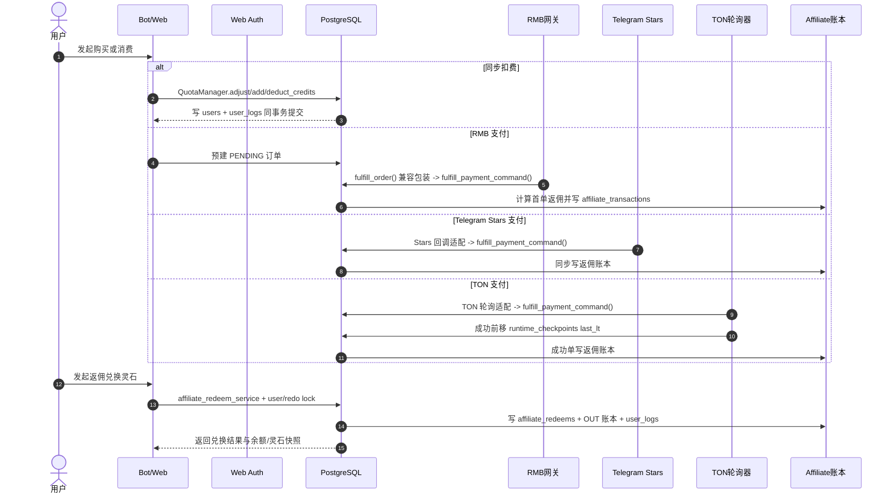

# 子模块: 计费与支付核心 (Billing & Payment)

## 1. 目标与范围
本模块负责 AllBot 的资产变动、支付履约、返佣账本与返佣兑换闭环。当前实现已经从“单一支付回调 + 充值发货”扩展为四条并行链路：
- 灵石同步扣减与退款
- 标准邀请奖励分层入账
- RMB 网关异步回调履约
- Telegram Stars 官方支付回调履约
- TON 链上轮询入账与发货
- Affiliate 返佣入账、余额统计与兑换灵石

核心目标不是“把钱加上”，而是保证任意真实资产变化都具备以下性质：
- 有唯一业务单或唯一外部流水作为幂等锚点
- 有数据库锁或唯一约束阻断并发双花
- 有不可变快照或流水支持事后审计
- 有 user_logs / affiliate_transactions / affiliate_redeems 三类账本可追溯

## 2. 当前架构概览

## 3. 已落地的数据模型
- `orders`
  - 保存本地业务单、支付渠道、`tx_hash`、支付状态、`commission_usdt`、支付时间。
  - `tx_hash` 唯一，用于 TON 等外部流水幂等拦截。
- `affiliate_transactions`
  - 返佣主账本，记录 `IN/OUT`、`transaction_type`、`reference_type/reference_id`、`idempotency_key`。
  - 当前既承载首单返佣入账，也承载返佣兑换灵石的 `CREDITS_REDEEM / OUT / SUCCESS`。
- `affiliate_redeems`
  - 返佣兑换记录表，按 `(user_id, idempotency_key)` 保证单用户幂等。
  - `details` 中落地 `current_credits` 与 `available_balance_usdt` 快照，供重放时稳定返回首次成功结果。
- `runtime_checkpoints`
  - 保存跨进程运行时游标，当前首个用途是 TON 轮询 `last_lt`。
  - TON key 形如 `ton:<merchant_address>:last_lt`，`value` 保存 JSON 快照并记录 `updated_at`。

## 4. 核心实现事实

### 4.1 Web 鉴权与资产访问前提
- Web 侧 JWT 由 `src/web_api/core/security.py` 使用 `SECRET_KEY` 签发，不再由 `BOT_TOKEN` 直接签发。
- 登录通道已经包含 Telegram Mini App / Login Widget 与账号密码两类入口。
- `get_current_user` 在解 JWT 后还会做两次动态校验：
  - `password_version` 黑名单校验，确保改密后旧 Token 失效。
  - 当前身份/境界是否仍满足 Web 访问条件，防止“先登录后降权”继续访问。

### 4.2 订单履约红线
- 当前支付履约共享内核是 `payment_fulfillment_service.fulfill_payment_command(PaymentFulfillmentCommand(...))`，返回 `PaymentFulfillmentResult`；RMB `fulfill_order(...)` 只保留旧 bool 兼容包装。
- RMB 适配层按本地业务单定位订单；TON / Stars 适配层只负责通道解析、金额单位适配、外部流水与通知回调，资产副作用必须进入共享内核。
- 共享内核会按幂等锚点锁定/创建订单，先校验金额，再在同一事务内更新订单与用户资产。
- TON 不依赖单一 Webhook，而是由轮询器抓链上交易，按 `tx_hash` 唯一约束落单，避免重复到账；轮询 `last_lt` 从 `runtime_checkpoints` 恢复，处理失败时不能前移游标。
- 各支付渠道发货完成后都会同步尝试：
  - 计算首单返佣 `commission_usdt`
  - 写入 `affiliate_transactions`
  - 失效邀请充值相关缓存
- “纯灵石套餐”与“身份月卡套餐”共用履约入口，但 `duration_days == 0` 时只加灵石，不变更身份。

### 4.3 Affiliate 返佣闭环
- 首单返佣金额写入 `orders.commission_usdt`，缺汇率时必须失败并回滚，不能静默写 0。
- 邀请人余额不是冗余字段，而是通过 `affiliate_transactions` 汇总得到。
- 返佣兑换灵石当前已正式落地：
  - 汇率固定为 `1.0000 USDT = 90 credits`
  - `amount_usdt` 量化到 4 位小数
  - `credits_granted` 采用 `ROUND_HALF_UP`
  - 会写入 `affiliate_redeems`、`affiliate_transactions`、`user_logs`
- 同一个 `idempotency_key` 重放时，服务返回首次成功的快照结果，而不是重新计算当前余额。
- 返佣余额缓存失效必须在最终事务提交后执行，不能在外部事务提交前抢跑。

### 4.4 审计与事务边界
- `QuotaManager.adjust_credits/add_credits/deduct_credits` 在复用外部 `AsyncSession` 时，也必须把 `user_logs` 一并写进当前事务。
- 路由层如果传入外部事务，核心服务应复用该事务并由调用方统一 `commit`；核心服务不能擅自提前提交半个闭环。
- “先持久化唯一业务单/外部流水，再做资产副作用”仍是支付与返佣相关逻辑的统一基线。

### 4.5 标准邀请奖励
- 标准邀请奖励与付费 affiliate 返佣是两套账：前者直接写 `users.credits` + `user_logs`，后者写 `affiliate_transactions` 并可兑换灵石。
- 新用户通过邀请链接注册时，仅记录 `referrals`、`users.invited_by`、邀请人 `referral_count`，不再给邀请人发放注册奖励；被邀请新用户仍按默认新手资产记录 `welcome_bonus = +6`。
- 被邀请用户首次确认入群时，邀请人奖励目标为累计 5 灵石，审计类型为 `referral_reward_channel`。
- 被邀请用户首次成功生成内容时，邀请人奖励目标为累计 10 灵石，审计类型为 `referral_reward_generation`。
- 奖励发放按同一邀请关系的历史 `referral_reward_initial/referral_reward_channel/referral_reward_generation` 流水补差额，`extra_info.invitee_id` 是幂等核对字段；老数据中已发过的注册 +5 会计入目标，不会因新规则重复发放。

### 4.6 Provider 注册入口
- Billing core 不在模块 import 时自动装配 provider；应用入口负责调用 `ensure_billing_core_providers_registered()`。
- 当前必须注册 billing provider 的入口包括 `src/web_api/main.py`、`src/bot_main.py`、`src/payment_api_server.py` 和 `dashboard/backend/main.py`。
- Dashboard Backend 的退款、强制终止、资产调整和订单处理会进入 billing core；若只注册 task core provider，会触发 `Billing core providers 未注册`。
- `paid_group_guard_bot` 只读查询 `users` / `orders` 判断付费群入群资格，不做支付履约、返佣、灵石、会员结算或 user_logs 写入，因此不属于 billing provider 注册入口。

### 4.7 付费群审核资格
- 付费群审核 Bot 的默认资格口径为：`users.telegram_id` 命中申请人，且存在 `orders.status = 'SUCCESS'` 的历史订单。
- 真实支付订单要求 `paid_at IS NOT NULL`；后台赠送免费套餐订单通过 `tx_hash` 的 `manual_` 前缀或 `order_id` 的 `GIFT:` 前缀识别。
- 单纯手动修改身份但未生成订单的用户不会被自动放行；如需纳入，应通过后台赠送套餐补齐订单记录或另建白名单能力。

## 5. 对外接口口径
- RMB 支付回调：`POST /api/payment/notify`
  - 仅适用于 RMB 网关异步通知。
  - 成功必须返回文本 `success` 阻断第三方重试。
- Telegram 登录：`POST /api/auth/telegram`
  - 支持 Mini App `initData` 与 Login Widget 字段。
- 密码登录：`POST /api/auth/login`
- 绑定/修改密码：`POST /api/auth/bind-password`
- Affiliate 兑换灵石：位于 `users` 路由下的兑换接口，调用 `redeem_affiliate_balance_to_credits()` 完成。

## 6. 必须同步维护的测试面
- 支付履约幂等
  - 同一 RMB 回调重复通知只发货一次。
  - 同一 TON `tx_hash` 重复出现只落一笔单。
- 支付金额校验
  - RMB 金额按 Decimal/字符串链路量化到两位，禁止 float 漂移。
- Affiliate 并发与幂等
  - 同用户并发兑换不能双花。
  - 同 `idempotency_key` 同参数稳定返回首次结果。
  - 同 `idempotency_key` 不同参数必须冲突失败。
- 审计闭环
  - `users.credits` 变化必须与 `user_logs` 对平。
  - 标准邀请奖励必须覆盖注册不发邀请人、入群补到 5、首次生成补到 10、老 `referral_reward_initial` 计入目标的 focused tests。
  - `affiliate_transactions` IN/OUT 汇总必须能回推出当前可兑换余额。
- Provider 启动回归
  - Dashboard Backend、Web API、Payment API、Bot 启动测试应覆盖 billing provider 已注册。
  - 管理后台退款/强制终止路径不得在运行时才暴露 `Billing core providers 未注册`。

## 7. 文档维护约束
- 不要再把本模块描述成“只有一个 `/api/payment/notify` 回调”。这已经只覆盖 RMB 子链路。
- 不要把 JWT 描述成由 `BOT_TOKEN` 直接签发。当前是 `SECRET_KEY` JWT，Telegram Token 仅用于验签。
- 不要把 affiliate 写成“规划中”。返佣账本与返佣兑换灵石已经是现行生产能力。
