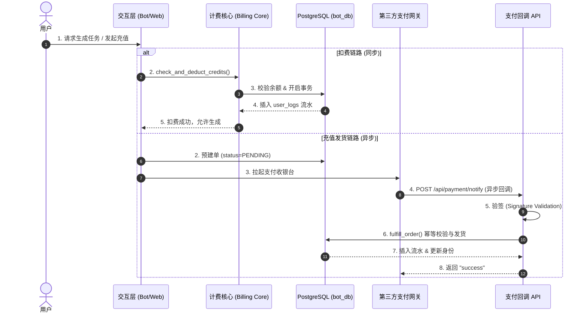

# 子模块: 计费与支付核心 (Billing & Payment)

## 1. 目标与范围
本模块负责系统全局的资产管理、扣费/退费逻辑以及跨渠道（如微信、支付宝、TON、Telegram Stars）的支付回调与履约（Fulfillment）。通过实施**单轨制代币（灵石）**和**异步预建单与回调验签分离**架构，确保所有账本流水的强一致性（ACID）和极高的并发幂等性。

## 2. 架构图与调用链



## 3. 核心代码片段

### 事务管理与退款防漏 (Transaction & Refund)
在 FastAPI 路由 (Routers) 或 Telegram Handlers 中，**严禁在 `try-except` 捕获异常后，手动调用 `refund_credits` 等业务级补偿方法同时执行 `session.rollback()`**。
> **原因**：因为依赖注入的 `AsyncSession` 会由外层 Unit of Work (UoW) 或中间件自动 `rollback`。如果手动退款并在异常块内执行回滚，可能导致“退款流水记录未被持久化”而余额被修改，或出现重复退款漏洞。所有事务与补偿必须遵循核心层的原子性闭环，业务异常应抛出后由全局拦截器处理。

### 计费扣减与流水追踪 (src/core/billing_core.py)
[`billing_core.py:L42-L61`](file:///home/hfy/APP/All_bot/src/core/billing_core.py#L42-L61)
```python
async def check_and_deduct_credits(internal_user_id: int, cost: int, task_type: str, username: str = None) -> Tuple[bool, str]:
    """同步扣费逻辑，强依赖 user_logs 表进行流水追踪，保障账本一致性"""
    async with async_session() as session:
        user = await session.get(User, internal_user_id)
        if user.credits < cost:
            return False, "灵石不足，请前往「个人中心」充值"
        
        # 执行扣费
        user.credits -= cost
        
        # 核心红线：强制写入流水以供审计
        log_entry = UserLog(
            user_id=internal_user_id,
            credit_change=-cost,
            operation_type=task_type,
            description=f"Task: {task_type}"
        )
        session.add(log_entry)
        await session.commit()
        return True, "扣费成功"
```

### 订单发货与幂等处理 (src/services/payment_fulfillment_service.py)
[`payment_fulfillment_service.py:L14-L35`](file:///home/hfy/APP/All_bot/src/services/payment_fulfillment_service.py#L14-L35)
```python
async def fulfill_order(out_trade_no: str, external_trade_no: str, paid_amount: float) -> bool:
    """订单发货逻辑，包含幂等性校验和月卡跨级折算"""
    async with async_session() as session:
        order = await session.execute(select(Order).where(Order.out_trade_no == out_trade_no))
        order = order.scalar_one_or_none()
        
        # 幂等性拦截：防止第三方网关重发回调导致重复发货
        if order.status == 'SUCCESS':
            return True
            
        order.status = 'SUCCESS'
        order.external_trade_no = external_trade_no
        order.paid_at = datetime.utcnow()
        
        # 调用发货、权限升级逻辑...
        await session.commit()
        return True
```

## 4. 接口定义 (OpenAPI 3.0)

```yaml
openapi: 3.0.3
info:
  title: Payment Fulfillment API
  version: 1.0.0
paths:
  /api/payment/notify:
    post:
      summary: 第三方支付网关异步回调
      description: 接收外部支付网关的异步通知，进行验签和发货处理。
      requestBody:
        required: true
        content:
          application/x-www-form-urlencoded:
            schema:
              type: object
              properties:
                out_trade_no:
                  type: string
                trade_no:
                  type: string
                money:
                  type: string
                sign:
                  type: string
      responses:
        '200':
          description: 处理成功，必须返回文本 success 阻断第三方重试
          content:
            text/plain:
              schema:
                type: string
                example: success
        '400':
          description: 验签失败或参数缺失
```

## 5. 单元与集成测试要求
- **覆盖率基准**：此模块涉及真金白银，代码测试覆盖率要求 **≥95%**。
- **核心用例**：
  1. `test_concurrent_deduction`：模拟 100 个并发请求调用扣费接口，断言 `user_logs` 流水总和与 `users.credits` 扣减额完全一致（防超卖）。
  2. `test_idempotent_fulfillment`：使用相同的 `out_trade_no` 发起两次支付回调，断言系统只发放一次奖励，第二次直接返回 `True`。
  3. `test_invalid_signature`：构造错误的网关 `sign` 请求回调接口，断言系统抛出 `400` 并拒绝发货。

## 6. 部署与回滚步骤
- **部署**：
  由于支付 API 独立于主 Bot 容器，修改支付逻辑后，在宿主机执行：
  `docker-compose -f deploy/docker-compose.yml up -d --build payment-api`
- **回滚**：
  保留上一个镜像 Tag。若出现严重的发货 Bug，执行：
  `docker tag my-payment-api:last-stable my-payment-api:latest && docker-compose restart payment-api`

## 7. 监控告警规则 (SLI/SLO)
- **SLI (Service Level Indicator)**：支付回调接口 `/api/payment/notify` 的 5xx 错误率与 400（验签失败）频率。
- **SLO (Service Level Objective)**：回调接口可用性 99.99%，处理延迟 < 500ms。
- **告警策略**：
  - **Critical**：连续 5 分钟内出现 3 次以上“支付成功但发货异常（如数据库锁死）”报错，触发 P0 级电话/短信告警。
  - **Warning**：`user_logs` 表每小时核对总额与 `users` 表的余额变化差值不为 0 时（对账不平），触发飞书/钉钉告警。
