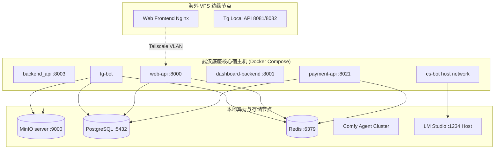

# 子模块: 运维指南与容器管理 (Ops & Deployment)

## 1. 目标与范围
本模块梳理了修仙主题 AI 创作工作台 (All_Bot) 的分布式部署策略、微服务容器管理规范以及各类线上突发故障的排查指南。涵盖了从代码构建、服务启停、网络配置（含 Host 模式与 Nginx 反代）、数据库迁移到常见存储与网络假死（如 502/503）的应急恢复操作。

## 2. 架构图与服务拓扑



## 3. 核心运维与排障脚本

### 3.1 紧急维护模式切换
当需要阻止新任务提交而不影响查询时，使用文件锁机制：
- **开启维护模式**：`docker exec tg-bot touch /app/MAINTENANCE`
- **关闭维护模式**：`docker exec tg-bot rm -f /app/MAINTENANCE`

### 3.2 常见排障脚本调用
在宿主机根目录执行以下脚本进行干预：
```bash
# 1. 强制清理并释放由于 Worker 宕机导致的僵尸任务锁
docker exec tg-bot python clean_zombies.py

# 2. 检查 Redis DB2 的任务排队情况与 Worker 心跳
docker exec tg-bot python check_redis.py

# 3. 本地模拟发送第三方支付回调请求（脱离网关限制）
python scripts/test_huanyuy.py
```

## 4. 常见线上故障与恢复契约 (SOP)

| 故障现象 | 根本原因分析 (RCA) | 应急恢复指令/方案 |
| :--- | :--- | :--- |
| **Web大文件上传 503** | Worker 高负载导致磁盘 IO 拥堵，MinIO 被迫离线，导致 SDK 获取 Region 的网络请求卡死 FastAPI 事件循环。 | `docker restart minio-server`。<br>代码层必须注入静态 `_region_map` 离线映射。 |
| **Web端 502 Bad Gateway** | 海外 VPS 的 Nginx 无法连通国内 `web-api`。 | 1. 检查 `docker ps` 确认 `web-api` 存活。<br>2. 检查 Tailscale 节点状态 (`tailscale status`)。 |
| **前端登录 "Username invalid"** | WebApp 缺失关联的 Bot 用户名，或未在 BotFather 绑定域名。 | 配置前端环境变量 `VITE_TELEGRAM_BOT_USERNAME`，并在 TG 执行 `/setdomain`。 |
| **CS Bot 修改代码后不生效** | 使用了单纯的 `docker restart`。 | 必须带构建参数重构容器：<br>`docker rm -f cs-bot && docker-compose up -d --build` |
| **Bot 获取大视频时 404/403** | Local API 容器对宿主机挂载目录 `/var/lib/telegram-bot-api` 权限不足。 | `chmod -R 777 /var/lib/telegram-bot-api` |
| **Agent 报 NoSuchKey 或 ComfyUI 400** | Agent 读取了默认的 MinIO 存储桶（如 `comfyui-input`），而主应用使用了其他桶名（如 `bot-data`）。 | 在 `workers/docker-compose.yml` 中确保 `MINIO_INPUT_BUCKET` 与后端主服务的 `MINIO_BUCKET` 保持一致。 |

## 5. 部署与重建步骤 (CI/CD)
系统微服务分散在多个目录下，重建时需进入特定目录操作。为避免遗留 `ContainerConfig` 错误，推荐先 `rm -f` 再构建：

1. **主 Bot、Web API 与 支付服务 (根目录)**：
   `docker rm -f tg-bot web-api payment-api && docker-compose -f deploy/docker-compose.yml up -d --build`
2. **Dashboard 与 中控 API (子目录)**：
   `cd dashboard && docker-compose up -d --build`
   `cd backend && docker-compose up -d --build`
3. **Comfy Agent 算力集群 (workers 目录)**：
   集群 Agent (`comfy-agent-x`) 支持独立平滑更新配置，不影响集群中其他节点。
   - **整体部署**：`cd workers && docker-compose up -d --build`
   - **单节点更新**（当修改环境变量后，重构并重启单个节点）：`docker-compose up -d comfy-agent-1`
   - **单节点重启**（不重新构建，仅重启）：`docker-compose restart comfy-agent-1`
4. **前端 Vue 自动发布**：
   `cd frontend && npm run deploy` (依赖内置私钥通过 SCP 同步至海外 VPS)。

## 6. 安全与权限监控规则 (SLI/SLO)
- **SLI**：前端 SSH 私钥文件 (`id_rsa.pem`) 的权限状态；数据库表结构的 Alembic 变更一致性。
- **SLO**：自动化部署 100% 成功，无原生 SQL Alter 引发的锁表。
- **告警与防线策略**：
  - **Critical**：绝对禁止在生产环境直接使用 `ALTER TABLE` 原生 SQL 修改数据库结构。必须通过 `alembic revision --autogenerate` 生成迁移版本并在容器启动时统一应用。
  - **Warning**：执行部署脚本前，务必检查私钥权限：`chmod 600 id_rsa.pem`，否则 SSH 将因为权限过大拒绝通信。
