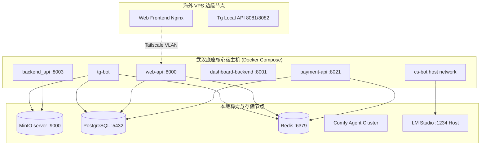

# 子模块: 运维指南与容器管理 (Ops & Deployment)

## 1. 目标与范围
本模块梳理了修仙主题 AI 创作工作台 (All_Bot) 的分布式部署策略、微服务容器管理规范以及各类线上突发故障的排查指南。涵盖了从代码构建、服务启停、网络配置（含 Host 模式与 Nginx 反代）、数据库迁移到常见存储与网络假死（如 502/503）的应急恢复操作。

## 2. 架构图与服务拓扑



## 3. 核心运维与排障脚本

### 3.1 紧急维护模式切换
当需要阻止新任务提交而不影响查询时，使用文件锁机制：
- **开启维护模式**：`docker exec tg-bot touch /app/MAINTENANCE`
- **关闭维护模式**：`docker exec tg-bot rm -f /app/MAINTENANCE`

### 3.2 常见排障脚本调用
在宿主机根目录执行以下脚本进行干预：
```bash
# 1. 强制清理并释放由于 Worker 宕机导致的僵尸任务锁
docker exec tg-bot python src/services/zombie_cleaner_service.py

# 2. 检查 Redis DB2 的任务排队情况与 Worker 心跳
docker exec tg-bot python check_redis.py

# 3. 本地模拟发送第三方支付回调请求（脱离网关限制）
python scripts/test_huanyuy.py
```

### 3.3 安全自动化部署脚本 (推荐)
为了解决部署过程中的任务中断和 Redis 死锁问题，系统提供了 `safe_deploy.sh` 一键安全部署脚本。
- **机制**：开启双端维护模式 -> 智能监控活跃任务队列至清空 -> 执行 `zombie_cleaner_service.py` 清理死锁 -> 依次平滑重建 Agent、中控 API、主服务群、Dashboard 和测试服务。
- **用法**：在拉取最新代码并确认 `.env` 配置后，直接运行 `bash safe_deploy.sh`。
- **详见**：[SAFE_DEPLOY_GUIDE.md](./SAFE_DEPLOY_GUIDE.md)

## 4. 常见线上故障与恢复契约 (SOP)

| 故障现象 | 根本原因分析 (RCA) | 应急恢复指令/方案 |
| :--- | :--- | :--- |
| **Web大文件上传 503** | Worker 高负载导致磁盘 IO 拥堵，MinIO 被迫离线，导致 SDK 获取 Region 的网络请求卡死 FastAPI 事件循环。 | `docker restart minio-server`。<br>代码层必须注入静态 `_region_map` 离线映射。 |
| **边缘节点上传超时或 403** | Nginx `proxy_pass` 包含斜杠导致预签名 URL 解码，或缓冲导致 Tailscale 拥堵。 | 请严格参阅 [边缘节点运维指南](./子模块_边缘节点运维指南_edge_node_ops.md) 优化代理配置。 |
| **Web端 502 Bad Gateway** | 海外 VPS 的 Nginx 无法连通国内 `web-api`。 | 1. 检查 `docker ps` 确认 `web-api` 存活。<br>2. 检查 Tailscale 节点状态 (`tailscale status`)。 |
| **前端登录 "Username invalid"** | WebApp 缺失关联的 Bot 用户名，或未在 BotFather 绑定域名。 | 配置前端环境变量 `VITE_TELEGRAM_BOT_USERNAME`，并在 TG 执行 `/setdomain`。 |
| **CS Bot 修改代码后不生效** | 使用了单纯的 `docker restart`。 | 必须带构建参数重构容器：<br>`docker rm -f cs-bot && docker-compose up -d --build` |
| **Bot 获取大视频时 404/403** | Local API 容器对宿主机挂载目录 `/var/lib/telegram-bot-api` 权限不足。 | `chmod -R 777 /var/lib/telegram-bot-api` |
| **Agent 报 NoSuchKey 或 ComfyUI 400** | Agent 读取了默认的 MinIO 存储桶（如 `comfyui-input`），而主应用使用了其他桶名（如 `bot-data`）。 | 在 `workers/docker-compose.yml` 中确保 `MINIO_INPUT_BUCKET` 与后端主服务的 `MINIO_BUCKET` 保持一致。 |

## 5. 部署与重建步骤 (CI/CD)
系统微服务分散在多个目录下，重建时需进入特定目录操作。**强烈建议直接使用 `safe_deploy.sh` 进行全量一键平滑部署**。
如需手动操作，为避免遗留 `ContainerConfig` 错误，推荐先 `rm -f` 再构建：

1. **主 Bot、Web API 与 支付服务 (根目录)**：
   `docker rm -f tg-bot web-api payment-api && docker-compose -f deploy/docker-compose.yml up -d --build`
2. **Dashboard 与 中控 API (子目录)**：
   `cd dashboard && docker rm -f dashboard_dashboard-backend_1 dashboard_dashboard-frontend_1 && docker-compose up -d --build`
   `cd backend && docker rm -f backend_api_1 && docker-compose up -d --build`
3. **Comfy Agent 算力集群 (workers 目录)**：
   集群 Agent (`comfy-agent-x`) 支持独立平滑更新配置，不影响集群中其他节点。
   - **整体部署**：`cd workers && docker rm -f comfy-agent-1 comfy-agent-2 comfy-agent-3 comfy-agent-4 comfy-agent-5 && docker-compose up -d --build`
   - **单节点更新**（当修改环境变量后，重构并重启单个节点）：`docker-compose up -d comfy-agent-1`
   - **单节点重启**（不重新构建，仅重启）：`docker-compose restart comfy-agent-1`
4. **前端 Vue 自动发布**：
   `cd frontend && npm run deploy` (依赖内置私钥通过 SCP 同步至海外 VPS)。

**【极度重要】数据库迁移（按需）**：
生产环境在构建镜像时才会打入新代码，旧容器内尚未拉取新脚本，会导致迁移指令变成无效空跑。请在**部署脚本执行完毕、新容器启动后**，立刻手动执行以下命令应用迁移：
`docker exec -it tg-bot alembic upgrade head`

## 6. 安全与权限监控规则 (SLI/SLO)
- **SLI**：前端 SSH 私钥文件 (`id_rsa.pem`) 的权限状态；数据库表结构的 Alembic 变更一致性。
- **SLO**：自动化部署 100% 成功，无原生 SQL Alter 引发的锁表。
- **告警与防线策略**：
  - **Critical**：绝对禁止在生产环境直接使用 `ALTER TABLE` 原生 SQL 修改数据库结构。必须通过 `alembic revision --autogenerate` 生成迁移版本并在容器启动时统一应用。
  - **Warning**：执行部署脚本前，务必检查私钥权限：`chmod 600 id_rsa.pem`，否则 SSH 将因为权限过大拒绝通信。

## 7. 系统日志监控与故障排查规范 (Log Monitoring & Troubleshooting SOP)

在进行系统日志监控与深度分析任务时，请严格按照以下标准化步骤操作。此规范已封装为 `ops-log-monitor` AI 技能，供自动化排障时调用。

### 7.1 日志采集与监控（静默执行）
- **监控目标**：正式环境 bot 日志、测试环境 bot 日志、web api 日志、后端中控 api 日志。
- **时间范围**：提取过去10分钟的历史日志，并持续追加监控后续2分钟的实时日志（总计覆盖12分钟的日志窗口）。
- **排查双边缘节点故障**：当涉及网络层、跨域（CORS）、文件上传失败（413 Payload Too Large）、或者请求根本未到达后端时，**必须**使用 SSH 检查以下两个边缘节点的日志：
  - **Web 前端与流量转发节点** (`100.88.57.122` / `154.17.30.113`)：执行指令 `ssh -i frontend/ssh_key/id_rsa.pem root@100.88.57.122 "tail -n 100 /var/log/nginx/error.log"` 检查 Nginx 代理报错。
  - **Telegram Local API 节点** (`69.63.220.115`)：当出现 `telegram.error.TimedOut`、大文件下载 404/403 等异常时，执行指令 `ssh root@69.63.220.115 "docker logs --tail 100 tg-local-api"` 或检查 HTTP 文件服务器日志。
- **排查后端数据库慢查询与连接池**：当出现 `110 Connection timed out` 且后端日志无明显应用报错时，**必须**排查 PostgreSQL 连接池是否被耗尽。使用 `docker exec -i postgres-server psql -U postgres -d bot_db -c "SELECT count(*), state FROM pg_stat_activity GROUP BY state;"` 检查 `idle in transaction` 的数量。若发现大量卡死进程，可使用 `ALTER SYSTEM SET idle_in_transaction_session_timeout = '60000';` 进行熔断恢复，并配置 `log_min_duration_statement = '1000'` 追踪慢查询。
- **执行要求**：在此期间仅做观察、采集与记录，**绝对不要修改任何代码**。请将采集到的日志暂存到专用的临时文件或内存中，不要在控制台或对话窗口中打印原始日志流。

### 7.2 日志综合分析
采集结束后，基于临时日志数据进行以下多维分析：
1. **异常检测**：精准识别所有 ERROR、WARN、Exception、StackTrace、超时、重试、状态码非200等异常信号。
2. **频率统计**：按分钟粒度统计各类异常的出现次数，为趋势折线图准备数据。
3. **链路追踪**：利用 TraceId 等标识，对同一请求在 `bot → web api → 后端中控api` 之间的调用链进行关联，定位首次出错的节点。
4. **根因归类**：将发现的问题按“配置错误、依赖服务故障、代码逻辑缺陷、资源瓶颈、网络抖动、权限/鉴权失败”六大类进行归档。
5. **影响评估**：评估并定级每类问题对线上用户、测试流程、系统稳定性的影响级别（P0/P1/P2）。
6. **解决方案**：针对每类根因提供可执行的修复或缓解措施（包括：参数调优、降级策略、重试机制、告警阈值调整、代码后续改动建议）。**注：此处仅做文字描述，禁止直接实施代码修改。**

### 7.3 报告生成与无痕清理（核心要求）
- **生成报告**：输出一份 Markdown 格式的分析报告，必须包含以下模块：
  - 监控时间范围与日志源列表
  - 异常总览表（异常类型、出现次数、首次/末次时间、影响接口）
  - 趋势图（必须使用 inline Mermaid 语法绘制折线图）
  - 调用链追踪示例（以文本形式粘贴关键 TraceId 与各节点耗时截图/片段）
  - 根因与解决方案对照表
  - 后续行动清单（责任人、优先级、截止时间）
- **保存文件**：将报告命名为 `log_analysis_report_<yyyyMMdd_HHmm>.md`，使用 UTF-8 编码，写入到项目根目录的 `logs/` 文件夹下（若目录不存在请自动创建）。此文件无需提交 Git。
- **清理中间产物**：**强制要求**在报告成功写入磁盘后，立即通过 shell 命令彻底删除所有临时日志文件、数据切片或缓存记录。
- **最终输出**：排障结束时，仅输出“报告已生成完毕”及文件的绝对路径，并简要总结报告中的 P0/P1 级核心结论。**严禁输出任何监控过程的中间产物或大段原始日志。**
