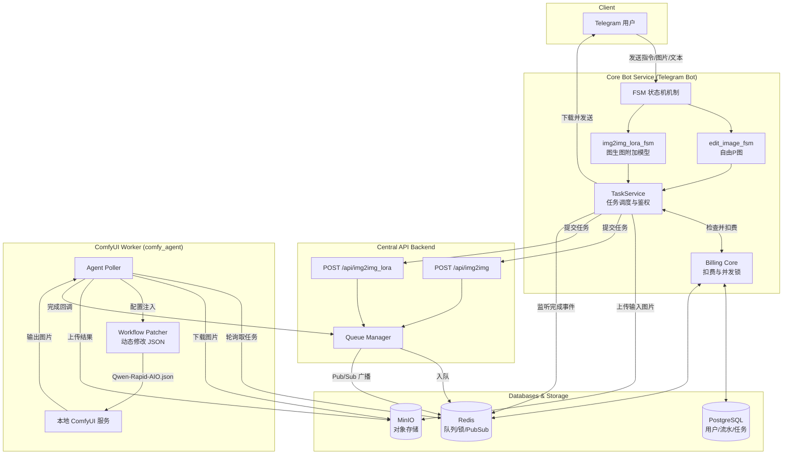
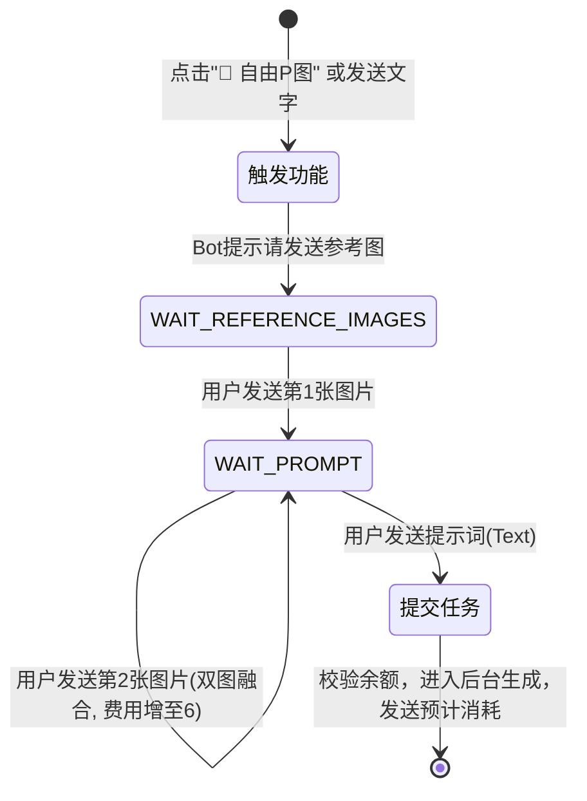
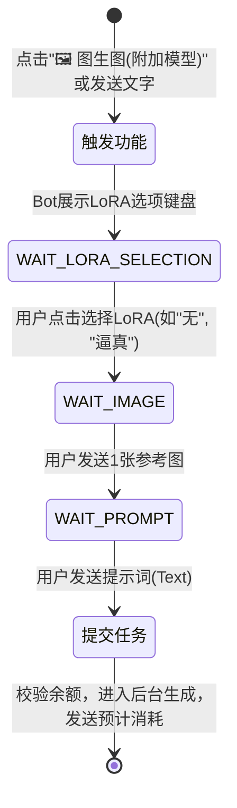
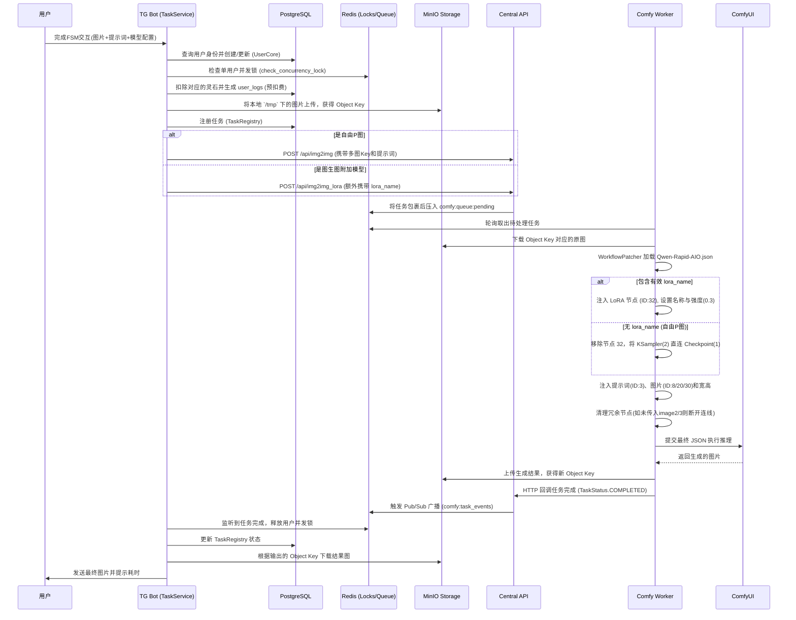

# 自由P图与图生图（附加模型）功能分析报告

本文档对系统中的“自由P图”（`edit` / `img2img`）与“图生图（附加模型）”（`img2img_lora`）两大功能进行详细梳理，涵盖用户操作流程、任务流、数据流以及系统架构图。

## 1. 系统架构图 (System Architecture Diagram)

这两个功能共享同一套底层生成链路（均使用 `Qwen-Rapid-AIO.json` 工作流），区别在于前置 FSM（状态机）交互与 LoRA 节点的动态路由控制。

## 2. 用户操作流程 (User Operation Flow)

用户在 Telegram 端与 Bot 交互时的界面操作流向。

### 2.1 自由P图 (Free Edit)

### 2.2 图生图附加模型 (Img2Img with LoRA)

## 3. 任务流 (Task Flow)

从任务产生到销毁的全生命周期运转流程。

## 4. 数据流 (Data Flow)

说明在各个服务间流转的数据实体及变化机制。

1. **输入媒体流（Input Media Flow）**：
   - **Telegram Client** -> 上传至 Telegram 服务器 -> **VPS Local API** 暴露本地绝对路径 (`/var/lib/telegram-bot-api/...`)。
   - **Bot (FSM)** -> 通过 `httpx` 下载至本地 `/tmp/bot_fsm_tmp/`。
   - **TaskService** -> 将本地文件异步上传至 **MinIO**（通常为 `comfyui-input` 桶），将其转化为轻量级的 `Object Key`（如 `comfyui-input/abc.png`）。此后内部系统**不再直接传输二进制流**，大幅节省内网带宽。
   - **Worker** -> 接收到 JSON 任务后，根据 `Object Key` 从 MinIO 拉取文件供 ComfyUI 使用。

2. **参数配置流（Configuration Flow）**：
   - **Bot 组装**：通过 FSM 收集到 `prompt`, `image_paths` (List), `lora_name`, `lora_strength`。
   - **API 传递**：封装在 `Img2ImgRequest` / `Img2ImgLoraRequest` 的 JSON body 中转发给 Redis 队列。
   - **Worker 动态修补 (Workflow Patcher)**：
     - 基础文件为 `Qwen-Rapid-AIO.json`。
     - **自由P图 (`task_type="img2img"`)**：因为没有传入 `lora_name`，Patcher 会将 JSON 中 ID 为 `32` 的 LoRA 节点强行删除，并重新修正节点连线（将采样器直接连到大模型）。
     - **图生图附加模型 (`task_type="img2img_lora"`)**：如果指定了 LoRA（如 `qwen/YARN_1.0.safetensors`），Patcher 会在 ID 为 `32` 的节点中动态写入模型名，并将强度 `strength_model` 设为 `0.3`。
     - **多图融合容错**：如果不满足 2 张或 3 张图片，Patcher 会自动断开 `TextEncodeQwenImageEditPlus` 节点中多余的图片输入连线，避免 ComfyUI 报 400 格式错误。

3. **输出媒体流（Output Media Flow）**：
   - **ComfyUI** -> 输出至本地 `output` 文件夹。
   - **Worker** -> 上传至 **MinIO**（`comfyui-temp` 或 `bot-data` 桶），获得生成的 `Object Key`。
   - **Bot** -> 接收到包含新 `Object Key` 的完成事件，从 MinIO 下载流。
   - **Bot** -> 调用 Telegram Local API (`send_photo` / `send_document`) 发送给用户终端。

## 5. 关键业务红线与特点
- **隔离与解耦**：Bot 端不关心具体的节点 ID 和连线，只需负责调用 API 传入高维度的参数（图片、提示词、LoRA名）。底层 JSON 解析脏活全由 `workers/comfy_agent/workflow_patcher.py` 负责。
- **动态图处理**：无论是单图、双图（消耗 6 灵石）还是指定 LoRA 模型，底层共用同一个全能工作流模板 `Qwen-Rapid-AIO.json`，极大地降低了维护多套 JSON 的成本。
- **防内存溢出**：利用 `is_maintenance_mode()` 与 `check_concurrency_lock` 实现防并发与队列压垮机制；图片以 `to_thread` 形式异步上传，防止阻塞主协程。
