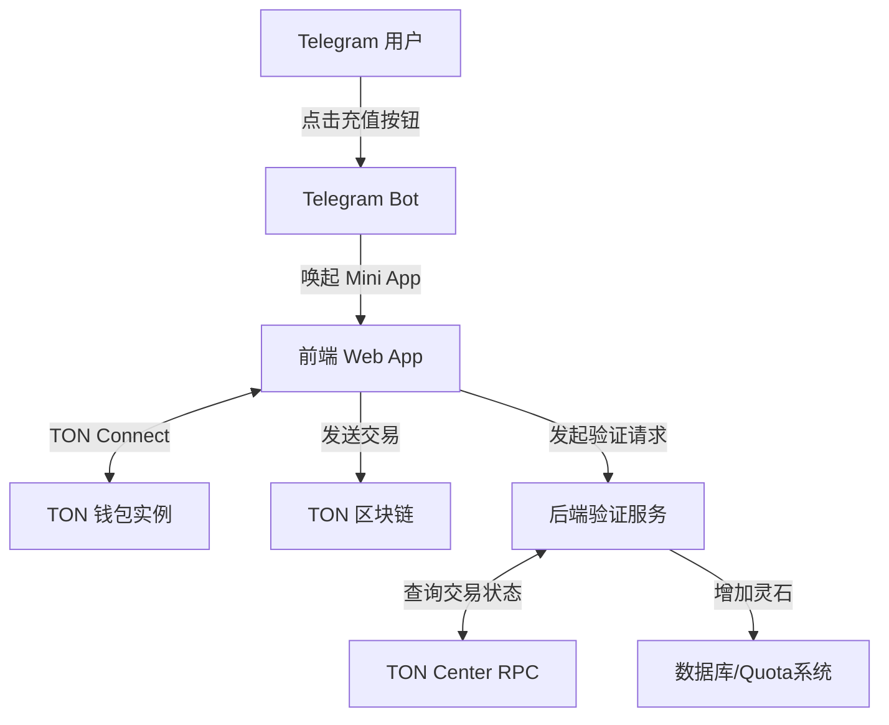

# TON支付系统技术总结报告

## 目录
1. [系统架构概述](#1-系统架构概述)
2. [核心功能模块说明](#2-核心功能模块说明)
3. [支付流程解析](#3-支付流程解析)
4. [安全机制评估](#4-安全机制评估)
5. [性能指标分析](#5-性能指标分析)
6. [存在的问题与风险点](#6-存在的问题与风险点)
7. [优化建议](#7-优化建议)
8. [未来发展规划](#8-未来发展规划)

---

## 1. 系统架构概述

本项目下的 TON 支付系统是一个为 Telegram Bot 提供“灵石”（虚拟信用点）充值服务的完整闭环雏形。系统采用前后端分离架构，通过 Telegram Web App (Mini App) 无缝集成至 Bot 交互中。

**架构图示：**


## 2. 核心功能模块说明

系统由以下三个核心模块组成：

### 2.1 Bot 交互模块 (`bot_integration/handler.py`)
- **功能**：负责处理用户在 Telegram 内的充值指令。
- **实现**：使用 `telegram.ext` 构建，向用户下发包含 `WebAppInfo` 的内联键盘按钮。点击后会在 Telegram 内部弹出前端支付页面。
- **代码示例**：
  ```python
  InlineKeyboardButton(
      text="💎 打开灵石充值中心",
      web_app=WebAppInfo(url="https://pay.aivison.it.com")
  )
  ```

### 2.2 前端支付模块 (`frontend/index.html` & `tonconnect-manifest.json`)
- **功能**：提供用户界面，展示商品列表，并与用户的 TON 钱包进行交互。
- **实现**：引入官方 `@tonconnect/ui` 库，实现一键连接钱包功能。支持三种固定额度的充值套餐。使用 `sendTransaction` 接口拉起钱包签名并广播交易。
- **配置**：`tonconnect-manifest.json` 定义了 DApp 的元数据（名称“合欢宗账房”、图标及协议链接）。

### 2.3 后端验证模块 (`backend/validator.py`)
- **功能**：在链上验证用户交易的真实性与准确性。
- **实现**：封装 `TonPaymentValidator` 类，基于 `aiohttp` 异步请求 `toncenter.com/api/v2/jsonRPC` 接口。通过拉取指定收款地址的历史交易，比对转账金额（nanotons）和备注信息（订单号）以确认支付。

## 3. 支付流程解析

标准的支付业务数据流转如下：

1. **入口触达**：用户在 Telegram 机器人中发送指令，Bot 返回带有“打开灵石充值中心”按钮的卡片。
2. **连接钱包**：用户在打开的 Mini App 中点击 TON Connect 按钮，授权连接本地或云端 TON 钱包。
3. **商品选择**：前端渲染出充值套餐（如 100灵石/1TON），用户点击选中目标套餐。
4. **交易构造**：前端根据选择构造 Transaction 对象，包括收款地址（硬编码）、金额（转换为 nanotons）和有效期。
5. **签名上链**：用户在钱包中确认并签名交易，交易被广播至 TON 区块链。
6. **异步验证**：交易成功发送后，前端应通知后端（目前代码中为待实现的 `fetch('/api/verify_payment')`）。后端使用 `TonPaymentValidator.check_transaction` 去公共 RPC 节点轮询该笔交易。
7. **权益发放**：后端确认金额和备注（订单号）无误后，调用 Permission Agent 为用户增加相应的“灵石”。

## 4. 安全机制评估

### 优势
- **去中心化授权**：使用标准的 TON Connect 协议，前端不接触用户的私钥，保证了用户资金安全。
- **Mini App 隔离**：在 Telegram 沙盒环境中运行，防止了常见的网页端跨站攻击。

### 劣势与隐患
- **备注验证机制脆弱**：当前后端验证仅使用了简单的字符串包含检查 (`comment in str(in_msg)`)。真实的 TON 交易消息（Message）通常以 BOC (Bag of Cells) 格式编码，直接转字符串匹配极易引发漏判或被恶意构造的数据绕过。
- **前端状态不可信**：前端硬编码了价格和收款地址，若用户拦截请求或篡改前端代码，可能导致向错误地址转账或发起虚假验证请求。

## 5. 性能指标分析

- **前端加载**：采用原生 HTML/CSS/JS 编写，无重型框架（如 React/Vue），首屏加载极快，非常适合 Telegram Mini App 环境。
- **后端并发**：验证脚本采用了 `aiohttp` 异步网络库，避免了阻塞，能够支撑较高的并发验证请求。
- **外部依赖瓶颈**：强依赖 `https://toncenter.com/api/v2/jsonRPC` 公共节点。在没有配置 API Key 的情况下，极易触发 Rate Limit（HTTP 429），导致大并发下验证失败。

## 6. 存在的问题与风险点

1. **支付闭环未完成**：前端的 `payload`（订单备注）目前被注释掉，后端无法将链上交易与具体用户/订单进行精准绑定。前端支付成功后的回调 API 也尚未实现。
2. **硬编码问题严重**：收款地址 `UQAluW2wxRCDsJIKGH59jB07xODgEbStdUPEj9AjI88d9l-s` 和商品价格直接写死在前端 HTML 中，缺乏灵活性，修改需重新部署前端。
3. **BOC 解码缺失**：后端缺少解析链上原始数据的能力，无法准确提取转账备注文本。
4. **异常处理不足**：后端在请求 RPC 失败时直接返回 `False`，缺乏重试机制；前端在交易失败时仅有简单的 `alert`。

## 7. 优化建议

1. **引入 BOC 解码库**：后端必须引入 `pytoniq` 或 `ton` 等专业库，对交易的 `in_msg` 进行标准的 BOC 解码，安全准确地提取 Payload（订单号）。
2. **动态订单生成**：
   - 流程应改为：前端请求后端 -> 后端生成唯一订单号（存入数据库）并返回 -> 前端将该订单号作为 `payload` 填入交易。
3. **消除硬编码**：通过后端 API 动态获取收款地址和商品列表配置，便于后续运营调整。
4. **增强 RPC 稳定性**：
   - 申请 TonCenter 的 API Key 以提升限流阈值。
   - 实现退避重试（Exponential Backoff）机制。
   - 考虑引入多个备用 RPC 节点（如 TonAPI）。

## 8. 未来发展规划

1. **Webhook 实时通知**：废弃低效的客户端触发轮询模式，改用 TonAPI 等第三方服务提供的 Webhook 订阅收款地址。一旦有新交易入账，服务端自动被动接收通知，实现秒级充值到账。
2. **Telegram 官方钱包集成**：除了 TON Connect，探索直接调用 Telegram 内置 `@wallet` 的支付 API (Telegram Stars / Wallet Pay)，缩短用户的支付路径。
3. **智能合约收银台**：开发专门的收款智能合约（Smart Contract）。资金先打入合约，合约触发 Event 被后端监听到后再发放灵石，后续资金再由管理员统一归集。这将大幅提升系统的自动化和安全性。
4. **订阅制支持**：基于 TON 网络的特性，未来可探索推出“月卡/季卡”的自动扣款订阅模式。
